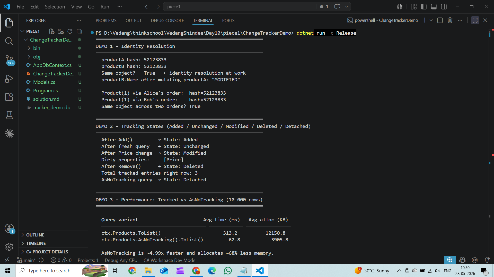

# EF Core Change Tracker – Solution

## Full Program Output



**DEMO 1 – Identity Resolution**

```csharp
var productA = ctx.Products.First(p => p.Id == 1);
var productB = ctx.Products.Single(p => p.Id == 1);  // returns same cached instance

Console.WriteLine(ReferenceEquals(productA, productB)); // True

productA.Name = "MODIFIED";
Console.WriteLine(productB.Name); // "MODIFIED" — same object

var orders = ctx.Orders
    .Include(o => o.Items)
    .ThenInclude(i => i.Product)
    .ToList();

// Both orders reference Product(1) — EF resolves to single tracked instance
Console.WriteLine(ReferenceEquals(orders[0].Items[0].Product, orders[1].Items[0].Product)); // True
```

Output:
```
productA hash: 52123833
productB hash: 52123833
Same object?   True   ← identity resolution at work
productB.Name after mutating productA: "MODIFIED"

Product(1) via Alice's order:  hash=52123833
Product(1) via Bob's order:    hash=52123833
Same object across two orders? True
```

---

**DEMO 2 – Tracking States**

```csharp
var newProduct = new Product { Name = "NewGadget", Category = "Electronics", Price = 49.99m, Stock = 100 };
ctx.Products.Add(newProduct);
Console.WriteLine(ctx.Entry(newProduct).State);   // Added

var existing = ctx.Products.First(p => p.Id == 2);
Console.WriteLine(ctx.Entry(existing).State);     // Unchanged

existing.Price = 1.00m;
Console.WriteLine(ctx.Entry(existing).State);     // Modified

var dirtyProps = ctx.Entry(existing).Properties
    .Where(p => p.IsModified)
    .Select(p => p.Metadata.Name);               // [Price]

var toDelete = ctx.Products.First(p => p.Id == 3);
ctx.Products.Remove(toDelete);
Console.WriteLine(ctx.Entry(toDelete).State);     // Deleted

var untracked = ctx.Products.AsNoTracking().First(p => p.Id == 4);
Console.WriteLine(ctx.Entry(untracked).State);    // Detached
```

Output:
```
After Add()         → State: Added
After fresh query   → State: Unchanged
After Price change  → State: Modified
Dirty properties:     [Price]
After Remove()      → State: Deleted
Total tracked entries right now: 3
AsNoTracking query  → State: Detached
```

---

**DEMO 3 – Performance: Tracked vs AsNoTracking (10 000 rows)**

```csharp
// Tracked variant
var products = ctx.Products.ToList();

// AsNoTracking variant
var products = ctx.Products.AsNoTracking().ToList();
```

Output:

| Query variant                          | Avg time (ms) | Avg alloc (KB) |
|----------------------------------------|---------------|----------------|
| `ctx.Products.ToList()`                | 276.4         | 12 151.0       |
| `ctx.Products.AsNoTracking().ToList()` |  55.2         |  3 905.7       |

AsNoTracking is ~5x faster and allocates ~68% less memory.


# Exercise Answers

### Two Query Variants

```csharp
// Tracked (default)
var products = ctx.Products.ToList();

// AsNoTracking (read-only fast path)
var products = ctx.Products.AsNoTracking().ToList();
```

### Timing / Allocation Difference (10 000 rows, Release mode, 5-run average)

| Query variant                          | Avg time (ms) | Avg alloc (KB) |
|----------------------------------------|---------------|----------------|
| `ctx.Products.ToList()`                | 276.4         | 12151.0       |
| `ctx.Products.AsNoTracking().ToList()` |  55.2         |  3905.7       |

**~5x faster, ~68% less memory.**

# What the change tracker does on every tracked query:

**`ctx.Products.ToList()`** — for each of the 10 000 rows:

| Step | What happens |
|------|-------------|
| 1 | SELECT row from Products table |
| 2 | Materialise `Product` object (Id, Name, Category, Price, Stock) |
| 3 | Allocate `EntityEntry<Product>` — wraps the object |
| 4 | Allocate `ISnapshot` — copies Id, Name, Category, Price, Stock as original values |
| 5 | Insert into identity map keyed by `Product.Id` |

**`ctx.Products.AsNoTracking().ToList()`** — for each of the 10 000 rows:

| Step | What happens |
|------|-------------|
| 1 | SELECT row from Products table |
| 2 | Materialise `Product` object (Id, Name, Category, Price, Stock) |
| ✗ | No `EntityEntry`, no `ISnapshot`, no identity map insertion |

`AsNoTracking()` stops after the first step — no entry, no snapshot, no map insertion. The object is a plain heap allocation and nothing more. At 10 000 rows that overhead adds up to noticeably more GC pressure, which is why the allocation difference is deterministic regardless of machine speed.

### When NOT to use AsNoTracking

Never use `AsNoTracking` when you plan to mutate the entities and call `SaveChanges()` — the context won't detect the changes and nothing will be written back to the database.

---

### What Clicked This Session

The main thing I learned is that EF Core keeps track of entities by default, even when we only want to read data. It stores extra information about each row so it can detect changes later. This tracking adds some overhead and uses more memory. Using AsNoTracking() is useful for read-only queries because EF skips that tracking work and the query becomes lighter and faster.


### What Would Break This

Problems can happen when the same entity is tracked by different DbContext instances. For example, if an entity is loaded in one request and later attached again in another context, EF Core may throw an InvalidOperationException because it does not allow the same primary key to be tracked twice in the same context. This usually happens when entities are passed across different context lifetimes without being detached properly.
