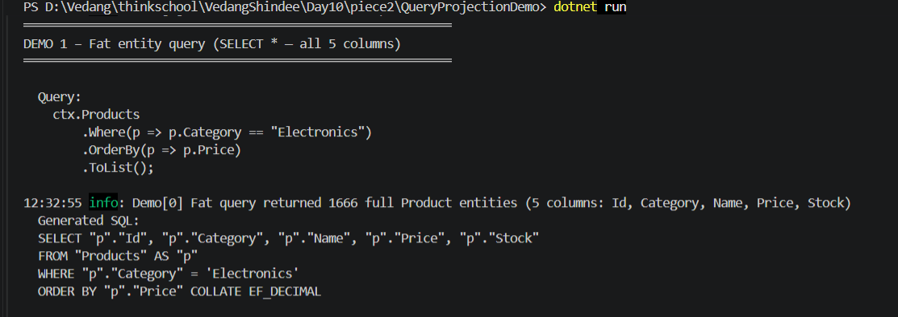
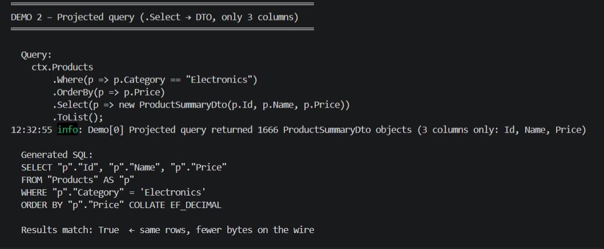
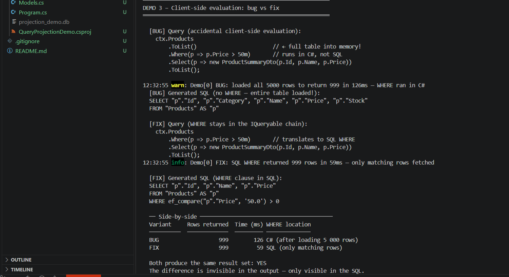

# EF Core – Query Translation & Projections

## Setup

SQL logging is enabled via `LogTo` with `DbLoggerCategory.Database.Command` so only
SQL execution events are captured — no state-change or migration noise.
`EnableSensitiveDataLogging` is also on so literal parameter values appear in the SQL.

```csharp
var options = new DbContextOptionsBuilder<AppDbContext>()
    .UseSqlite($"Data Source={DbPath}")
    .LogTo(msg => sqlLog.Add(msg),
           [DbLoggerCategory.Database.Command.Name],
           LogLevel.Information)
    .EnableSensitiveDataLogging()
    .Options;
```

Application-level log statements use **named parameters**, not string interpolation,
so structured log sinks (Seq, Application Insights) can index values separately from
the message text:

```csharp
// CORRECT — named parameter {Count} is a structured value
log.LogInformation("Projected query returned {Count} DTOs", projectedResults.Count);

// WRONG — string interpolation embeds the value into the message string
// log.LogInformation($"Projected query returned {projectedResults.Count} DTOs");
```

---

## Exercise Answers

### 1 – Original SQL (fat entity query)

```csharp
// Loads ALL columns for every Electronics product — even Stock, which is never used
var results = ctx.Products
    .Where(p => p.Category == "Electronics")
    .OrderBy(p => p.Price)
    .ToList();
```

**EF-generated SQL:**
```sql
SELECT "p"."Id", "p"."Category", "p"."Name", "p"."Price", "p"."Stock"
FROM "Products" AS "p"
WHERE "p"."Category" = 'Electronics'
ORDER BY "p"."Price" COLLATE EF_DECIMAL
```

All 5 columns are fetched. `Category` and `Stock` travel over the wire even though
the caller only needs `Id`, `Name`, and `Price`.



---

### 2 – Projected query + leaner SQL

```csharp
// .Select() tells EF exactly which columns are needed — SQL only fetches those 3
var results = ctx.Products
    .Where(p => p.Category == "Electronics")
    .OrderBy(p => p.Price)
    .Select(p => new ProductSummaryDto(p.Id, p.Name, p.Price))
    .ToList();
```

**EF-generated SQL:**
```sql
SELECT "p"."Id", "p"."Name", "p"."Price"
FROM "Products" AS "p"
WHERE "p"."Category" = 'Electronics'
ORDER BY "p"."Price" COLLATE EF_DECIMAL
```

`Category` and `Stock` are gone from the `SELECT` list.
At 1 666 matching rows that is 2 fewer columns × 1 666 rows = 3 332 fewer values
crossing the wire (and no `Product` entity snapshots allocated in the change tracker).



---

### 3 – Client-side evaluation caught and fixed

#### The Bug

```csharp
// BUG: .ToList() collapses IQueryable<T> to IEnumerable<T> at that point.
// The remaining .Where() and .Select() become LINQ-to-Objects — they run in
// C#, after the ENTIRE table has been loaded into memory.
var results = ctx.Products
    .ToList()                        // ← materialises all 5 000 rows
    .Where(p => p.Price > 50m)       // runs in C#, not SQL
    .Select(p => new ProductSummaryDto(p.Id, p.Name, p.Price))
    .ToList();
```

**EF-generated SQL (no WHERE clause — full table scan):**
```sql
SELECT "p"."Id", "p"."Category", "p"."Name", "p"."Price", "p"."Stock"
FROM "Products" AS "p"
```

All 5 000 rows are fetched; 4 001 rows are discarded in C# after the fact.

#### The Fix

```csharp
// FIX: keep .Where() inside the IQueryable chain so EF translates it to SQL.
// Only the 999 matching rows are fetched; unneeded columns are pruned by .Select().
var results = ctx.Products
    .Where(p => p.Price > 50m)       // translates to SQL WHERE
    .Select(p => new ProductSummaryDto(p.Id, p.Name, p.Price))
    .ToList();
```

**EF-generated SQL (WHERE in SQL):**
```sql
SELECT "p"."Id", "p"."Name", "p"."Price"
FROM "Products" AS "p"
WHERE ef_compare("p"."Price", '50.0') > 0
```

**Side-by-side (5 000-row table, 999 matching rows):**

| Variant | Rows fetched | Rows returned | WHERE location          |
|---------|-------------|---------------|-------------------------|
| BUG     | 5 000       | 999           | C# (after loading all)  |
| FIX     | 999         | 999           | SQL (only matching rows)|

The bug is invisible in the result set — both return 999 identical rows.
It is only visible in the generated SQL.



> **Note on `ef_compare`:** `Price` is stored as `TEXT` in SQLite (decimal stored
> as string). EF registers a custom `ef_compare` SQL function so that string-stored
> decimal comparisons sort correctly. This is specific to SQLite; SQL Server and
> PostgreSQL use native `decimal`/`numeric` types and emit a plain `> 50.0`.

---


### What I learned this session
The main thing I learned was how important .Select() is in EF Core queries. If we don’t specify which fields we need, EF fetches all columns from the table because it assumes the full entity might be used. Using projection with .Select() makes the query smaller and more efficient because only the required columns are returned from the database.

Another thing that clicked was how .ToList() changes where the query runs. Everything before .ToList() is converted into SQL and runs on the database, while everything after it runs in C# memory. This can create hidden performance problems because the application still works correctly, but it may load much more data than necessary without showing any obvious error.

### Structured logging fix

Previous submissions used `$"text {variable}"` in log calls. This embeds the value
into the message string, making it unsearchable in structured log sinks. This
submission uses named parameters `{Count}`, `{ElapsedMs}` throughout so log sinks
can query by value independently of message text.

### What would break this

Some examples are database-specific. For example, the ef_compare behavior shown with SQLite may not apply the same way in SQL Server or PostgreSQL. Another issue is accidentally converting IQueryable into IEnumerable too early, which can move filtering from SQL to application memory without showing an error. Projection can also cause problems if navigation properties are added later without proper handling, because EF may fail to load related data correctly or return unexpected results.
