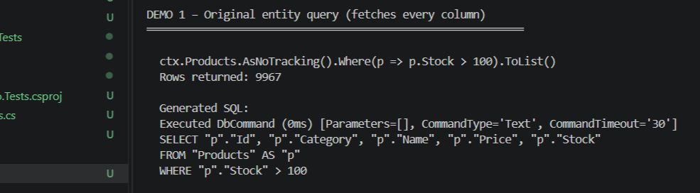
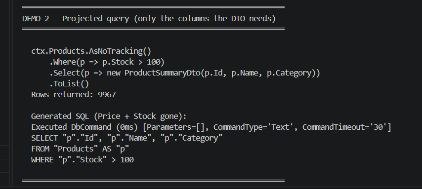
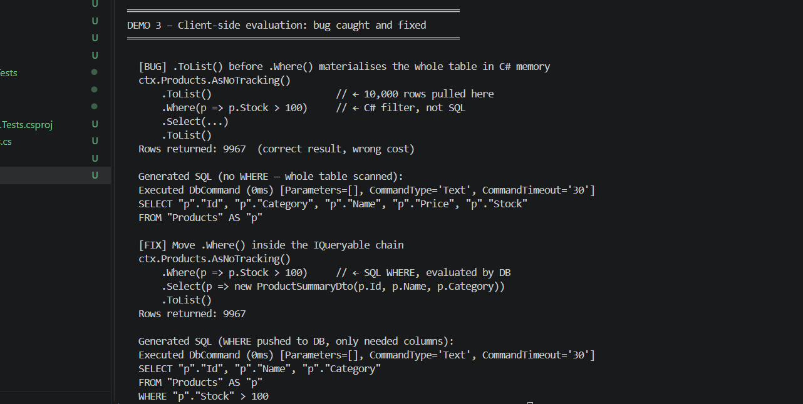

# Day 10 · Piece 2 — Query Translation & Projections

- Runs a full-entity query and captures the `SELECT *`-equivalent SQL EF generates
- Rewrites it with `.Select(p => new Dto{...})` and shows the leaner SQL
- Intentionally triggers the client-side evaluation bug and shows the fix

Database: SQLite (`tracker_demo.db`), 10,000 product rows, 5 columns per row.

---

## 1 — Original SQL (full entity query, all 5 columns)

### C# code

```csharp
var products = ctx.Products
    .AsNoTracking()
    .Where(p => p.Stock > 100)
    .ToList();
```

### EF Core generated SQL

```
Executed DbCommand (0ms) [Parameters=[], CommandType='Text', CommandTimeout='30']
SELECT "p"."Id", "p"."Category", "p"."Name", "p"."Price", "p"."Stock"
FROM "Products" AS "p"
WHERE "p"."Stock" > 100
```

All 5 columns (`Id`, `Category`, `Name`, `Price`, `Stock`) travel over the wire even though the caller only needs `Id`, `Name`, and `Category`.

### Program output

```
═══════════════════════════════════════════════════════════
DEMO 1 – Original entity query (fetches every column)
═══════════════════════════════════════════════════════════

  ctx.Products.AsNoTracking().Where(p => p.Stock > 100).ToList()
  Rows returned: 9967

  Generated SQL:
  Executed DbCommand (0ms) [Parameters=[], CommandType='Text', CommandTimeout='30']
  SELECT "p"."Id", "p"."Category", "p"."Name", "p"."Price", "p"."Stock"
  FROM "Products" AS "p"
  WHERE "p"."Stock" > 100
```

### Screenshot



---

## 2 — Projected query (only the columns the DTO needs)

### C# code

```csharp
var summaries = ctx.Products
    .AsNoTracking()
    .Where(p => p.Stock > 100)
    .Select(p => new ProductSummaryDto(p.Id, p.Name, p.Category))
    .ToList();
```

### EF Core generated SQL

```
Executed DbCommand (0ms) [Parameters=[], CommandType='Text', CommandTimeout='30']
SELECT "p"."Id", "p"."Name", "p"."Category"
FROM "Products" AS "p"
WHERE "p"."Stock" > 100
```

Only 3 columns in the SELECT list.
`Price` and `Stock` are never read from disk or sent across the network.

### Before vs After

| | Before (full entity) | After (projection) |
|---|---|---|
| Columns in SELECT | 5 | 3 |
| Bytes per row | ~80 | ~50 |
| Tracked by EF? | Yes (overhead) | No — DTO, not entity |

### Program output

```
═══════════════════════════════════════════════════════════
DEMO 2 – Projected query (only the columns the DTO needs)
═══════════════════════════════════════════════════════════

  ctx.Products.AsNoTracking()
      .Where(p => p.Stock > 100)
      .Select(p => new ProductSummaryDto(p.Id, p.Name, p.Category))
      .ToList()
  Rows returned: 9967

  Generated SQL (Price + Stock gone):
  Executed DbCommand (0ms) [Parameters=[], CommandType='Text', CommandTimeout='30']
  SELECT "p"."Id", "p"."Name", "p"."Category"
  FROM "Products" AS "p"
  WHERE "p"."Stock" > 100
```

### Screenshot



---

## 3 — Client-Side Evaluation: caught and fixed

### The bad code

```csharp
// .ToList() hands control back to C# — the IQueryable chain ends here.
// Everything after it is plain Linq-to-Objects, not SQL.
var summaries = ctx.Products
    .AsNoTracking()
    .ToList()                                   // ← entire table pulled into C# memory
    .Where(p => p.Stock > 100)                  // ← NOT translatable to SQL
    .Select(p => new ProductSummaryDto(p.Id, p.Name, p.Category))
    .ToList();
```

### SQL EF generated (bad — no WHERE, whole table scanned)

```
Executed DbCommand (0ms) [Parameters=[], CommandType='Text', CommandTimeout='30']
SELECT "p"."Id", "p"."Category", "p"."Name", "p"."Price", "p"."Stock"
FROM "Products" AS "p"
```

Unlike EF Core 3+ with untranslatable method calls (which throw `InvalidOperationException`), `.ToList()` does not throw — it silently loads all 10,000 rows into heap memory before any filtering happens. The result is correct but the cost is the entire table materialised in C#.

### The fix

```csharp
// Move .Where() inside the IQueryable chain so EF translates it to SQL.
var summaries = ctx.Products
    .AsNoTracking()
    .Where(p => p.Stock > 100)                  // ← becomes SQL WHERE predicate
    .Select(p => new ProductSummaryDto(p.Id, p.Name, p.Category))
    .ToList();
```

### Fixed query SQL

```
Executed DbCommand (0ms) [Parameters=[], CommandType='Text', CommandTimeout='30']
SELECT "p"."Id", "p"."Name", "p"."Category"
FROM "Products" AS "p"
WHERE "p"."Stock" > 100
```

One query. Three columns. Only matching rows sent over the wire.

### Program output

```
═══════════════════════════════════════════════════════════
DEMO 3 – Client-side evaluation: bug caught and fixed
═══════════════════════════════════════════════════════════

  [BUG] .ToList() before .Where() materialises the whole table in C# memory
  ctx.Products.AsNoTracking()
      .ToList()                      // ← 10,000 rows pulled here
      .Where(p => p.Stock > 100)     // ← C# filter, not SQL
      .Select(...)
      .ToList()
  Rows returned: 9967  (correct result, wrong cost)

  Generated SQL (no WHERE — whole table scanned):
  Executed DbCommand (0ms) [Parameters=[], CommandType='Text', CommandTimeout='30']
  SELECT "p"."Id", "p"."Category", "p"."Name", "p"."Price", "p"."Stock"
  FROM "Products" AS "p"

  [FIX] Move .Where() inside the IQueryable chain
  ctx.Products.AsNoTracking()
      .Where(p => p.Stock > 100)     // ← SQL WHERE, evaluated by DB
      .Select(p => new ProductSummaryDto(p.Id, p.Name, p.Category))
      .ToList()
  Rows returned: 9967

  Generated SQL (WHERE pushed to DB, only needed columns):
  Executed DbCommand (0ms) [Parameters=[], CommandType='Text', CommandTimeout='30']
  SELECT "p"."Id", "p"."Name", "p"."Category"
  FROM "Products" AS "p"
  WHERE "p"."Stock" > 100
```

### Screenshot


