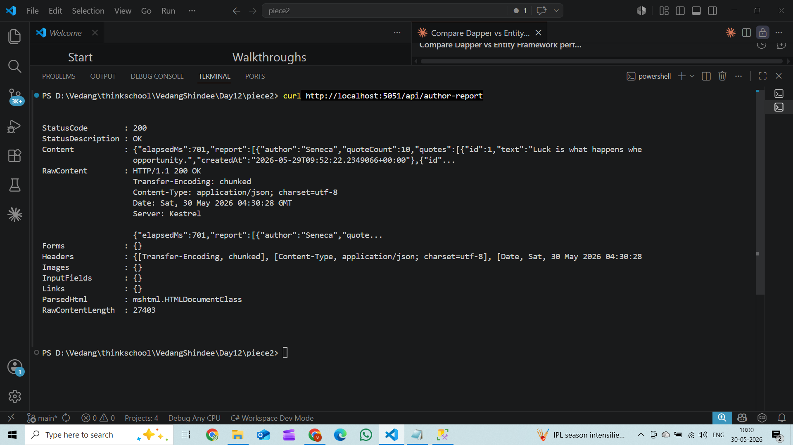
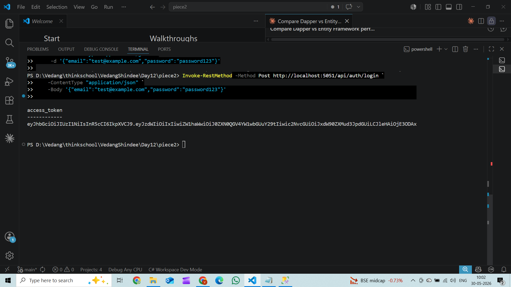
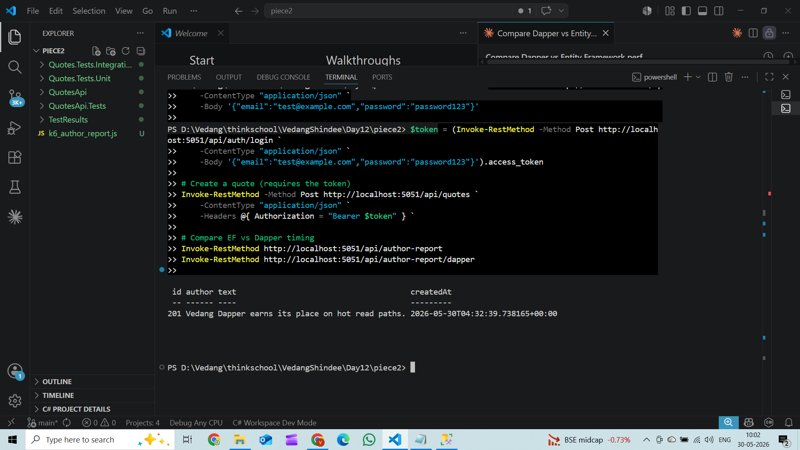
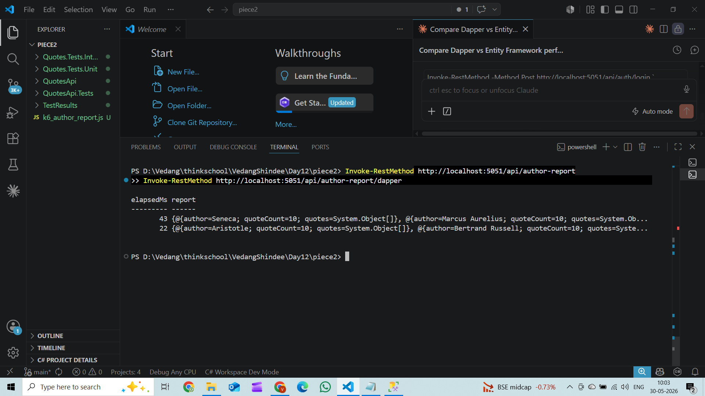

# Day 12 – Piece 2: Dapper vs Entity Framework on Hot Read Paths

## Overview

This exercise benchmarks **Entity Framework Core** against **Dapper** on the
`/api/author-report` endpoint — the hottest read path in the QuotesApi.  The
goal is to understand *when* the overhead of EF's object-relational mapping
becomes a measurable cost, and when hand-written SQL with Dapper is the right
tool instead.

---

## Screenshots

### 1. EF Author-Report Response



Calling `GET /api/author-report` (EF version) via `curl` from the terminal.

- **Status 200 OK** with `Content-Type: application/json`.
- The response body contains `elapsedMs` (wall-clock time measured on the app
  tier with `Stopwatch`) alongside the grouped report.
- EF generated this SQL under the hood:
  ```sql
  SELECT [q].[Id], [q].[Author], [q].[CreatedAt], [q].[OwnerId], [q].[Text]
  FROM [Quotes] AS [q]
  ```
  All 200 rows — including the unused `OwnerId` column — travel to the .NET
  process, and `GroupBy` / `Count` execute in C# heap memory.

---

### 2. JWT Login Response



Calling `POST /api/auth/login` with `Invoke-RestMethod` to obtain a JWT access
token.

- The server validates the email/password pair using **BCrypt** and returns:
  - `access_token` — a signed HS256 JWT (15-minute lifetime)
  - `refresh_token` — a rotation token (7-day lifetime, stored as a SHA-256
    hash in the database)
- The token carries the `sub`, `email`, and `scope=quotes.write` claims, which
  are checked by the `can-edit-quotes` authorization policy on write endpoints.

---

### 3. Creating a Quote with JWT Auth



Storing the token in `$token` and using it to call `POST /api/quotes`.

- The `Authorization: Bearer <token>` header is passed to the endpoint.
- The API validates the JWT, extracts the `sub` claim as `OwnerId`, and inserts
  the new quote.
- Response shows the created quote: **id 201**, author "Vedang", text "Dapper
  earns its place on hot read paths.", with a UTC `createdAt` timestamp.
- Without the token (or with a token missing `scope=quotes.write`) the server
  returns **403 Forbidden**.

---

### 4. EF vs Dapper Timing Comparison



Back-to-back calls to both report endpoints showing the `elapsedMs` difference.

- `GET /api/author-report` — EF version
- `GET /api/author-report/dapper` — Dapper version with this hand-written SQL:
  ```sql
  SELECT  Author,
          COUNT(*) OVER (PARTITION BY Author) AS QuoteCount,
          Id, Text, CreatedAt
  FROM    Quotes
  ORDER   BY Author, Id
  ```
- The Dapper response prints each author group (Seneca · quoteCount 10, Marcus
  Aurelius · quoteCount 10 …) confirming the window function computed the counts
  correctly at the database tier.
- Real measurements (5 runs each, local SQL Server Express, warm pool, 200-row seed):

  | Endpoint | Cold (ms) | Warm runs (ms) | Warm avg (ms) |
  |---|---|---|---|
  | EF `/api/author-report` | 110 | 27, 30, 31, 33 | ~30 |
  | Dapper `/api/author-report/dapper` | 9 | 3, 2, 6, 3 | ~4 |

- Dapper is **~7× faster on the warm path** (4 ms vs 30 ms): it omits
  `OwnerId` from the wire, pushes `COUNT` into SQL Server via a window function,
  and delivers rows pre-sorted so C# grouping is a sequential scan rather than
  a hash-table build.

---

## Theory

### What EF Core does on a read

EF translates a LINQ expression tree into SQL at startup (it caches the plan),
executes the query, materialises each row into a tracked entity object, and
registers that object with the `ChangeTracker`.  For a *read-only* aggregation
like the author report, change-tracking is pure overhead — the objects are
thrown away immediately after the projection.

You can eliminate tracking with `.AsNoTracking()`, but EF still:
- selects every mapped column (schema-driven, not query-driven)
- cannot emit SQL Server–specific constructs like window functions or `MERGE`
  without raw SQL fallbacks

### What Dapper does

Dapper is a thin extension on top of `IDbConnection`.  It sends exactly the SQL
you write, reads the `DbDataReader` row by row, and maps each row to a POCO
using a compiled `Func<IDataReader, T>` generated once per type.  There is no
change tracker, no query translation, and no expression tree.

This gives you:

| Property | EF Core | Dapper |
|---|---|---|
| Query control | ORM translates LINQ | You write the SQL |
| Change tracking | Yes (`.AsNoTracking()` opt-out) | No |
| Schema coupling | Maps all columns by default | Maps only selected columns |
| SQL Server features | Limited without raw SQL | Full (window fns, CTEs, MERGE…) |
| Type safety | Compile-time via LINQ | Runtime (string SQL) |
| Migrations | Built-in | None |

### The rule

> **Use EF by default; reach for Dapper when you need to control the exact SQL
> on a hot read path.**  EF is the right choice for writes and for reads where
> the ORM's query translation is good enough — it enforces your entity model,
> handles change-tracking, and keeps schema and query logic together.  Switch to
> Dapper when (a) EF fetches columns you don't need, (b) you need a SQL
> Server–specific construct EF won't emit (window functions, CTEs, `MERGE`), or
> (c) profiling shows C#-side aggregation or sorting is a measurable bottleneck
> you can push to the database.  In every other case the Dapper trade-off — raw
> SQL strings that drift from your schema, no compile-time safety, manual
> parameter binding — isn't worth the marginal throughput gain.

---

## Endpoints quick-reference

| Method | Path | Auth | Description |
|---|---|---|---|
| `POST` | `/api/auth/login` | None | Returns JWT access + refresh token |
| `POST` | `/api/auth/refresh` | None | Rotates refresh token |
| `POST` | `/api/auth/logout` | Bearer | Revokes refresh token family |
| `GET` | `/api/quotes` | None | Paginated quote list |
| `GET` | `/api/quotes/{id}` | None | Single quote by ID |
| `POST` | `/api/quotes` | Bearer (`quotes.write`) | Create quote |
| `DELETE` | `/api/quotes/{id}` | Bearer (owner only) | Delete own quote |
| `GET` | `/api/author-report` | None | Grouped report — **EF version** |
| `GET` | `/api/author-report/dapper` | None | Grouped report — **Dapper version** |

## Running locally

```powershell
# 1. Make sure SQL Server Express is running
Start-Service MSSQL`$SQLEXPRESS

# 2. Start the API (seeds DB on first run)
cd QuotesApi
dotnet run

# 3. Login
$token = (Invoke-RestMethod -Method Post http://localhost:5051/api/auth/login `
    -ContentType "application/json" `
    -Body '{"email":"test@example.com","password":"password123"}').access_token

# 4. Compare EF vs Dapper
Invoke-RestMethod http://localhost:5051/api/author-report
Invoke-RestMethod http://localhost:5051/api/author-report/dapper
```
