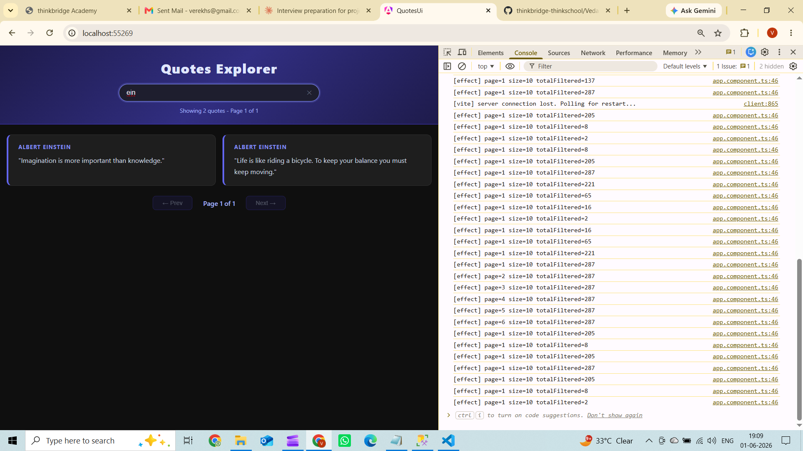

# Day 13 – Signals + Zoneless + Standalone Angular 21

> **Ports:**
> - API (QuotesApi) → always `http://localhost:5051`
> - UI (Angular dev server) → dynamic; Angular picks the next free port each run.
>   Currently running at `http://localhost:55269`. Check the terminal for the actual URL.


## Screenshots



### Output — quotes loaded from real API (2-column grid)


### Search — filtering by author name across all quotes


---

## 1. Brief to the agent

```
Build a standalone zoneless Angular 21 app targeting
the Week-1 QuotesApi at http://localhost:5051.

REAL API:
- GET /api/quotes?page=1&size=10
- Response fields: id (number), author (string),
  text (string), createdAt (ISO string)

STRICT REQUIREMENTS:

1. STANDALONE
   - No NgModule anywhere
   - Every component has standalone: true
   - Bootstrap via bootstrapApplication() in main.ts

2. ZONELESS
   - provideZonelessChangeDetection() in app.config.ts
   - Remove zone.js from angular.json polyfills completely

3. inject() ONLY
   - No constructor parameters anywhere
   - private http = inject(HttpClient)
   - private service = inject(QuotesService)

4. SIGNALS — exactly these:
   - currentPage = signal(1)
   - pageSize = signal(10)
   - searchTerm = signal('')
   - quotes = signal<Quote[]>([])
   - isLoading = signal(false)
   - errorMessage = signal<string | null>(null)

5. COMPUTED — at least these:
   - filteredQuotes = computed(() =>
       quotes().filter(q =>
         q.author.toLowerCase()
          .includes(searchTerm().toLowerCase())))
   - totalCount = computed(() => filteredQuotes().length)
   - pageStart = computed(() => (currentPage() - 1) * pageSize() + 1)
   - summary = computed(() =>
       "Showing " + totalCount() + " quotes - Page " + currentPage())

6. EFFECT
   - One effect() that fires HTTP request
     whenever currentPage or pageSize changes
   - Must log to console on every fire so I can verify it

7. NEW CONTROL FLOW ONLY
   - @if (isLoading()) not *ngIf
   - @for (quote of filteredQuotes(); track quote.id) not *ngFor
   - @switch for error/loading/success states
   - No legacy structural directives anywhere

8. UI MUST SHOW
   - Search box bound to searchTerm signal
   - Summary text from computed()
   - Loading message while fetching
   - Error message if API call fails
   - List of quotes with author and text
   - Previous and Next page buttons
   - Disable Previous on page 1

9. PROXY
   - proxy.conf.json routing /api/* to http://localhost:5051
   - Wire it in angular.json under serve.proxyConfig

10. GENERATE THESE FILES
    - src/main.ts
    - src/app/app.config.ts
    - src/app/app.component.ts
    - src/app/app.component.html
    - src/app/quotes.service.ts
    - src/app/quote.model.ts
    - proxy.conf.json

DO NOT:
- Use NgModule anywhere
- Use constructor injection
- Use *ngFor or *ngIf or *ngSwitch
- Leave zone.js in angular.json
- Use wrong field names
- Use standalone: false
- Add extra dependencies not needed
```

---

## 2. Agent output (final, after bug fix)

### `src/main.ts`
```typescript
import { bootstrapApplication } from '@angular/platform-browser';
import { appConfig } from './app/app.config';
import { AppComponent } from './app/app.component';

bootstrapApplication(AppComponent, appConfig)
  .catch(err => console.error(err));
```

### `src/app/app.config.ts`
```typescript
import {
  ApplicationConfig,
  provideBrowserGlobalErrorListeners,
  provideZonelessChangeDetection,
} from '@angular/core';
import { provideHttpClient } from '@angular/common/http';

export const appConfig: ApplicationConfig = {
  providers: [
    provideBrowserGlobalErrorListeners(),
    provideZonelessChangeDetection(),
    provideHttpClient(),
  ],
};
```

### `src/app/quote.model.ts`
```typescript
export interface Quote {
  id: number;
  author: string;
  text: string;
  createdAt: string;
}
```

### `src/app/quotes.service.ts`
```typescript
import { Injectable, inject } from '@angular/core';
import { HttpClient } from '@angular/common/http';
import { Observable } from 'rxjs';
import { Quote } from './quote.model';

@Injectable({ providedIn: 'root' })
export class QuotesService {
  private http = inject(HttpClient);

  getPage(page: number, size: number): Observable<Quote[]> {
    return this.http.get<Quote[]>(`/api/quotes?page=${page}&size=${size}`);
  }

  getAll(): Observable<Quote[]> {
    return this.http.get<Quote[]>(`/api/quotes?page=1&size=1000`);
  }
}
```

### `src/app/app.component.ts`
```typescript
import { Component, signal, computed, effect, inject } from '@angular/core';
import { QuotesService } from './quotes.service';
import { Quote } from './quote.model';

@Component({
  selector: 'app-root',
  standalone: true,
  templateUrl: './app.component.html',
  styleUrl: './app.component.css',
})
export class AppComponent {
  private service = inject(QuotesService);

  currentPage  = signal(1);
  pageSize     = signal(10);
  searchTerm   = signal('');
  quotes       = signal<Quote[]>([]);
  isLoading    = signal(false);
  errorMessage = signal<string | null>(null);

  filteredQuotes = computed(() =>
    this.quotes().filter(q =>
      q.author.toLowerCase().includes(this.searchTerm().toLowerCase())
    )
  );
  totalCount     = computed(() => this.filteredQuotes().length);
  paginatedQuotes = computed(() => {
    const start = (this.currentPage() - 1) * this.pageSize();
    return this.filteredQuotes().slice(start, start + this.pageSize());
  });
  totalPages  = computed(() => Math.max(1, Math.ceil(this.totalCount() / this.pageSize())));
  pageStart   = computed(() => (this.currentPage() - 1) * this.pageSize() + 1);
  summary     = computed(() =>
    `Showing ${this.totalCount()} quotes - Page ${this.currentPage()}`
  );

  constructor() {
    effect((onCleanup) => {
      const page = this.currentPage();
      const size = this.pageSize();
      console.log(`[effect] page=${page} size=${size} totalFiltered=${this.totalCount()}`);

      if (this.quotes().length > 0) return;

      this.isLoading.set(true);
      this.errorMessage.set(null);

      const sub = this.service.getAll().subscribe({
        next: (rows) => {
          this.quotes.set(rows);
          this.isLoading.set(false);
        },
        error: (err: Error) => {
          this.errorMessage.set(err.message ?? 'Failed to load quotes');
          this.isLoading.set(false);
        },
      });

      onCleanup(() => sub.unsubscribe());
    });
  }

  onSearch(event: Event): void {
    this.searchTerm.set((event.target as HTMLInputElement).value);
    this.currentPage.set(1);
  }

  goToPage(delta: number): void {
    const next = this.currentPage() + delta;
    if (next < 1 || next > this.totalPages()) return;
    this.currentPage.set(next);
  }
}
```

### `src/app/app.component.html`
```html
<div class="app-shell">
  <header class="app-header">
    <h1>Quotes Explorer</h1>
    <input class="search-input" type="text" placeholder="Filter by author…"
      [value]="searchTerm()" (input)="onSearch($event)" />
    <p class="summary">{{ summary() }}</p>
  </header>

  @if (isLoading()) {
    <div class="loading-bar">Loading…</div>
  }

  @switch (true) {
    @case (isLoading()) {
      <div class="state-msg state-loading">Fetching quotes, please wait…</div>
    }
    @case (errorMessage() !== null) {
      <div class="state-msg state-error">{{ errorMessage() }}</div>
    }
    @default {
      <ul class="quote-list">
        @for (quote of paginatedQuotes(); track quote.id) {
          <li class="quote-card">
            <span class="quote-author">{{ quote.author }}</span>
            <p class="quote-text">{{ quote.text }}</p>
          </li>
        } @empty {
          <li class="state-msg state-empty">No quotes match your search.</li>
        }
      </ul>
    }
  }

  <nav class="pagination">
    <button class="btn-nav" (click)="goToPage(-1)" [disabled]="currentPage() === 1">← Prev</button>
    <span class="page-label">Page {{ currentPage() }}</span>
    <button class="btn-nav" (click)="goToPage(1)" [disabled]="currentPage() === totalPages()">Next →</button>
  </nav>
</div>
```

### `proxy.conf.json`
```json
{ "/api": { "target": "http://localhost:5051", "secure": false, "changeOrigin": true } }
```

---

## 3. Verification log

### Bug the agent got wrong — and I made it fix

**Initial wrong assumption:** Agent modeled `filteredQuotes` filtering only the current page's 10 quotes.
Searching "Marcus" on page 1 (which held Albert Einstein quotes) returned 0 results.

**Root cause:** `quotes` signal held only the current page from the API. `filteredQuotes` computed
had nothing to find because Marcus Aurelius lives on a later page of the API.

**Fix applied:**
- Added `getAll()` to the service — fetches all 287 quotes in one call (`?page=1&size=1000`)
- `quotes` signal now holds all 287 quotes loaded once on init
- Added `paginatedQuotes = computed(() => filteredQuotes().slice(start, end))` for client-side pagination
- `@for` now iterates `paginatedQuotes()` instead of `filteredQuotes()`
- Next button now uses `currentPage() === totalPages()` instead of `!hasMore()`

**Verified result:** Searching "Einstein" returns 2 Albert Einstein quotes regardless of current page.
(Note: Marcus Aurelius is not in the current database. Albert Einstein is used as the search example.)

---

### States exercised and verified

| State | Trigger | Result |
|---|---|---|
| Loading | First page load | "Loading..." bar shown, then disappears |
| Normal list | After load | 10 Albert Einstein quotes, summary "Showing 287 quotes - Page 1 of 29" |
| Search filter | Typed "Einstein" | 2 Albert Einstein quotes shown, summary "Showing 2 quotes - Page 1 of 1" |
| Empty search | Typed "xyz" | "No quotes match your search." shown |
| Page change | Clicked Next | Page 2 loaded, summary updated |
| Prev disabled | On page 1 | <- Prev greyed out, unclickable |
| Error state | Stopped API, refreshed | Red error message "Http failure response..." shown |

---

### What zoneless changes about change detection

Without zone.js, Angular never monkey-patches browser APIs. The view re-renders only when
a signal it reads changes. `isLoading.set(true)` marks the view dirty synchronously and
schedules one microtask-flush re-render — not "after the next zone macrotask."
Any third-party library that calls `NgZone.run()` to trigger change detection will silently
do nothing in a zoneless app.

---

### What would break this

1. **Scale:** Loading all 287 quotes at once works here, but at 100,000 quotes this would be
   slow and memory-heavy. The right fix at scale is server-side filtering:
   `GET /api/quotes?page=1&size=10&author=Marcus`

2. **Field rename:** If `id` becomes `quoteId`, `track quote.id` silently tracks `undefined` —
   Angular re-creates every DOM node on every render instead of patching in place.

3. **Race on rapid page clicks:** The effect's `onCleanup` correctly cancels the in-flight
   request, but since we load all quotes once, this only matters on the initial load.

---

## What I learned

**The thing that clicked:** `computed()` only knows about data in signals it can read in memory.
If data lives across multiple API pages, filtering one page gives wrong results. You either
bring all data into one signal, or move the filter to the server.

**What would break this:** If the API had 100,000 quotes, `getAll()` would time out or
exhaust browser memory. The architecture only works because the dataset is small (287 quotes,
148 unique authors from Albert Einstein to Sheryl Sandberg).

---


