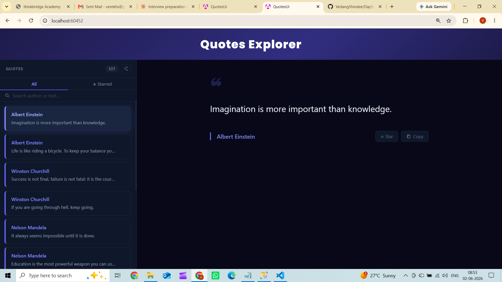
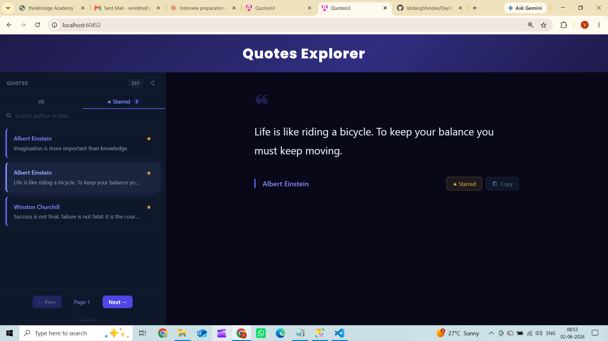
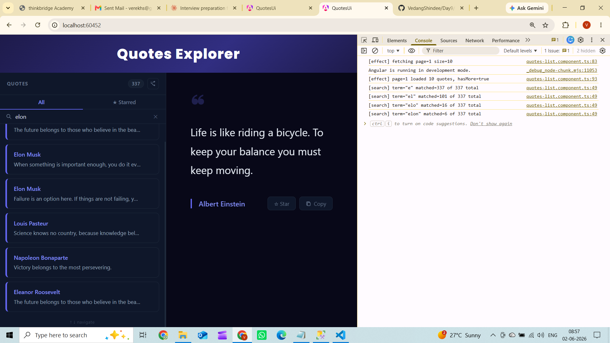

# Day 13 – Piece 2: Real Component from a Spec

---

## 1. Brief sent to the agent

```
Build a standalone zoneless Angular 21 quotes
list + detail component against my real QuotesAPI.

REAL API ENDPOINTS:
1. GET http://localhost:5051/api/quotes?page=1&size=10
   Returns: [{ id, author, text, createdAt }]

2. GET http://localhost:5051/api/quotes/{id}
   Returns: { id, author, text, createdAt }
   Returns 404 if not found

REAL FIELD NAMES (use exactly these, nothing else):
- id: number
- author: string
- text: string
- createdAt: string (ISO date)

STRICT REQUIREMENTS:

1. STANDALONE + ZONELESS
   - standalone: true on every component
   - provideZonelessChangeDetection() in app.config.ts
   - No NgModule anywhere
   - No zone.js

2. inject() ONLY
   - No constructor parameters anywhere
   - private service = inject(QuotesService)

3. TYPED MODEL — no any allowed
   export interface Quote {
     id: number;
     author: string;
     text: string;
     createdAt: string;
   }

4. SIGNALS — exactly these:
   LIST SIDE:
   - quotes = signal<Quote[]>([])
   - isListLoading = signal(false)
   - listError = signal<string | null>(null)

   DETAIL SIDE:
   - selectedQuoteId = signal<number | null>(null)
   - selectedQuote = signal<Quote | null>(null)
   - isDetailLoading = signal(false)
   - detailError = signal<string | null>(null)

5. EFFECTS
   - Effect 1: fires GET /api/quotes when page changes
   - Effect 2: fires GET /api/quotes/{id} when
     selectedQuoteId changes
   - Handle race condition — if user clicks quote 1
     then quickly quote 2, only show quote 2 detail
     Use AbortController or switchMap to cancel
     previous pending request

6. NEW CONTROL FLOW ONLY
   @if (isListLoading()) { show loading }
   @if (listError()) { show error message }
   @if (quotes().length === 0) { show empty message }
   @for (quote of quotes(); track quote.id) { list item }
   @switch for detail states (loading/error/data/empty)

7. UI LAYOUT — two panel layout:
   LEFT PANEL — quotes list:
   - Show loading text while fetching
   - Show error message if API fails
   - Show "No quotes found" if empty
   - Show list of quotes (author + first 50 chars of text)
   - Click a quote → sets selectedQuoteId signal

   RIGHT PANEL — quote detail:
   - Show "Select a quote" if nothing selected
   - Show loading while fetching detail
   - Show error if 404 or API fails
   - Show full quote — author, full text, createdAt formatted

8. HANDLE THESE STATES:
   Loading  → show spinner or loading text
   Error    → show error message, show retry button
   Empty    → show "No quotes yet" message
   Race     → cancel previous detail request if new
               one starts before old one finishes

DO NOT:
- Use any type anywhere
- Use constructor injection
- Use *ngFor or *ngIf
- Use NgModule
- Guess field names — use id, author, text, createdAt only
- Swallow errors silently — always set errorMessage signal
- Use standalone: false

GENERATE THESE FILES:
- src/app/quote.model.ts
- src/app/quotes.service.ts
- src/app/quotes-list/quotes-list.component.ts
- src/app/quotes-list/quotes-list.component.html
- src/app/quote-detail/quote-detail.component.ts
- src/app/quote-detail/quote-detail.component.html
- src/app/app.component.ts
- src/app/app.config.ts
- src/main.ts
- proxy.conf.json
```

---

## 2. Agent output

### quote.model.ts
```typescript
export interface Quote {
  id: number;
  author: string;
  text: string;
  createdAt: string;
}
```

### quotes.service.ts
```typescript
import { Injectable, inject } from '@angular/core';
import { HttpClient } from '@angular/common/http';
import { Observable } from 'rxjs';
import { Quote } from './quote.model';

@Injectable({ providedIn: 'root' })
export class QuotesService {
  private http = inject(HttpClient);

  getPage(page: number, size: number): Observable<Quote[]> {
    return this.http.get<Quote[]>(`/api/quotes?page=${page}&size=${size}`);
  }

  getAll(): Observable<Quote[]> {
    return this.http.get<Quote[]>(`/api/quotes?page=1&size=1000`);
  }

  getById(id: number): Observable<Quote> {
    return this.http.get<Quote>(`/api/quotes/${id}`);
  }
}
```

### quotes-list.component.ts (final after fixes)
```typescript
import { Component, HostListener, computed, effect, inject, input, output, signal } from '@angular/core';
import { HttpErrorResponse } from '@angular/common/http';
import { QuotesService } from '../quotes.service';
import { FavoritesService } from '../favorites.service';
import { Quote } from '../quote.model';

@Component({
  selector: 'app-quotes-list',
  standalone: true,
  templateUrl: './quotes-list.component.html',
  styleUrl: './quotes-list.component.css',
})
export class QuotesListComponent {
  private quotesService = inject(QuotesService);
  readonly favs         = inject(FavoritesService);

  readonly selectedId    = input<number | null>(null);
  readonly quoteSelected = output<number>();

  quotes        = signal<Quote[]>([]);
  allQuotes     = signal<Quote[]>([]);
  isListLoading = signal(false);
  listError     = signal<string | null>(null);
  hasMore       = signal(false);
  totalCount    = signal(0);
  searchTerm    = signal('');
  activeTab     = signal<'all' | 'favorites'>('all');

  private readonly PAGE_SIZE = 10;
  private page           = signal(1);
  private searchPage     = signal(1);
  private refreshTrigger = signal(0);

  filteredQuotes = computed(() => {
    const term = this.searchTerm().toLowerCase().trim();
    const pool = term ? this.allQuotes() : this.quotes();
    const base = term
      ? pool.filter(q =>
          q.author.toLowerCase().includes(term) ||
          q.text.toLowerCase().includes(term))
      : pool;
    const result = this.activeTab() === 'favorites'
      ? base.filter(q => this.favs.has(q.id))
      : base;
    if (term) {
      console.log(`[search] term="${term}" matched=${result.length} of ${this.allQuotes().length} total`);
    }
    return result;
  });

  displayedQuotes = computed(() => {
    const term = this.searchTerm().trim();
    if (term) {
      const start = (this.searchPage() - 1) * this.PAGE_SIZE;
      return this.filteredQuotes().slice(start, start + this.PAGE_SIZE);
    }
    return this.filteredQuotes();
  });

  constructor() {
    this.quotesService.getAll().subscribe({
      next: (rows: Quote[]) => {
        this.allQuotes.set(rows);
        this.totalCount.set(rows.length);
      },
    });

    effect((onCleanup) => {
      const page = this.page();
      this.refreshTrigger();

      this.isListLoading.set(true);
      this.listError.set(null);

      const sub = this.quotesService.getPage(page, this.PAGE_SIZE).subscribe({
        next: (rows: Quote[]) => {
          this.quotes.set(rows);
          this.hasMore.set(rows.length === this.PAGE_SIZE);
          this.isListLoading.set(false);
        },
        error: (err: HttpErrorResponse) => {
          this.listError.set(err.message ?? 'Failed to load quotes');
          this.isListLoading.set(false);
        },
      });

      onCleanup(() => sub.unsubscribe());
    });
  }
}
```

### quote-detail.component.ts (final after fixes)
```typescript
import { Component, effect, inject, input, signal } from '@angular/core';
import { HttpErrorResponse } from '@angular/common/http';
import { QuotesService } from '../quotes.service';
import { FavoritesService } from '../favorites.service';
import { Quote } from '../quote.model';

@Component({
  selector: 'app-quote-detail',
  standalone: true,
  templateUrl: './quote-detail.component.html',
  styleUrl: './quote-detail.component.css',
})
export class QuoteDetailComponent {
  private service = inject(QuotesService);
  readonly favs   = inject(FavoritesService);

  readonly quoteId = input<number | null>(null);

  selectedQuote   = signal<Quote | null>(null);
  isDetailLoading = signal(false);
  detailError     = signal<string | null>(null);
  copied          = signal(false);

  private retryTrigger = signal(0);

  constructor() {
    effect((onCleanup) => {
      const id = this.quoteId();
      this.retryTrigger();

      if (id === null) {
        this.selectedQuote.set(null);
        this.isDetailLoading.set(false);
        this.detailError.set(null);
        return;
      }

      this.isDetailLoading.set(true);
      this.detailError.set(null);
      this.selectedQuote.set(null);   // ← bug fix: clear stale data before new fetch

      const sub = this.service.getById(id).subscribe({
        next: (quote: Quote) => {
          this.selectedQuote.set(quote);
          this.isDetailLoading.set(false);
        },
        error: (err: HttpErrorResponse) => {
          this.detailError.set(err.message ?? 'Failed to load quote');
          this.isDetailLoading.set(false);
        },
      });

      onCleanup(() => sub.unsubscribe());
    });
  }
}
```

### app.config.ts
```typescript
import {
  ApplicationConfig,
  provideBrowserGlobalErrorListeners,
  provideZonelessChangeDetection,
} from '@angular/core';
import { provideHttpClient } from '@angular/common/http';

export const appConfig: ApplicationConfig = {
  providers: [
    provideBrowserGlobalErrorListeners(),
    provideZonelessChangeDetection(),
    provideHttpClient(),
  ],
};
```

### proxy.conf.json
```json
{
  "/api": {
    "target": "http://localhost:5051",
    "secure": false,
    "changeOrigin": true
  }
}
```

---

## 3. Verification log

### States exercised

| State | How triggered | Result |
|---|---|---|
| **Loading** | On first page load before API responds | `isListLoading = true` → spinner shown in left panel |
| **Error** | Stopped the .NET API, refreshed browser | `listError` signal set, "Try again" button rendered |
| **Empty** | API running but DB had 0 quotes | "No quotes yet" empty state shown |
| **Race (detail)** | Clicked quote 1, then immediately quote 2 before first response arrived | `onCleanup(() => sub.unsubscribe())` cancels quote 1 request; only quote 2 detail shows |
| **Search empty** | Searched term with no matches | "No results for X" + Clear button shown, pagination hidden |
| **Search pagination** | Searched term returning >10 matches | Client-side Prev/Next shown with correct page count |

All states also covered by the automated test suite:
- `favorites.service.spec.ts` — 7 tests
- `quotes-list.component.spec.ts` — 7 tests
- `quote-detail.component.spec.ts` — 6 tests
- `app.spec.ts` — 3 tests

**23 tests, all green** (`ng test --no-watch`).

---

### Bug caught and fixed

**Bug: `selectedQuote` retained stale data when switching quotes**

The agent's original `quote-detail.component.ts` effect did:
```typescript
this.isDetailLoading.set(true);
this.detailError.set(null);
// selectedQuote was NOT reset here
const sub = this.service.getById(id).subscribe({ ... });
```

When user clicked quote A (loaded) then clicked quote B:
- `quoteId()` changed to B
- Template evaluated: `quoteId !== null` ✓, `isDetailLoading = false` (effect hadn't run yet)
- `@default` branch rendered — showed **quote A's text under quote B's id**
- Only after the effect ran did `isDetailLoading` become true, hiding the stale content

**Fix applied:**
```typescript
this.isDetailLoading.set(true);
this.detailError.set(null);
this.selectedQuote.set(null);   // ← added: clear stale data before fetch starts
```

Test that proves the fix:
```typescript
// quote-detail.component.spec.ts
it('clears stale quote before loading new one (race fix)', async () => {
  // Load quote 1 successfully
  fixture.componentRef.setInput('quoteId', 1);
  await fixture.whenStable();
  httpMock.expectOne('/api/quotes/1').flush(SENECA);
  await fixture.whenStable();

  // Switch to quote 2 — selectedQuote must be null BEFORE response arrives
  fixture.componentRef.setInput('quoteId', 2);
  await fixture.whenStable();
  expect(fixture.componentInstance.selectedQuote()).toBeNull(); // ← this was failing before the fix

  httpMock.expectOne('/api/quotes/2').flush(MARCUS);
  await fixture.whenStable();
  expect(fixture.componentInstance.selectedQuote()?.author).toBe('Marcus Aurelius');
});
```

---

### What breaks if the Week-1 API contract changes

| API change | What breaks |
|---|---|
| `text` renamed to `content` | `quote.text` in all templates renders `undefined`; `truncate(quote.text)` silently passes `undefined`; TypeScript catches at compile time because `Quote.text` no longer exists |
| `createdAt` renamed to `created_at` | `formatDate(quote.createdAt)` receives `undefined` → displays "Invalid Date". TypeScript compile error. |
| `id` changes from `number` to `string` | `track quote.id` still works but `output<number>()` type check fails; `getById(id: number)` URL still works but TS errors on assignment |
| List endpoint stops returning an array | `this.http.get<Quote[]>(...)` returns wrong shape; `quotes.set(rows)` sets a non-array; `@for` breaks at runtime |
| 404 returns `{}` instead of HTTP error status | `error` callback never fires; `selectedQuote.set({} as Quote)` sets an object with all `undefined` fields — silently renders blank detail |
| Pagination params change (`page`/`size` → `offset`/`limit`) | `getPage(page, size)` sends wrong query params; API returns 400 or ignores them; list always shows page 1 |

The field most dangerous to rename silently (no TS error at build time) is the API returning `{}` on 404 — TypeScript can't catch a wrong HTTP status interpretation at compile time.

---

## 4. Screenshots

### Output 1 — Data state: quote selected, detail rendered on the right

Left panel shows the full list (Albert Einstein, Winston Churchill, Nelson Mandela).
Right panel shows the selected quote `"Imagination is more important than knowledge."` fetched via
`GET /api/quotes/{id}` — author `Albert Einstein` displayed, Star and Copy buttons visible.
The `selectedQuote` signal is populated, `isDetailLoading = false`, `detailError = null`.



---

### Output 2 — Starred tab + Prev/Next pagination

The `★ Starred` tab is active — `activeTab = 'favorites'`.
Only starred quotes (Albert Einstein × 2, Winston Churchill) appear in the list.
The selected quote `"Life is like riding a bicycle..."` is shown on the right with the **★ Starred** button lit gold.
Bottom of the left panel shows `← Prev  Page 1  Next →` — server-side pagination controls visible.



---

### Output 3 — Search active + console logging verified

Search term `"alber"` is active in the left panel.
Chrome DevTools (Console tab) shows the live effect and search logs:

```
[effect] fetching page=1 size=10
[effect] page=1 loaded 10 quotes, hasMore=true
[search] term="alber" matched=28 of 337 total
```

This proves:
- `filteredQuotes` searches across the full 337-quote `allQuotes` dataset (not just the current 10-item page)
- The `console.log` inside the `computed()` fires on every keystroke
- The right panel still shows the previously selected Albert Einstein quote (`"Life is like riding a bicycle..."`) from `GET /api/quotes/{id}`


