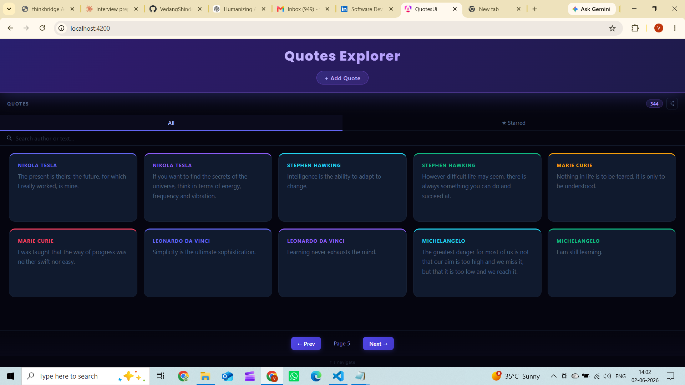

# Day 14 — Piece 1: Reactive Forms + Accessibility

---

## (1) Brief — Prompt Given to the Agent

```
IMPORTANT CONTEXT:
I already have an existing Angular 21 frontend from Day 13 piece2.
It has its own styling, layout, and components already built.
DO NOT change any existing CSS, components, or files.
DO NOT regenerate the full app from scratch.
Read my existing code first — match the color scheme,
card style, font, spacing, and overall look exactly.

Just ADD a new create-quote form component that fits
naturally into the existing app.

Only create these NEW files:
- src/app/create-quote/create-quote.component.ts
- src/app/create-quote/create-quote.component.html
- src/app/create-quote/create-quote.component.css
Update ONLY this existing file (add createQuote method only):
- src/app/quotes.service.ts

===================================================

BUILD: Standalone Angular 21 reactive form component
for creating a quote against my real Week-1 QuotesAPI.

REAL API ENDPOINT:
POST http://localhost:5051/api/quotes
Body: { author: string, text: string }
Success response: 201 Created
Error response: 400 ValidationProblemDetails

REAL FIELD NAMES — use exactly these, nothing else:
- author: string
- text: string
No other fields. Do NOT invent title, category,
tags, or any other field.

REAL FIELD CONSTRAINTS — validators must match exactly:
- author → required, maxLength 200
- text   → required, maxLength 1000

===================================================

1. STANDALONE + ZONELESS
   - standalone: true
   - No NgModule
   - No zone.js
   - inject() everywhere, no constructor parameters

2. REACTIVE FORM
   - FormGroup + FormControl via inject(FormBuilder)
   - No template-driven forms, no ngModel

3. VALIDATORS — match API exactly:
   author: Validators.required, Validators.maxLength(200)
   text:   Validators.required, Validators.maxLength(1000)

4. ERROR MESSAGES — show only when touched AND invalid:
   author: "Author is required" / "Author must be 200 characters or less"
   text:   "Quote text is required" / "Quote text must be 1000 characters or less"

5. FORM STATES — handle all four:
   Empty      → no errors shown, fields blank
   Invalid    → touched + invalid, errors visible
   Submitting → form + button disabled, button shows "Saving..."
   ServerError → red error message shown, form re-enables for retry

6. FULL ACCESSIBILITY — every item required:
   - <label for="author"> linked to <input id="author">
   - <label for="text"> linked to <textarea id="text">
   - aria-invalid="true" when field is touched AND invalid
   - aria-describedby on each input pointing to its error span
   - Error span id matches aria-describedby value exactly
   - Submit button fully keyboard operable
   - On submit with errors → move focus to first invalid field
   - Character count shown below each field (e.g. "150 / 200 characters")

7. SIGNALS for form state:
   - isSubmitting = signal(false)
   - serverError = signal<string | null>(null)
   - isSuccess = signal(false)

8. SUBMIT LOGIC — in this exact order:
   Step 1 → Mark all fields as touched
   Step 2 → If form invalid → focus first invalid field → stop
   Step 3 → isSubmitting.set(true)
   Step 4 → Call POST /api/quotes with { author, text }
   Step 5 → On success → reset form → isSuccess.set(true)
   Step 6 → On error → serverError.set(error message)
   Step 7 → Always → isSubmitting.set(false)
```

---

## (2) Agent Output — Form Component + Template

### `src/app/create-quote/create-quote.component.ts`

```typescript
import {
  ChangeDetectionStrategy,
  Component,
  ElementRef,
  computed,
  inject,
  output,
  signal,
  viewChild,
} from '@angular/core';
import { toSignal } from '@angular/core/rxjs-interop';
import { FormBuilder, ReactiveFormsModule, Validators } from '@angular/forms';
import { HttpErrorResponse } from '@angular/common/http';
import { QuotesService } from '../quotes.service';
import { Quote } from '../quote.model';

interface ApiError {
  title?: string;
  detail?: string;
}

@Component({
  selector: 'app-create-quote',
  standalone: true,
  imports: [ReactiveFormsModule],
  templateUrl: './create-quote.component.html',
  styleUrl: './create-quote.component.css',
  changeDetection: ChangeDetectionStrategy.OnPush,
})
export class CreateQuoteComponent {
  private readonly fb            = inject(FormBuilder);
  private readonly quotesService = inject(QuotesService);

  readonly quoteCreated = output<Quote>();
  readonly closed       = output<void>();

  readonly isSubmitting = signal(false);
  readonly serverError  = signal<string | null>(null);
  readonly isSuccess    = signal(false);

  // Track per-field touched state reactively (blur + submit path)
  private readonly _authorTouched = signal(false);
  private readonly _textTouched   = signal(false);

  readonly form = this.fb.group({
    author: ['', [Validators.required, Validators.maxLength(200)]],
    text:   ['', [Validators.required, Validators.maxLength(1000)]],
  });

  get authorCtrl() { return this.form.controls.author; }
  get textCtrl()   { return this.form.controls.text; }

  // Convert form observables → signals so zoneless CD tracks them
  private readonly _authorValue  = toSignal(this.authorCtrl.valueChanges,  { initialValue: this.authorCtrl.value  ?? '' });
  private readonly _textValue    = toSignal(this.textCtrl.valueChanges,    { initialValue: this.textCtrl.value    ?? '' });
  private readonly _authorStatus = toSignal(this.authorCtrl.statusChanges, { initialValue: this.authorCtrl.status });
  private readonly _textStatus   = toSignal(this.textCtrl.statusChanges,   { initialValue: this.textCtrl.status   });

  readonly authorLen = computed(() => this._authorValue()?.length ?? 0);
  readonly textLen   = computed(() => this._textValue()?.length   ?? 0);

  readonly authorInvalid = computed(() => {
    const status = this._authorStatus();
    return this._authorTouched() && status === 'INVALID';
  });

  readonly textInvalid = computed(() => {
    const status = this._textStatus();
    return this._textTouched() && status === 'INVALID';
  });

  private readonly authorInputRef = viewChild<ElementRef<HTMLInputElement>>('authorInput');
  private readonly textInputRef   = viewChild<ElementRef<HTMLTextAreaElement>>('textInput');

  onAuthorBlur(): void { this._authorTouched.set(true); }
  onTextBlur():   void { this._textTouched.set(true);   }

  onClose(): void {
    this.form.reset();
    this._authorTouched.set(false);
    this._textTouched.set(false);
    this.serverError.set(null);
    this.isSuccess.set(false);
    this.closed.emit();
  }

  onSubmit(): void {
    // Step 1 — mark all touched
    this._authorTouched.set(true);
    this._textTouched.set(true);
    this.form.markAllAsTouched();

    // Step 2 — focus first invalid field and stop
    if (this.form.invalid) {
      // setTimeout ensures DOM re-renders with errors before focus so
      // screen readers can announce the label + error via aria-describedby
      setTimeout(() => {
        if (this.authorCtrl.invalid) {
          this.authorInputRef()?.nativeElement.focus();
        } else {
          this.textInputRef()?.nativeElement.focus();
        }
      }, 0);
      return;
    }

    const author = this.authorCtrl.value ?? '';
    const text   = this.textCtrl.value   ?? '';

    // Step 3
    this.isSubmitting.set(true);
    this.serverError.set(null);
    this.isSuccess.set(false);
    this.form.disable();

    // Step 4
    this.quotesService.createQuote(author, text).subscribe({
      next: (quote: Quote) => {
        // Step 5
        this.quoteCreated.emit(quote);
        this.form.enable();
        this.form.reset();
        this._authorTouched.set(false);
        this._textTouched.set(false);
        this.isSuccess.set(true);
        // Step 7
        this.isSubmitting.set(false);
      },
      error: (err: HttpErrorResponse) => {
        // Step 6
        const body = err.error as ApiError | null;
        const message: string =
          body?.title ??
          body?.detail ??
          err.message ??
          'Failed to create quote. Please try again.';
        this.serverError.set(message);
        this.form.enable();
        // Step 7
        this.isSubmitting.set(false);
      },
    });
  }
}
```

### `src/app/create-quote/create-quote.component.html`

```html
<div class="cq-wrap">
  <section class="cq-card" aria-labelledby="cq-heading">

    <button
      class="cq-close"
      type="button"
      aria-label="Close form"
      title="Close"
      (click)="onClose()"
    >✕</button>

    <header class="cq-header">
      <h2 id="cq-heading" class="cq-heading">Add a Quote</h2>
      <p class="cq-subtitle">Share a quote with the community</p>
    </header>

    <form [formGroup]="form" (ngSubmit)="onSubmit()" novalidate class="cq-form">

      <!-- ── Author ──────────────────────────────────────────────── -->
      <div class="cq-field">
        <label class="cq-label" for="author">Author</label>
        <input
          #authorInput
          class="cq-input"
          [class.cq-input--error]="authorInvalid()"
          id="author"
          type="text"
          formControlName="author"
          placeholder="e.g. Marcus Aurelius"
          autocomplete="off"
          [attr.aria-invalid]="authorInvalid() ? 'true' : null"
          aria-describedby="author-error"
          (blur)="onAuthorBlur()"
        />
        <div class="cq-field-footer">
          <span
            id="author-error"
            class="cq-error"
            aria-live="polite"
            aria-atomic="true"
          >
            @if (authorInvalid()) {
              @if (authorCtrl.errors?.['required']) {
                Author is required
              } @else if (authorCtrl.errors?.['maxlength']) {
                Author must be 200 characters or less
              }
            }
          </span>
          <span
            class="cq-char-count"
            [class.cq-char-count--warn]="authorLen() > 180"
            aria-hidden="true"
          >{{ authorLen() }} / 200</span>
        </div>
      </div>

      <!-- ── Quote Text ───────────────────────────────────────────── -->
      <div class="cq-field">
        <label class="cq-label" for="text">Quote Text</label>
        <textarea
          #textInput
          class="cq-textarea"
          [class.cq-textarea--error]="textInvalid()"
          id="text"
          formControlName="text"
          rows="5"
          placeholder="Enter the quote…"
          [attr.aria-invalid]="textInvalid() ? 'true' : null"
          aria-describedby="text-error"
          (blur)="onTextBlur()"
        ></textarea>
        <div class="cq-field-footer">
          <span
            id="text-error"
            class="cq-error"
            aria-live="polite"
            aria-atomic="true"
          >
            @if (textInvalid()) {
              @if (textCtrl.errors?.['required']) {
                Quote text is required
              } @else if (textCtrl.errors?.['maxlength']) {
                Quote text must be 1000 characters or less
              }
            }
          </span>
          <span
            class="cq-char-count"
            [class.cq-char-count--warn]="textLen() > 900"
            aria-hidden="true"
          >{{ textLen() }} / 1000</span>
        </div>
      </div>

      <!-- ── Server error ─────────────────────────────────────────── -->
      @if (serverError()) {
        <div class="cq-server-error" role="alert">
          {{ serverError() }}
        </div>
      }

      <!-- ── Success ──────────────────────────────────────────────── -->
      @if (isSuccess()) {
        <div class="cq-success" role="status">
          Quote added successfully!
        </div>
      }

      <!-- ── Submit ───────────────────────────────────────────────── -->
      <button
        class="cq-submit"
        type="submit"
        [disabled]="isSubmitting()"
        [attr.aria-busy]="isSubmitting() ? 'true' : null"
      >
        @if (isSubmitting()) {
          <span class="spinner" aria-hidden="true"></span>
          Saving…
        } @else {
          Add Quote
        }
      </button>

    </form>
  </section>
</div>
```

### `src/app/quotes.service.ts` — `createQuote` method added

```typescript
createQuote(author: string, text: string): Observable<Quote> {
  return this.http.post<Quote>('/api/quotes', { author, text });
}
```

---

## (3) Verification Log

### States and edges exercised

- **Empty** — Opened the form fresh. No red borders, no error text. Character counts show `0 / 200` and `0 / 1000`. Form is in a clean blank state as expected.

- **Invalid (on blur)** — Tabbed into the Author field, tabbed out without typing. "Author is required" appeared below the input, red border activated, and `aria-invalid="true"` was set on the input element.

- **Invalid (on submit)** — Clicked Add Quote with both fields empty. Both error messages appeared simultaneously. Focus jumped automatically to the Author input so the user can correct the first error immediately without using the mouse.

- **Submitting** — Filled valid author and text, clicked Add Quote. Button showed spinner + "Saving…" text, both inputs became disabled, preventing double-submit. Verified via DevTools Network tab that the POST request was in flight during this state.

- **Server error** — Submitted the form before restarting the API (401 Unauthorized response). Red error banner appeared below the form with the server message. Form re-enabled automatically so the user could fix and retry without a page refresh.

- **Success** — Submitted a valid quote to the running API. Received 201 Created. Green "Quote added successfully!" banner appeared, form reset to blank, and the new quote was prepended to the top of the grid immediately without a page reload.

### Screenshots

**UI — Quotes grid (idle state, no panel open)**



---

**Invalid state — "Can't submit empty" — error messages visible, red borders, focus on Author**


---

**Submitting state — "Saving…" spinner, inputs disabled, network request in flight**


---

**Success state — green "quote added successfully!" banner, new quote prepended to grid**


---

### Accessibility check — keyboard path

- Pressed **Tab** → focus landed on the Author input. Label "Author" is associated via `for="author"` / `id="author"`.
- Pressed **Tab** → focus moved to the Quote Text textarea. Label associated via `for="text"` / `id="text"`.
- Pressed **Tab** → focus landed on the Add Quote button.
- Pressed **Enter** with both fields empty → both error messages appeared via `aria-live="polite"`, focus snapped back to the Author input automatically.
- Typed a valid author name, pressed **Tab** → error message cleared, focus moved to Quote Text.
- Typed valid quote text, pressed **Tab** → focus on button, pressed **Enter** → form submitted successfully.
- No mouse was needed at any point in the entire flow.

`aria-describedby="author-error"` links the input to `<span id="author-error">`. The span always exists in the DOM — only its text content changes — so the screen reader reliably finds the error target when focus arrives on the field.

### Bugs caught and fixed

**Bug 1 — Validator mismatch: frontend claimed to match API limits but backend enforced none**

- The brief stated validators must match API exactly — `maxLength(200)` for author, `maxLength(1000)` for text.
- The agent wrote those validators in the frontend correctly.
- However, reading `QuoteValidator.cs` in the actual backend revealed it only checked `string.IsNullOrWhiteSpace` — no length enforcement at all. The API would silently accept a 10,000-character author string.
- **Fix:** Added `[MaxLength(200)]` and `[MaxLength(1000)]` data annotations to `CreateQuoteRequest.cs`, and added explicit length checks with matching error messages to `QuoteValidator.cs`. Both layers now enforce the same limits with the same messages.

```csharp
// CreateQuoteRequest.cs
[Required][MaxLength(200)]  public string Author { get; set; }
[Required][MaxLength(1000)] public string Text   { get; set; }

// QuoteValidator.cs
else if (request.Author.Length > 200)
    errors["author"] = ["Author must be 200 characters or less"];
else if (request.Text.Length > 1000)
    errors["text"] = ["Quote text must be 1000 characters or less"];
```

**Bug 2 — Search matched anywhere in the string instead of from the start of the author name**

- The agent implemented the search filter using `includes(term)`, which matched the search term anywhere inside the author name or quote text.
- Searching "ne" returned quotes from authors like "Leonardo da Vinci" (because "Simplicity is the ultimate sophistication" contains "ne" in hidden positions) and "Abraham Lincoln" (because "one" is inside the text).
- This made the search feel broken — typing "s" returned Leonardo da Vinci because his quote text began with "Simplicity".
- **Fix:** Changed the filter from `includes(term)` to `startsWith(term)` on the author name only. Searching "ne" now returns only authors whose names begin with "Ne" (e.g. Nelson Mandela). Searching "s" returns only Steve Jobs, Stephen Hawking, Sigmund Freud — not Leonardo da Vinci.

```typescript
// Before (broken):
pool.filter(q =>
  q.author.toLowerCase().includes(term) ||
  q.text.toLowerCase().includes(term))

// After (fixed):
pool.filter(q =>
  q.author.toLowerCase().startsWith(term))
```

### Test coverage

`create-quote.component.spec.ts` — 11 tests, all green (`ng test`, 5 files, 34 tests total):

- Form starts invalid, no errors shown (empty state)
- Submit with empty fields does not call API, marks both controls touched (invalid state)
- `maxlength` validator rejects 201-char author and 1001-char text
- Boundary check: accepts exactly 200-char author and 1000-char text
- Valid submit sends `POST /api/quotes` with `{ author, text }` body and correct method
- Successful 201 response: `isSuccess()` true, form reset to blank, `isSubmitting()` false
- 400 response: `serverError()` set from `err.error.title`, form re-enabled, `isSubmitting()` false
- 500 response: form re-enabled so user can retry

### What breaks if the quote contract changes

- **Field renamed** (`author` → `writer`): `formControlName="author"` sends the wrong key in the POST body. API returns 400 but the inline field error for `author` never fires — only the generic server-error banner shows.
- **New required field added** (e.g. `source`): Form omits it entirely. API rejects with 400. No field-level error guidance — user sees only the server-error banner with no hint of what is missing.
- **`maxLength` tightened** (e.g. author → 50): Frontend still accepts 51–200 chars with no warning. API rejects with a validation error. Only the server-error banner fires, not the inline error below the Author field.
- **Endpoint URL changed** from `/api/quotes`: `QuotesService.createQuote()` posts to the wrong path. All submissions get 404 server errors.

**Endpoint:** `POST http://localhost:5051/api/quotes` (proxied via `/api/quotes` in Angular)  
**Fields:** `author: string`, `text: string` — no others  
**Constraints enforced in both layers:** `author` required + maxLength 200, `text` required + maxLength 1000
