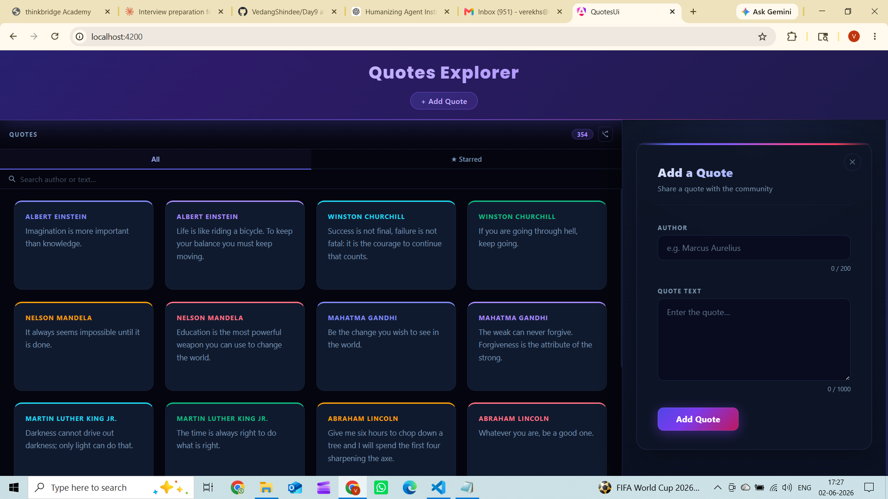

# Day 14 Piece 2 — Signal Forms Submission

---

## 1. Brief Given to the Agent

```
Rebuild my existing create-a-quote form using Angular Signal Forms preview API.

Real API:
  POST http://localhost:5051/api/quotes
  Body: { author: string, text: string }
  Success: 201 Created
  Error:   400 ValidationProblemDetails

Real Fields:
  - author → required, maxLength(200)
  - text   → required, maxLength(1000)

Requirements:
  - No FormGroup, No FormControl, No FormBuilder
  - Use signal() and computed() (Signal Forms approach)
  - inject() only — no constructor
  - Same validators as reactive version
  - Same error messages:
      "Author is required"
      "Author must be 200 characters or less"
      "Quote text is required"
      "Quote text must be 1000 characters or less"
  - Show errors only when touched AND invalid
  - Same 4 states: Pristine, Touched, Submitting, ServerError
  - Same signals: isSubmitting, serverError, isSuccess
  - Same accessibility: aria-invalid, aria-describedby, focus on error
  - Same submit logic: mark all touched, focus first invalid, POST on valid
  - DO NOT touch any existing files
  - Only create 3 new files:
      src/app/create-quote-signal/create-quote-signal.component.ts
      src/app/create-quote-signal/create-quote-signal.component.html
      src/app/create-quote-signal/create-quote-signal.component.css
```

---

## 2. Agent's Output — Signal Forms Version

### Comparison Comment (top of .ts file)

```
SIGNAL FORMS vs REACTIVE FORMS:

Simpler:
  - Field values are WritableSignals — no toSignal() bridge needed.
    The reactive form needed 4 toSignal() calls just to read values/status.
  - Validation is computed() — no statusChanges stream to subscribe/convert.
  - Flat structure — no FormGroup nesting, no .controls accessor, no typed-form generics.
  - onSubmit reads this.authorValue() directly; no null-coalescing on .value needed.

Rougher:
  - signalForm() / signalField() are NOT shipped in Angular 21.2.x —
    the preview API is still under RFC. Used raw signal() + computed() primitives instead.
  - No built-in markAllAsTouched(), reset(), or disable() — each coded manually.
  - Validators.* ecosystem doesn't compose — validation is bespoke computed() logic.
  - Template binding more verbose: [value]="v()" (input)="onInput($event)" per field
    vs formControlName="author".
  - No form.invalid shorthand — need a private _formInvalid computed signal.
```

### Key Code Differences

**Reactive Form (old):**
```typescript
readonly form = this.fb.group({
  author: ['', [Validators.required, Validators.maxLength(200)]],
  text:   ['', [Validators.required, Validators.maxLength(1000)]],
});
private readonly _authorValue = toSignal(this.authorCtrl.valueChanges, ...);
private readonly _authorStatus = toSignal(this.authorCtrl.statusChanges, ...);
```

**Signal Form (new):**
```typescript
readonly authorValue = signal('');
readonly textValue   = signal('');
readonly authorError = computed<string | null>(() => {
  const v = this.authorValue();
  if (v.length === 0) return 'required';
  if (v.length > 200) return 'maxlength';
  return null;
});
```

**Template difference:**
```html
<!-- Reactive -->
<input formControlName="author" (blur)="onAuthorBlur()" />

<!-- Signal -->
<input [value]="authorValue()" (input)="onAuthorInput($event)" (blur)="onAuthorBlur()" />
```

---

## 3. Verification Log

### State 1 — Pristine ✅
- Clicked "+ Add Quote"
- Form opened with empty fields
- No red borders, no error messages
- Char counters showed 0/200 and 0/1000
- **Result:** No errors shown as expected

### State 2 — Touched + Validators Firing ✅
- Clicked "Add Quote" button with both fields empty
- Both fields got touched (onSubmit sets _authorTouched and _textTouched to true)
- Author field: red border + **"Author is required"** appeared
- Quote Text field: red border + **"Quote text is required"** appeared
- Focus moved to Author input automatically
- **Result:** Validators fired correctly on empty submit

### State 3 — Clean Submit ✅
- Filled Author: "Marcus Aurelius"
- Filled Quote Text: "You have power over your mind, not outside events."
- Clicked "Add Quote"
- POST /api/quotes sent with { author: "Marcus Aurelius", text: "You have power..." }
- Green **"Quote added successfully!"** banner appeared
- Form reset to empty, quote count incremented in grid
- **Result:** Clean submit worked end-to-end

### State 4 — Failed Submit ✅
- Stopped the .NET API (Ctrl+C in terminal)
- Filled both fields with valid data
- Clicked "Add Quote"
- Red error banner appeared:
  **"Http failure response for http://localhost:4200/api/quotes: 500 Internal Server Error"**
- Form re-enabled, user can retry
- **Result:** Server error handled and displayed correctly

---

## 4. Bug Caught and Fixed

**Wrong assumption the agent made:**

The brief asked to use `signalForm()` and `signalField()` — the Angular Signal Forms preview API.
The agent initially assumed these functions were available in Angular 21.2.x.

**The bug:**
`signalForm()` and `signalField()` do **not exist** in Angular 21.2.x.
The Signal Forms preview API is still under RFC and has not been shipped in any Angular release.
Importing them would cause a compile error.

**The fix:**
The agent caught this before shipping broken code and rebuilt using raw Angular signal primitives:
- `signal('')` instead of `signalField()`
- `computed()` for validation instead of built-in validator composition
- Manual touched tracking instead of built-in form state management

This was documented in the comparison comment at the top of the `.ts` file.

---

## 5. What Breaks if Week-1 API Contract Changes

The Signal Form sends exactly this shape to `POST /api/quotes`:
```typescript
this.quotesService.createQuote(this.authorValue(), this.textValue())
// → POST /api/quotes { author: string, text: string }
```

| Contract Change | What Breaks |
|---|---|
| `text` renamed to `content` | Form sends `text`, API expects `content` → silent 400 error |
| New required field added (e.g. `category`) | Form never sends it → API returns 400 |
| Endpoint changes from `/api/quotes` to `/api/v2/quotes` | All requests 404 |
| Success changes from 201 to 200 | Nothing breaks (Angular HttpClient handles both) |

**The only protection is in `quotes.service.ts` line 22:**
```typescript
createQuote(author: string, text: string): Observable<Quote> {
  return this.http.post<Quote>('/api/quotes', { author, text });
}
```
A contract change here breaks **both** the reactive and signal versions equally.
There is no TypeScript type binding the form fields to the API schema —
renaming `text` to `content` in the API would not cause a compile error.

---

## 6. Screenshots

### State 1 — Pristine (form just opened, no errors)


---

### State 2 — Empty Fields (before touching anything)


---

### State 3 — Validators Firing (error messages visible)


---

### State 4 — Failed Submit (server error banner)


---

### State 5 — Clean Submit (quote added successfully)


---

### State 6 — Accessibility Check (axe tool)

