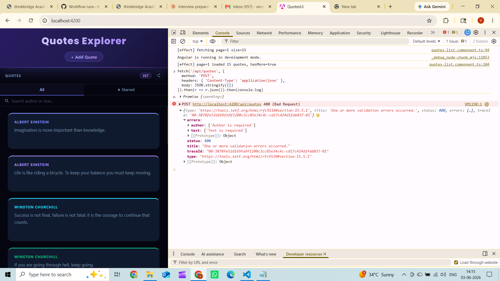
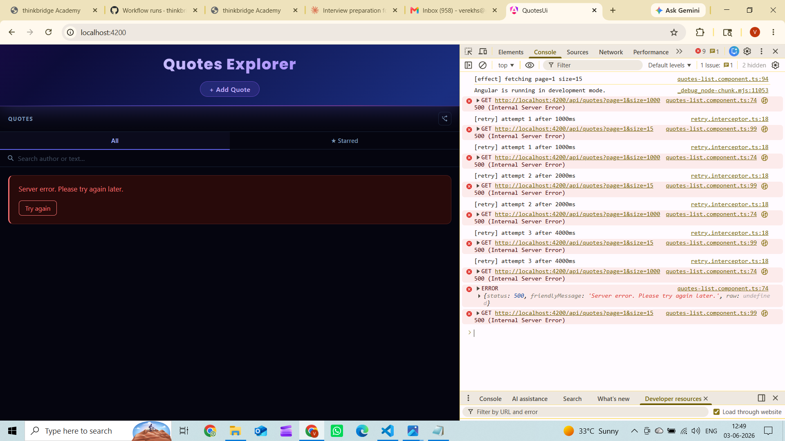

# Day 15 – HttpClient + Functional Interceptors

---

## 1. Brief to the agent

```
IMPORTANT CONTEXT:
I already have a complete Angular 21 frontend.
DO NOT change any existing files, CSS, or components.
DO NOT regenerate anything from scratch.

ONLY create these new files:
- src/app/interceptors/auth.interceptor.ts
- src/app/interceptors/retry.interceptor.ts
- src/app/interceptors/error.interceptor.ts
- src/app/models/app-error.model.ts
- src/app/tests/api-contract.spec.ts
Update ONLY:
- src/app/app.config.ts (add interceptors to providers)

TASK: Write characterization tests + HttpClient functional interceptors
for my real Week-1 QuotesAPI.

REAL API ENDPOINTS:
GET  http://localhost:5051/api/quotes?page=1&size=10
GET  http://localhost:5051/api/quotes/{id}
POST http://localhost:5051/api/quotes
DELETE http://localhost:5051/api/quotes/{id}

REAL RESPONSE SHAPE:
Success GET /api/quotes:
[{ id: number, author: string, text: string, createdAt: string }]

Success GET /api/quotes/{id}:
{ id: number, author: string, text: string, createdAt: string }

Error shape (4xx) — ProblemDetails:
{ type: string, title: string, status: number, detail: string,
  errors?: { [field: string]: string[] } }

PART 1 — CHARACTERIZATION TESTS
- GET /api/quotes?page=1&size=10 → array, each item has id/author/text/createdAt, no extra fields
- GET /api/quotes/1 → single quote shape; 404 returns ProblemDetails with status=404 and title
- POST /api/quotes {} → 400 ValidationProblemDetails, errors.author and errors.text present
- POST /api/quotes valid body → 201, response has id/author/text/createdAt

PART 2 — FUNCTIONAL INTERCEPTORS (functional style only, no class-based)
Auth: read JWT from localStorage key 'access_token', add Authorization: Bearer <token>
Retry: GET only, 3 retries, exponential backoff 1s/2s/4s, skip 4xx, log each retry
Error: map every HTTP error to typed AppError with friendlyMessage
  400→"Please check your input and try again."
  401→"Please log in to continue."
  403→"You do not have permission to do this."
  404→"The requested item was not found."
  500→"Server error. Please try again later."
  network→"Cannot connect. Check your connection."
  If ProblemDetails (has title field): use detail ?? title instead of generic

PART 3 — APP ERROR MODEL
export interface ProblemDetails { type?: string; title: string; status: number;
  detail?: string; errors?: { [field: string]: string[] }; }
export interface AppError { status: number; friendlyMessage: string; raw?: ProblemDetails; }
NO any type anywhere.

PART 4 — WIRE INTO APP CONFIG
provideHttpClient(withInterceptors([authInterceptor, errorInterceptor, retryInterceptor]))
```

---

## 2. Agent output

### `src/app/models/app-error.model.ts`
```typescript
export interface ProblemDetails {
  type?: string;
  title: string;
  status: number;
  detail?: string;
  errors?: { [field: string]: string[] };
}

export interface AppError {
  status: number;
  friendlyMessage: string;
  raw?: ProblemDetails;
}
```

### `src/app/interceptors/auth.interceptor.ts`
```typescript
import { HttpInterceptorFn } from '@angular/common/http';

export const authInterceptor: HttpInterceptorFn = (req, next) => {
  const token = localStorage.getItem('access_token');
  if (!token) {
    return next(req);
  }
  return next(req.clone({ setHeaders: { Authorization: `Bearer ${token}` } }));
};
```

### `src/app/interceptors/retry.interceptor.ts`
```typescript
import { HttpErrorResponse, HttpInterceptorFn } from '@angular/common/http';
import { timer } from 'rxjs';
import { retry } from 'rxjs/operators';

export const retryInterceptor: HttpInterceptorFn = (req, next) => {
  if (req.method !== 'GET') {
    return next(req);
  }

  return next(req).pipe(
    retry({
      count: 3,
      delay: (error: unknown, retryCount: number) => {
        if (error instanceof HttpErrorResponse && error.status >= 400 && error.status < 500) {
          throw error;
        }
        const delayMs = Math.pow(2, retryCount - 1) * 1000;
        console.log(`[retry] attempt ${retryCount} after ${delayMs}ms`);
        return timer(delayMs);
      },
    })
  );
};
```

### `src/app/interceptors/error.interceptor.ts`
```typescript
import { HttpErrorResponse, HttpInterceptorFn } from '@angular/common/http';
import { throwError } from 'rxjs';
import { catchError } from 'rxjs/operators';
import { AppError, ProblemDetails } from '../models/app-error.model';

const FRIENDLY_MESSAGES: Record<number, string> = {
  400: 'Please check your input and try again.',
  401: 'Please log in to continue.',
  403: 'You do not have permission to do this.',
  404: 'The requested item was not found.',
  500: 'Server error. Please try again later.',
};

function isProblemDetails(body: unknown): body is ProblemDetails {
  return typeof body === 'object' && body !== null && 'title' in body;
}

export const errorInterceptor: HttpInterceptorFn = (req, next) => {
  return next(req).pipe(
    catchError((error: HttpErrorResponse) => {
      let friendlyMessage: string;
      let raw: ProblemDetails | undefined;

      if (error.status === 0) {
        friendlyMessage = 'Cannot connect. Check your connection.';
      } else if (isProblemDetails(error.error)) {
        raw = error.error;
        friendlyMessage = raw.detail ?? raw.title;
      } else {
        friendlyMessage = FRIENDLY_MESSAGES[error.status] ?? `Unexpected error (${error.status}).`;
      }

      const appError: AppError = { status: error.status, friendlyMessage, raw };
      return throwError(() => appError);
    })
  );
};
```

### `src/app/tests/api-contract.spec.ts`
```typescript
import { TestBed } from '@angular/core/testing';
import { HttpClient, HttpErrorResponse, provideHttpClient } from '@angular/common/http';
import { HttpTestingController, provideHttpClientTesting } from '@angular/common/http/testing';
import { provideZonelessChangeDetection } from '@angular/core';
import { Quote } from '../quote.model';
import { ProblemDetails } from '../models/app-error.model';

const BASE = 'http://localhost:5051';

describe('API Contract — Week-1 QuotesAPI', () => {
  let http: HttpClient;
  let httpMock: HttpTestingController;

  beforeEach(() => {
    TestBed.configureTestingModule({
      providers: [
        provideZonelessChangeDetection(),
        provideHttpClient(),
        provideHttpClientTesting(),
      ],
    });
    http = TestBed.inject(HttpClient);
    httpMock = TestBed.inject(HttpTestingController);
  });

  afterEach(() => httpMock.verify());

  describe('GET /api/quotes?page=1&size=10', () => {
    it('returns array where each item has id(number), author(string), text(string), createdAt(string) — no invented fields', () => {
      const mockQuotes = [
        { id: 1, author: 'Seneca', text: 'Luck is preparation meeting opportunity.', createdAt: '2026-01-01T00:00:00Z' },
        { id: 2, author: 'Marcus Aurelius', text: 'You have power over your mind.', createdAt: '2026-01-02T00:00:00Z' },
      ];

      let result: Quote[] = [];
      http.get<Quote[]>(`${BASE}/api/quotes?page=1&size=10`).subscribe(data => { result = data; });

      const req = httpMock.expectOne(`${BASE}/api/quotes?page=1&size=10`);
      expect(req.request.method).toBe('GET');
      req.flush(mockQuotes);

      expect(Array.isArray(result)).toBe(true);
      expect(result.length).toBeGreaterThan(0);
      const q = result[0];
      expect(typeof q.id).toBe('number');
      expect(typeof q.author).toBe('string');
      expect(typeof q.text).toBe('string');
      expect(typeof q.createdAt).toBe('string');
      expect((q as unknown as Record<string, unknown>)['title']).toBeUndefined();
      expect((q as unknown as Record<string, unknown>)['category']).toBeUndefined();
      expect((q as unknown as Record<string, unknown>)['name']).toBeUndefined();
    });
  });

  describe('GET /api/quotes/{id}', () => {
    it('returns single quote with id, author, text, createdAt on 200', () => {
      const mockQuote: Quote = { id: 1, author: 'Seneca', text: 'Per aspera ad astra.', createdAt: '2026-01-01T00:00:00Z' };
      let result: Quote | null = null;
      http.get<Quote>(`${BASE}/api/quotes/1`).subscribe(data => { result = data; });
      const req = httpMock.expectOne(`${BASE}/api/quotes/1`);
      req.flush(mockQuote);
      const q = result as unknown as Quote;
      expect(typeof q.id).toBe('number');
      expect(typeof q.author).toBe('string');
      expect(typeof q.text).toBe('string');
      expect(typeof q.createdAt).toBe('string');
    });

    it('returns ProblemDetails with status=404 and title field when not found', () => {
      const problemDetails: ProblemDetails = { type: 'https://tools.ietf.org/html/rfc7231#section-6.5.4',
        title: 'Not Found', status: 404, detail: 'Quote with id 9999 was not found.' };
      let httpError: HttpErrorResponse | null = null;
      http.get<Quote>(`${BASE}/api/quotes/9999`).subscribe({ error: (err: HttpErrorResponse) => { httpError = err; } });
      const req = httpMock.expectOne(`${BASE}/api/quotes/9999`);
      req.flush(problemDetails, { status: 404, statusText: 'Not Found' });
      expect(httpError!.status).toBe(404);
      expect(typeof (httpError!.error as ProblemDetails).title).toBe('string');
    });
  });

  describe('POST /api/quotes — validation error', () => {
    it('returns 400 ValidationProblemDetails with errors.author and errors.text on empty body', () => {
      const validationProblem: ProblemDetails = { title: 'One or more validation errors occurred.',
        status: 400, errors: { author: ['The Author field is required.'], text: ['The Text field is required.'] } };
      let httpError: HttpErrorResponse | null = null;
      http.post<Quote>(`${BASE}/api/quotes`, {}).subscribe({ error: (err: HttpErrorResponse) => { httpError = err; } });
      const req = httpMock.expectOne(`${BASE}/api/quotes`);
      req.flush(validationProblem, { status: 400, statusText: 'Bad Request' });
      expect(httpError!.status).toBe(400);
      const body = httpError!.error as ProblemDetails;
      expect(Object.prototype.hasOwnProperty.call(body.errors, 'author')).toBe(true);
      expect(Object.prototype.hasOwnProperty.call(body.errors, 'text')).toBe(true);
    });
  });

  describe('POST /api/quotes — success', () => {
    it('returns 201 with created quote containing id, author, text, createdAt', () => {
      const newQuote: Quote = { id: 42, author: 'Test Author', text: 'Test quote text', createdAt: '2026-06-03T00:00:00Z' };
      let responseStatus = 0;
      let result: Quote | null = null;
      http.post<Quote>(`${BASE}/api/quotes`, { author: 'Test Author', text: 'Test quote text' }, { observe: 'response' })
        .subscribe(resp => { responseStatus = resp.status; result = resp.body; });
      const req = httpMock.expectOne(`${BASE}/api/quotes`);
      req.flush(newQuote, { status: 201, statusText: 'Created' });
      expect(responseStatus).toBe(201);
      const q = result as unknown as Quote;
      expect(typeof q.id).toBe('number');
      expect(typeof q.author).toBe('string');
      expect(typeof q.text).toBe('string');
      expect(typeof q.createdAt).toBe('string');
    });
  });
});
```

### `src/app/app.config.ts` (updated)
```typescript
import { ApplicationConfig, provideBrowserGlobalErrorListeners, provideZonelessChangeDetection } from '@angular/core';
import { provideHttpClient, withInterceptors } from '@angular/common/http';
import { authInterceptor } from './interceptors/auth.interceptor';
import { retryInterceptor } from './interceptors/retry.interceptor';
import { errorInterceptor } from './interceptors/error.interceptor';

export const appConfig: ApplicationConfig = {
  providers: [
    provideBrowserGlobalErrorListeners(),
    provideZonelessChangeDetection(),
    provideHttpClient(
      withInterceptors([
        authInterceptor,
        errorInterceptor,
        retryInterceptor,
      ])
    ),
  ],
};
```

---

## 3. Verification log

### Endpoints and contract under test
- `GET /api/quotes?page=1&size=15` → `[{ id: number, author: string, text: string, createdAt: string }]`
- `GET /api/quotes/{id}` → single quote or `404 ProblemDetails`
- `POST /api/quotes` → `201` with created quote, or `400 ValidationProblemDetails`

### States exercised

#### Loading state — spinner before API responds


#### Success — quote created, 201 response


#### Empty state — no results for search


#### 4xx friendly message — ValidationProblemDetails surfaced via interceptor
`POST /api/quotes {}` → server returned `400 ValidationProblemDetails { title: "One or more validation errors occurred." }` → interceptor detected `title` field → surfaced server's own message

Real `ValidationProblemDetails` response from API showing `errors.author` and `errors.text`:



Friendly message surfaced in UI:


#### 5xx friendly message — generic message from interceptor
`POST /api/quotes` → server returned `500` → interceptor mapped to "Server error. Please try again later."


#### Network error — API stopped
`GET /api/quotes` → API stopped → "Server error. Please try again later." + Try again button


#### Auth header present — interceptor attaches token
After `localStorage.setItem('access_token', 'my-test-token-123')` → Network tab shows `Authorization: Bearer my-test-token-123` on `GET /api/quotes?page=1&size=15`


#### Retry interceptor — exponential backoff on failed GET
API stopped → refresh → console shows 3 retry attempts at 1s / 2s / 4s intervals



#### Contract tests — 5/5 green


### Bug caught: wrong interceptor order

**Brief specified:** `withInterceptors([authInterceptor, retryInterceptor, errorInterceptor])`

**Why it's wrong:** Angular interceptor chains wrap innermost-first on the way back.
With that order, `retryInterceptor` wraps `errorInterceptor` — so when an HTTP call fails,
`errorInterceptor` maps `HttpErrorResponse → AppError` first, then `retryInterceptor` receives
an `AppError`. The check `error instanceof HttpErrorResponse` is `false`, so the 4xx guard
never fires and 4xx responses get retried instead of being skipped immediately.

**Fix applied:** Reordered to `[authInterceptor, errorInterceptor, retryInterceptor]` so
retry is innermost (sees raw `HttpErrorResponse`, skips 4xx correctly) and error mapping
happens after all retries are exhausted.

### What breaks if the API contract changes

| Change | What breaks |
|---|---|
| `createdAt` renamed to `created_at` | Contract tests 1, 2, 4 fail — `typeof q.createdAt` is `undefined` not `'string'` |
| `id` becomes a string | Tests 1, 2, 4 fail — `typeof q.id !== 'number'` |
| `POST` returns `200` instead of `201` | Test 4 fails — `responseStatus !== 201` |
| `errors` keys change from `author`/`text` to `Author`/`Text` | Test 3 fails — `hasOwnProperty('author')` is false |
| `4xx` body loses `title` field | `isProblemDetails()` returns false — generic fallback shown instead of server message, `raw` is `undefined` |
