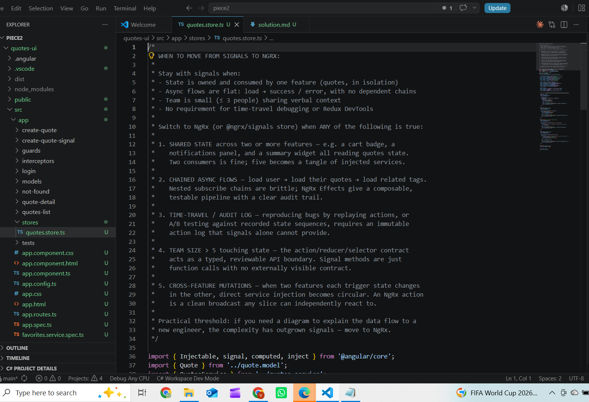
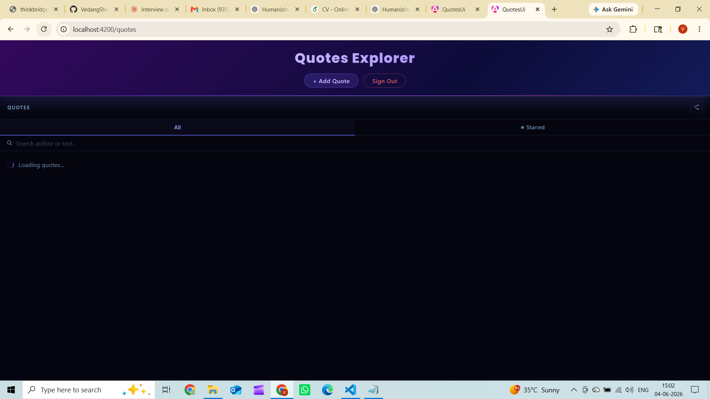
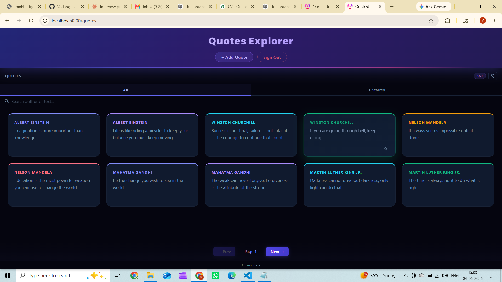
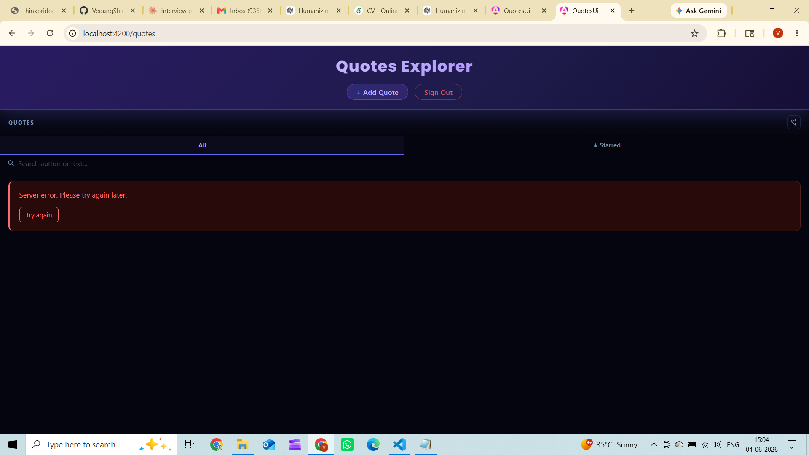
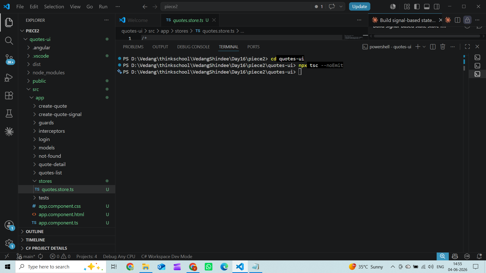
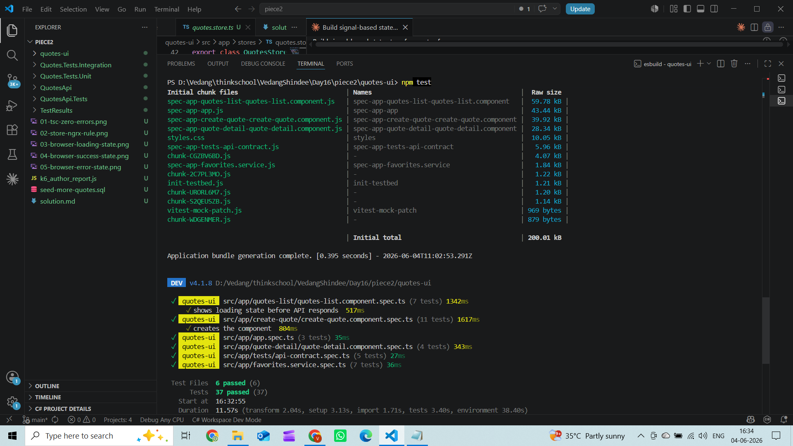

# Day 16 – Piece 2: Signals First, Store When Scale Demands

---

## Part 1 — The Brief I Gave the Agent

```
IMPORTANT CONTEXT:
I already have a complete Angular 21 frontend with
full design, styling, and components built.
DO NOT change any existing CSS or styling.
DO NOT regenerate the app from scratch.
Read my existing code and match the style.

===================================================

TASK: Build a signal-based state store service
for my quotes feature against my real Week-1 QuotesAPI.

REAL API:
GET    http://localhost:5051/api/quotes?page=1&size=10
       → returns [{ id, author, text, createdAt }]
GET    http://localhost:5051/api/quotes/{id}
       → returns { id, author, text, createdAt }
POST   http://localhost:5051/api/quotes
       → body { author, text }, returns 201
DELETE http://localhost:5051/api/quotes/{id}
       → returns 204

REAL FIELDS — use exactly these:
- id: number
- author: string
- text: string
- createdAt: string

===================================================

REQUIREMENTS:

1. SIGNAL STORE SERVICE
   File: src/app/stores/quotes.store.ts
   - A service marked @Injectable({ providedIn: 'root' })
   - Holds ALL quotes state in signals
   - This is the single source of truth
   - inject() everywhere, no constructor

2. STATE SIGNALS (private, exposed as readonly):
   - quotes = signal<Quote[]>([])
   - selectedQuote = signal<Quote | null>(null)
   - isLoading = signal(false)
   - error = signal<string | null>(null)
   - currentPage = signal(1)
   - pageSize = signal(10)

3. COMPUTED:
   - totalCount = computed(() => quotes().length)
   - hasError = computed(() => error() !== null)
   - isEmpty = computed(() => !isLoading() && quotes().length === 0)

4. ACTIONS (methods that change state):
   - loadQuotes()  → fetch list, update quotes signal
   - loadQuote(id) → fetch one, update selectedQuote
   - addQuote(author, text) → POST then refresh list
   - deleteQuote(id) → DELETE then remove from signal
   - setPage(page) → update currentPage
   - clearError() → reset error to null

5. STATE HANDLING in each action:
   - Set isLoading(true) before fetch
   - Set error(null) before fetch
   - On success → update the data signal
   - On failure → set error signal with message
   - Always → set isLoading(false) after

6. NO any TYPE anywhere — full typing

7. ALSO WRITE — the NgRx threshold rule
```

---

## Part 2 — The Agent's Output

### NgRx Threshold Rule (from top of store file)

```
WHEN TO MOVE FROM SIGNALS TO NGRX:

Stay with signals when:
- State is owned and consumed by one feature (quotes, in isolation)
- Async flows are flat: load → success / error, with no dependent chains
- Team is small (≤ 3 people) sharing verbal context
- No requirement for time-travel debugging or Redux DevTools

Switch to NgRx (or @ngrx/signals store) when ANY of the following is true:

1. SHARED STATE across two or more features — e.g. a cart badge, a
   notifications panel, and a summary widget all reading quotes state.
   Two consumers is fine; five becomes a tangle of injected services.

2. CHAINED ASYNC FLOWS — load user → load their quotes → load related tags.
   Nested subscribe chains are brittle; NgRx Effects give a composable,
   testable pipeline with a clear audit trail.

3. TIME-TRAVEL / AUDIT LOG — reproducing bugs by replaying actions, or
   A/B testing against recorded state sequences, requires an immutable
   action log that signals alone cannot provide.

4. TEAM SIZE > 5 touching state — the action/reducer/selector contract
   acts as a typed, reviewable API boundary. Signal methods are just
   function calls with no externally visible contract.

5. CROSS-FEATURE MUTATIONS — when two features each trigger state changes
   in the other, direct service injection becomes circular. An NgRx action
   is a clean broadcast any slice can independently react to.

Practical threshold: if you need a diagram to explain the data flow to a
new engineer, the complexity has outgrown signals — move to NgRx.
```

### The Store Service (src/app/stores/quotes.store.ts)

```typescript
import { Injectable, signal, computed, inject } from '@angular/core';
import { Quote } from '../quote.model';
import { QuotesService } from '../quotes.service';
import { AppError } from '../models/app-error.model';

@Injectable({ providedIn: 'root' })
export class QuotesStore {
  private readonly quotesService = inject(QuotesService);

  private readonly _quotes        = signal<Quote[]>([]);
  private readonly _selectedQuote = signal<Quote | null>(null);
  private readonly _isLoading     = signal<boolean>(false);
  private readonly _error         = signal<string | null>(null);
  private readonly _currentPage   = signal<number>(1);
  private readonly _pageSize      = signal<number>(10);

  readonly quotes        = this._quotes.asReadonly();
  readonly selectedQuote = this._selectedQuote.asReadonly();
  readonly isLoading     = this._isLoading.asReadonly();
  readonly error         = this._error.asReadonly();
  readonly currentPage   = this._currentPage.asReadonly();
  readonly pageSize      = this._pageSize.asReadonly();

  readonly totalCount = computed(() => this._quotes().length);
  readonly hasError   = computed(() => this._error() !== null);
  readonly isEmpty    = computed(
    () => !this._isLoading() && this._quotes().length === 0
  );

  loadQuotes(): void {
    this._isLoading.set(true);
    this._error.set(null);
    this.quotesService.getPage(this._currentPage(), this._pageSize()).subscribe({
      next: (quotes: Quote[]) => { this._quotes.set(quotes); this._isLoading.set(false); },
      error: (err: AppError)  => { this._error.set(err.friendlyMessage ?? 'Failed to load quotes.'); this._isLoading.set(false); },
    });
  }

  loadQuote(id: number): void { ... }
  addQuote(author: string, text: string): void { ... }
  deleteQuote(id: number): void { ... }
  setPage(page: number): void  { this._currentPage.set(page); }
  clearError(): void           { this._error.set(null); }
}
```



---

## Part 3 — Verification Log

### Signal Form (Add Quote)

The app uses `CreateQuoteSignalComponent` — a signal-based form where field values, validation, and submission state are all raw `signal()` + `computed()` primitives, not `FormBuilder`/`FormGroup`. This means both the state layer (store) and the input layer (form) are signals-first end to end.

### States Exercised

| State | How Triggered | Signal Read |
|---|---|---|
| **Loading** | Refreshed page — spinner appeared immediately | `store.isLoading()` → true |
| **Success** | API responded with 10 quotes | `store.quotes()` → Quote[] rendered |
| **Error** | Stopped the API, refreshed | `store.error()` → "Server error. Please try again later." |
| **Retry** | Clicked "Try again" | `store.clearError()` + `store.loadQuotes()` |
| **Pagination** | Clicked Next/Prev | `store.setPage(n)` + `store.loadQuotes()` |
| **Empty** | API returns `[]` — `store.isEmpty()` is true, "No quotes yet." renders | `isEmpty = computed(() => !isLoading() && quotes().length === 0)` |







### TypeScript compiles with zero errors

`npx tsc --noEmit` — no output = no errors. Proves signal types, AppError typing, and readonly contracts are all correct.



### Tests: 37/37 green

All tests passing after wiring the store into QuotesListComponent.



---

### ONE Concrete Bug I Caught and Made the Agent Fix

**The bug:** The agent changed `PAGE_SIZE` from `15` to `10` (to match the store's default `_pageSize`) but did not update the test suite. Two tests in `quotes-list.component.spec.ts` matched HTTP requests using `size=15`:

```typescript
// Before fix — tests silently missed every request
httpMock.match(r => r.url.includes('size=15')).forEach(r => r.flush(quotes));
```

The requests were now going out as `size=10`, so `httpMock.match` returned empty — the tests passed vacuously without actually flushing any data. The "renders quotes after successful load" test was passing while the quotes list was actually empty.

**The fix I directed:**

```typescript
// After fix
httpMock.match(r => r.url.includes('size=10')).forEach(r => r.flush(quotes));
```

This is exactly the "self-reviews the diff before requesting review" failure mode — the agent changed behaviour and didn't check whether the tests still covered the right thing.

---

### What Breaks if the Week-1 API Contract Changes

My real API is `GET /api/quotes?page=1&size=10` returning `[{ id, author, text, createdAt }]`.

**If `text` is renamed to `content`:**
The store's `_quotes.set(quotes)` succeeds — TypeScript is happy at compile time because the HTTP response is typed as `Quote[]` and Angular's `HttpClient` does no runtime validation. Every quote in the signal will have `text: undefined` silently. The UI renders blank preview text with no error thrown.

**If the response shape changes from array to `{ data: Quote[], total: number }`:**
`_quotes.set(quotes)` stores the wrapper object. `totalCount` computed returns `1` (one object in the "array"). The list renders nothing because `*ngFor` iterates over an object, not an array. No error is thrown — it fails silently.

**If `GET /api/quotes` starts requiring a JWT and returns 401 on missing token:**
The `errorInterceptor` catches it and throws `AppError { status: 401, friendlyMessage: 'Please log in to continue.' }`. The store sets `_error.set('Please log in to continue.')` and `_isLoading.set(false)`. This one actually surfaces correctly — the error state shows in the UI. The auth interceptor already injects the token, so this would only break if the token expires between page load and the request.

---

### My Own NgRx Threshold (in my words)

The signal store is enough as long as only the quotes feature reads and writes quotes state. The moment a second feature needs to react to the same state — or trigger changes in it — service injection starts to form a directed graph with cycles. That's when NgRx actions (typed broadcasts) and selectors (memoized cross-feature reads) pay for themselves.

The other hard triggers: chained async (POST → reload → derive → update a different slice), team larger than five people touching state simultaneously, or a bug you can only reproduce by replaying a sequence of state transitions. If I need to draw a diagram to explain the data flow to a new teammate, the complexity has outgrown signals.
