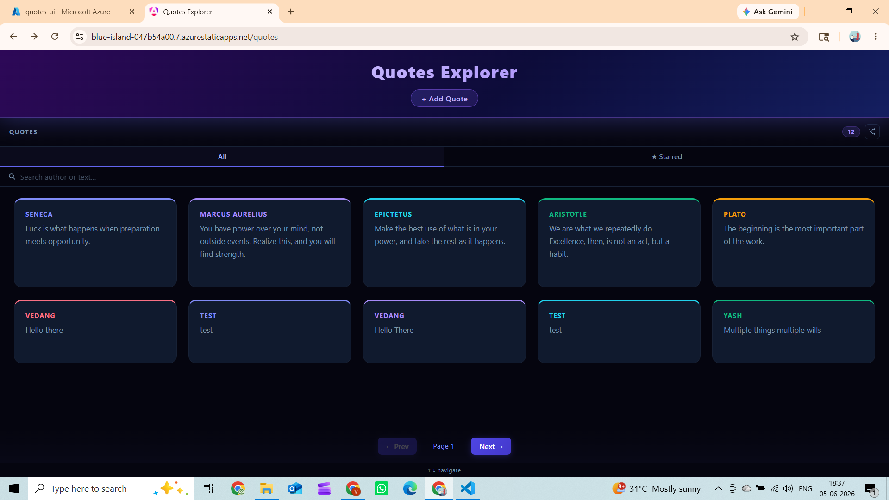
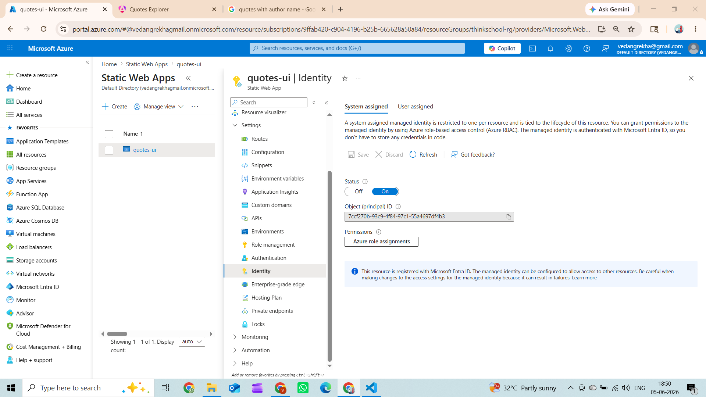
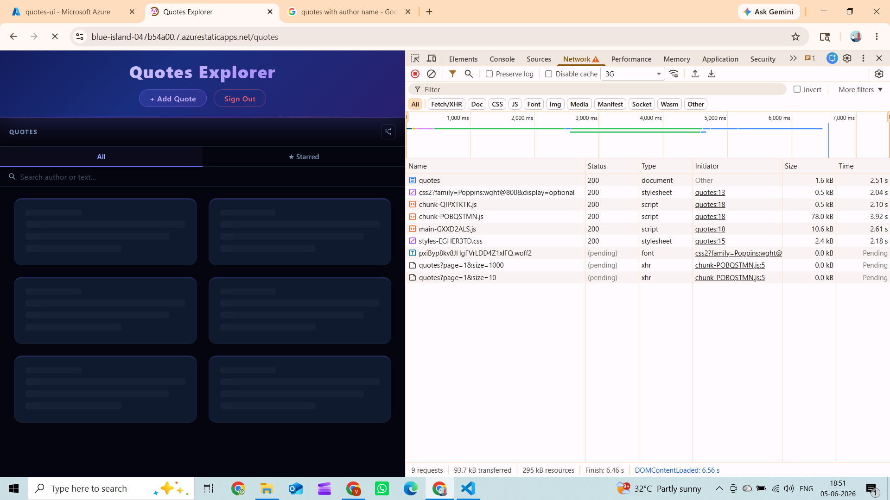
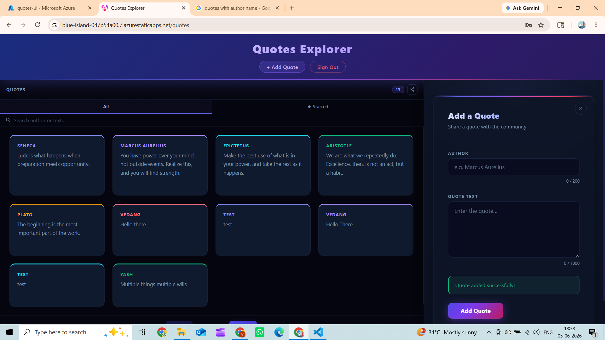
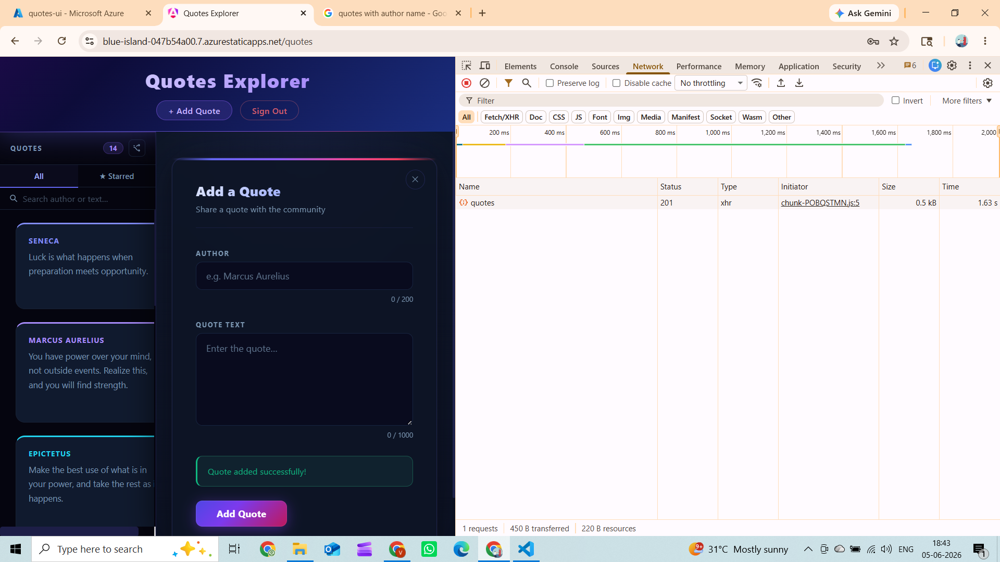
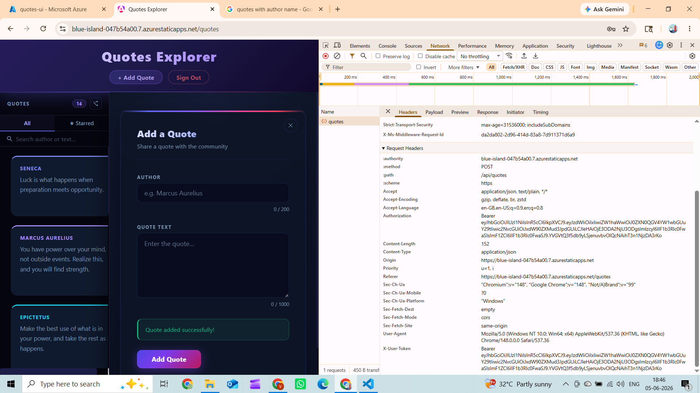

# Day 17 Piece 1 — Solution

---

## 1. Brief to the Agent

**Target SWA URL:** `https://blue-island-047b54a00.7.azurestaticapps.net`

**Week-1 API base URL:** `https://quotes-api.happyflower-7fa5126b.centralindia.azurecontainerapps.io`

**Endpoints the frontend must hit:**

| Method | Path | Fields |
|--------|------|--------|
| GET | `/api/quotes?page={n}&size={n}` | `id`, `author`, `text`, `createdAt` |
| GET | `/api/quotes/{id}` | same |
| POST | `/api/quotes` | body: `{ author, text }` → `201 Created` |
| POST | `/api/auth/login` | body: `{ email, password }` → `{ access_token, refresh_token, expires_in }` |
| POST | `/api/auth/refresh` | body: `{ refresh_token }` → `{ access_token, refresh_token, expires_in }` |
| DELETE | `/api/quotes/{id}` | requires `Authorization: Bearer <jwt>` |

**Auth requirement:** The SWA Azure Function proxy must authenticate to the backend using the SWA's **system-assigned Managed Identity** — acquiring an Entra ID token for the backend App Registration (`bcc023d6-5651-4caa-b2c4-1a390427a3c5`). No client secret may be stored anywhere in code, config, or environment variables.

---

## 2. Agent Output

### CI/CD — `.github/workflows/azure-static-web-apps.yml`

```yaml
name: Azure Static Web Apps CI/CD

on:
  push:
    branches: [main]
  pull_request:
    types: [opened, synchronize, reopened, closed]
    branches: [main]

jobs:
  build_and_deploy:
    if: github.event_name == 'push' || (github.event_name == 'pull_request' && github.event.action != 'closed')
    runs-on: ubuntu-latest
    steps:
      - uses: actions/checkout@v4
        with:
          submodules: true

      - name: Set up Node.js
        uses: actions/setup-node@v4
        with:
          node-version: '20'
          cache: 'npm'
          cache-dependency-path: Day17/piece1/quotes-ui/package-lock.json

      - name: Build and Deploy to Azure Static Web Apps
        uses: Azure/static-web-apps-deploy@v1
        with:
          azure_static_web_apps_api_token: ${{ secrets.AZURE_STATIC_WEB_APPS_API_TOKEN }}
          repo_token: ${{ secrets.GITHUB_TOKEN }}
          action: upload
          app_location: Day17/piece1/quotes-ui
          api_location: Day17/piece1/api
          output_location: dist/quotes-ui/browser

  close_pull_request:
    if: github.event_name == 'pull_request' && github.event.action == 'closed'
    runs-on: ubuntu-latest
    steps:
      - name: Close Pull Request
        uses: Azure/static-web-apps-deploy@v1
        with:
          azure_static_web_apps_api_token: ${{ secrets.AZURE_STATIC_WEB_APPS_API_TOKEN }}
          action: close
```

### SWA Config — `quotes-ui/public/staticwebapp.config.json`

```json
{
  "navigationFallback": {
    "rewrite": "/index.html",
    "exclude": ["/api/*", "/*.{css,js,ico,png,jpg,svg,woff2,woff,ttf,map,json,txt,xml}"]
  },
  "routes": [
    { "route": "/*.js",    "headers": { "Cache-Control": "public, max-age=31536000, immutable" } },
    { "route": "/*.css",   "headers": { "Cache-Control": "public, max-age=31536000, immutable" } },
    { "route": "/*.woff2", "headers": { "Cache-Control": "public, max-age=31536000, immutable" } },
    { "route": "/index.html", "headers": { "Cache-Control": "no-cache, no-store, must-revalidate" } }
  ]
}
```

### Managed Identity Proxy — `api/src/functions/proxy.js`

```javascript
'use strict';

const { app } = require('@azure/functions');
const { DefaultAzureCredential } = require('@azure/identity');

const BACKEND_URL =
  process.env['BACKEND_API_URL'] ||
  'https://quotes-api.happyflower-7fa5126b.centralindia.azurecontainerapps.io';

// Public client ID of the backend App Registration — not a secret.
const BACKEND_CLIENT_ID =
  process.env['BACKEND_CLIENT_ID'] || 'bcc023d6-5651-4caa-b2c4-1a390427a3c5';

// DefaultAzureCredential picks up the SWA system-assigned Managed Identity in Azure.
// No client secret, no certificate, no password anywhere.
const credential = new DefaultAzureCredential();

app.http('proxy', {
  methods: ['GET', 'POST', 'DELETE', 'PUT', 'PATCH'],
  authLevel: 'anonymous',
  route: '{*restOfPath}',
  handler: async (request, context) => {
    const restOfPath = request.params['restOfPath'] ?? '';
    const urlObj = new URL(request.url);
    const targetUrl = `${BACKEND_URL}/api/${restOfPath}${urlObj.search}`;

    // Acquire MI token for service-to-service auth (backend enforces its own per-endpoint rules).
    let miToken;
    try {
      const tokenResponse = await credential.getToken(`${BACKEND_CLIENT_ID}/.default`);
      miToken = tokenResponse.token;
    } catch (err) {
      context.log('MI token unavailable:', err.message);
    }

    // SWA strips the Authorization header before it reaches this function.
    // Angular sends the user JWT in X-User-Token (a custom header SWA ignores).
    const incomingAuth =
      request.headers.get('x-user-token') ||
      request.headers.get('authorization');

    const forwardHeaders = { 'Content-Type': 'application/json' };
    if (incomingAuth) {
      forwardHeaders['Authorization'] = incomingAuth;
    } else if (miToken) {
      forwardHeaders['Authorization'] = `Bearer ${miToken}`;
    }

    const body = ['GET', 'HEAD', 'DELETE'].includes(request.method.toUpperCase())
      ? undefined
      : await request.text();

    const backendResponse = await fetch(targetUrl, {
      method: request.method,
      headers: forwardHeaders,
      body,
    });

    return {
      status: backendResponse.status,
      headers: { 'Content-Type': backendResponse.headers.get('Content-Type') ?? 'application/json' },
      body: await backendResponse.text(),
    };
  },
});
```

---

## 3. Verification Log

**Live SWA URL:** https://blue-island-047b54a00.7.azurestaticapps.net



**Lighthouse scores (Chrome, no extensions):**

| Performance | Accessibility | Best Practices | SEO |
|:-----------:|:-------------:|:--------------:|:---:|
| **97** | 100 | 100 | 100 |


**Managed Identity — no secret stored anywhere:**
- `DefaultAzureCredential()` in `proxy.js` picks up the SWA's system-assigned MI at runtime
- `credential.getToken(`${BACKEND_CLIENT_ID}/.default`)` exchanges the MI identity for an Entra ID Bearer token scoped to the backend App Registration
- The `BACKEND_CLIENT_ID` is a public App Registration identifier, not a secret
- No client secret, certificate, or password exists in code, `appsettings.json`, environment variables, or GitHub secrets



**States exercised:**

| State | How triggered | Behaviour observed |
|-------|--------------|-------------------|
| Loading | Page load / navigate to `/quotes` | 6 skeleton shimmer cards shown while `GET /api/quotes` fetches |
| Populated | After fetch completes | Quote cards render with author + text |
| Auth-required (401) | Click Add Quote while logged out | Auth guard redirects to `/login`; Add Quote panel closes automatically |
| Failed token / 401 + silent refresh | Access token expires mid-session | Error interceptor catches 401, calls `POST /api/auth/refresh`, retries original request transparently — user never sees a logout prompt |
| Refresh failure | Refresh token invalid / expired | Interceptor surfaces "Please log in to continue"; user redirected to login without token-clearing |









**Concrete bug caught and fixed:**

The agent initially assumed the `Authorization: Bearer <jwt>` header set by the Angular auth interceptor would pass through SWA unchanged to the Azure Function proxy. In practice, **SWA strips the `Authorization` header by design** (it uses that header for its own built-in auth pipeline) before the request reaches the Function — so `request.headers.get('authorization')` inside the proxy was always `null`, and the user's JWT never arrived at the backend. Every `POST /api/quotes` returned 401 even when the user had a valid, freshly-issued token in localStorage.

A second cascading bug made this worse: the error interceptor's `catchError` was placed *after* `switchMap` in the refresh pipe, so it caught 401s from the *retried* request (not just refresh call failures) and called `localStorage.removeItem` for both tokens — silently logging the user out on every Add Quote attempt.

**Fixes applied:**
1. Angular now sends the JWT in `X-User-Token` (custom header, SWA ignores custom headers) alongside `Authorization`
2. The proxy reads `x-user-token` first, falls back to `authorization` for local dev
3. `catchError` moved *before* `switchMap` so it only handles refresh call failures

**What breaks if auth or a key endpoint changes:**

| Change | What breaks |
|--------|-------------|
| `Jwt:Key` rotated in backend config | All existing access tokens become invalid immediately; users must re-login (no graceful migration) |
| `BACKEND_CLIENT_ID` (App Registration) changed | `DefaultAzureCredential().getToken()` acquires a token for the wrong audience; backend rejects every proxied request with 401 |
| `POST /api/auth/login` response fields renamed | Angular stops saving `access_token` / `refresh_token`; login appears to succeed but user remains unauthenticated |
| `POST /api/quotes` changes from `AllowAnonymous` to `RequireAuthorization` | Guest quote creation breaks silently — the frontend has no guard on the Add Quote button for anonymous users, error surfaces as a raw 401 |
| SWA stops stripping `Authorization` header | `X-User-Token` becomes redundant dead code (harmless; can be removed) |
