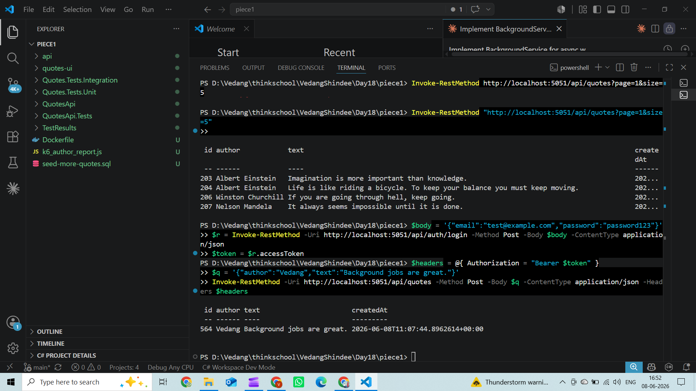
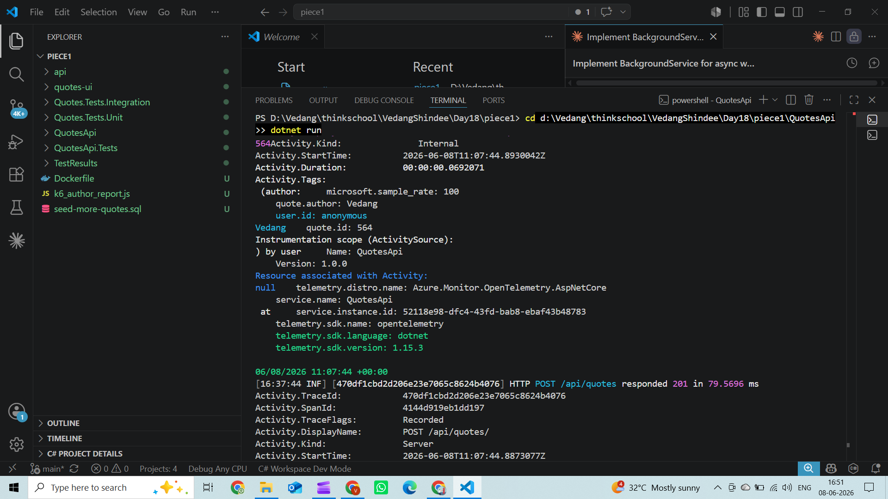
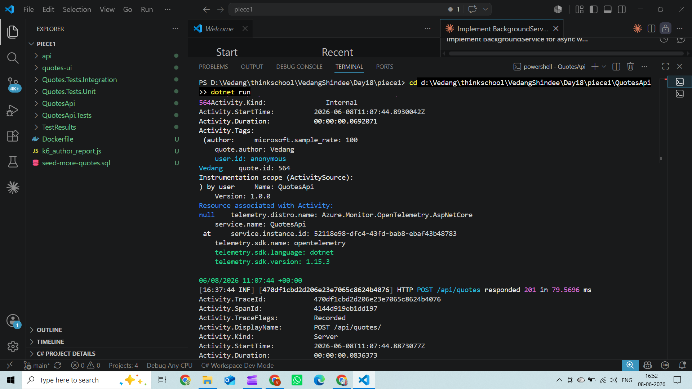
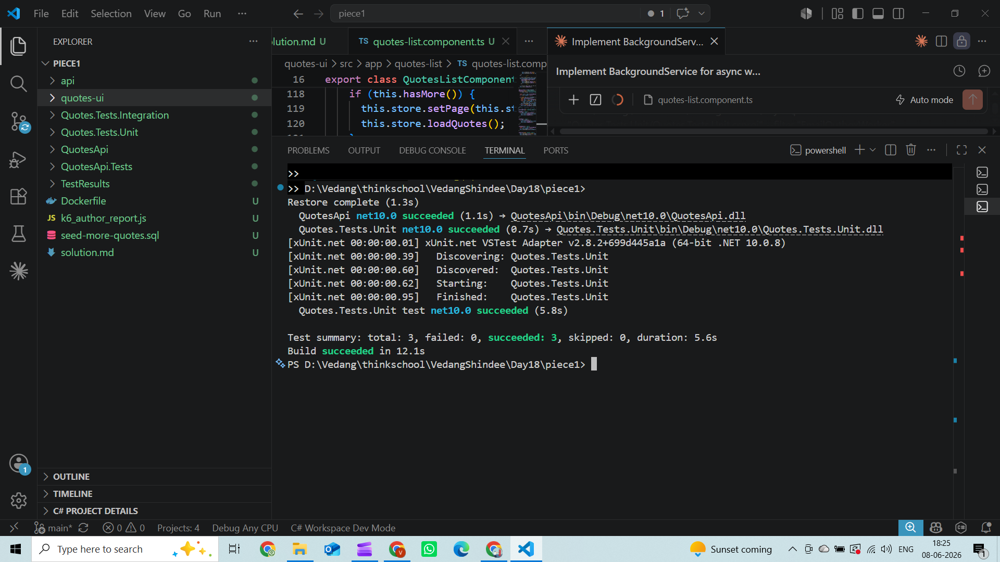

# Day 18 – Background Jobs

## BackgroundService that drains a queue

```csharp
public sealed class QuoteAuditWorker : BackgroundService
{
    private readonly QuoteAuditQueue _queue;
    private readonly ILogger<QuoteAuditWorker> _logger;

    public QuoteAuditWorker(QuoteAuditQueue queue, ILogger<QuoteAuditWorker> logger)
    {
        _queue = queue;
        _logger = logger;
    }

    protected override async Task ExecuteAsync(CancellationToken stoppingToken)
    {
        _logger.LogInformation("QuoteAuditWorker started");

        await foreach (var evt in _queue.Reader.ReadAllAsync(stoppingToken))
        {
            _logger.LogInformation(
                "[Audit] {Action} quote {QuoteId} (author: {Author}) by user {UserId} at {OccurredAt}",
                evt.Action, evt.QuoteId, evt.Author, evt.UserId, evt.OccurredAt);
        }

        // Drain items that arrived between the last ReadAllAsync tick and stoppingToken firing.
        while (_queue.Reader.TryRead(out var remaining))
        {
            _logger.LogInformation(
                "[Audit/drain] {Action} quote {QuoteId} at {OccurredAt}",
                remaining.Action, remaining.QuoteId, remaining.OccurredAt);
        }

        _logger.LogInformation("QuoteAuditWorker stopped cleanly");
    }
}
```

## How graceful shutdown works

1. SIGTERM arrives → host cancels `stoppingToken`
2. `ReadAllAsync(stoppingToken)` ends the async-enumerable — no exception to catch
3. Drain loop flushes items that snuck in during the shutdown window
4. `ExecuteAsync` returns → host marks the service stopped
5. Host waits up to `ShutdownTimeout` (default 30 s) before force-killing

## When Hangfire over a hosted service?

Use Hangfire when jobs must survive process restarts, run on a cron schedule, or need automatic retry semantics — use `BackgroundService` for lightweight in-process work that can restart with the app.

## Screenshots

### POST quote via PowerShell — request and response


### Server terminal — OTel activity trace + HTTP POST responded 201


### Server terminal — HTTP POST responded 201 (worker fires off-thread)


### Unit tests run

