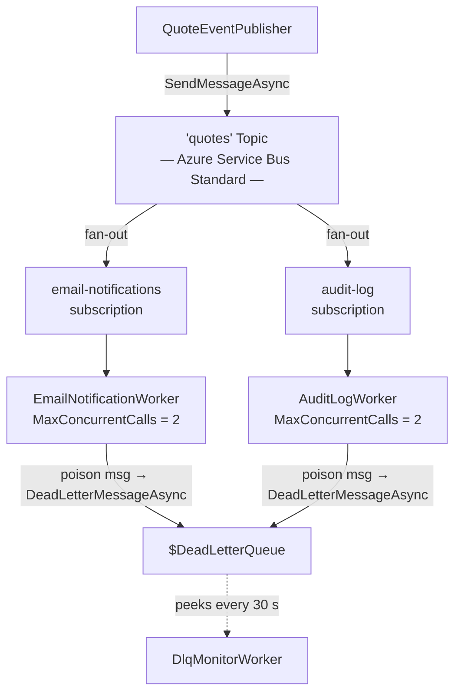
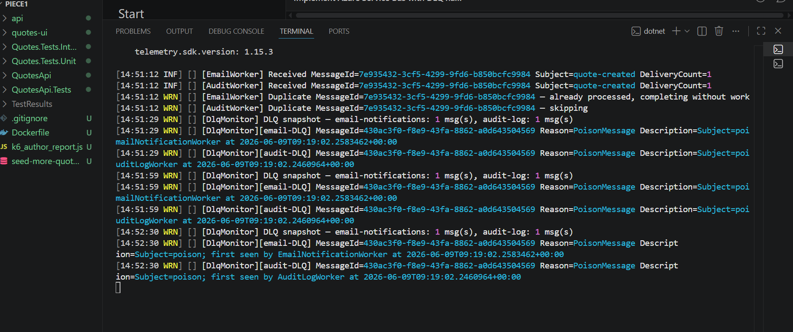
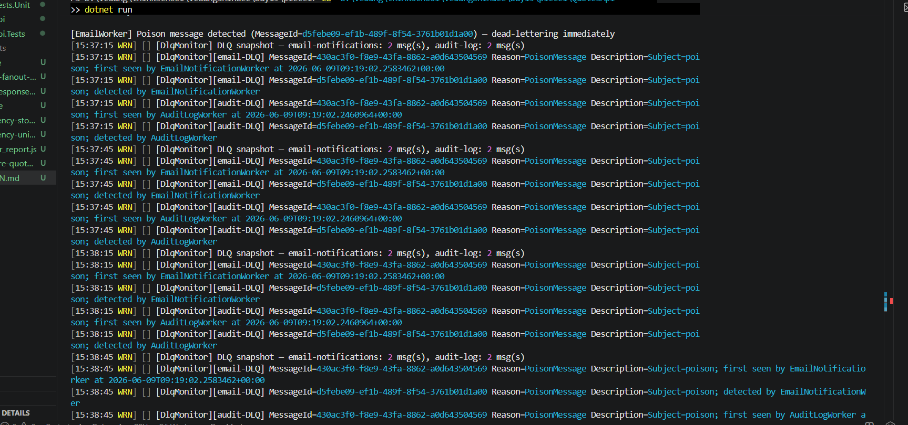
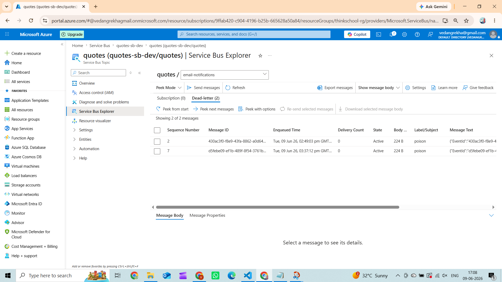
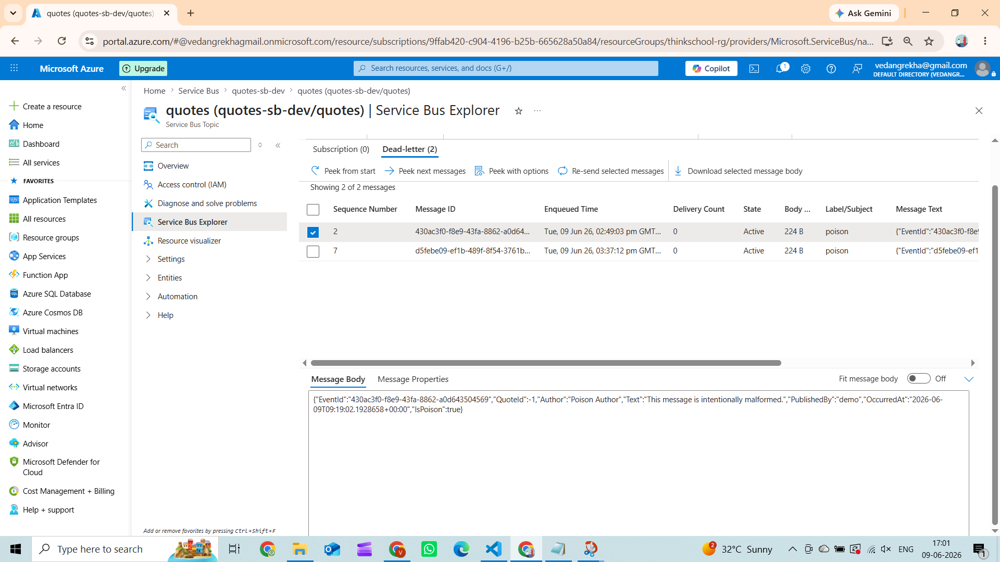
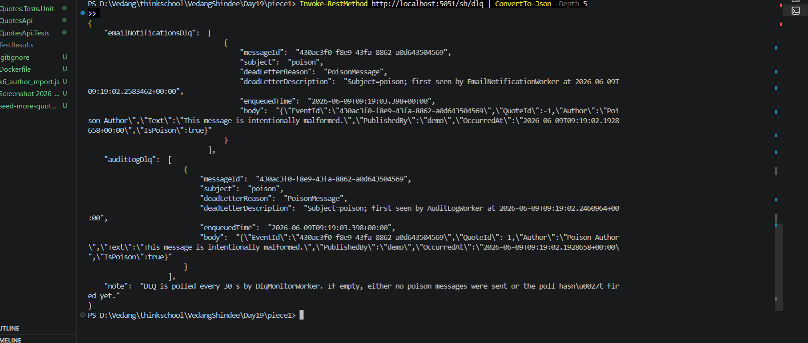
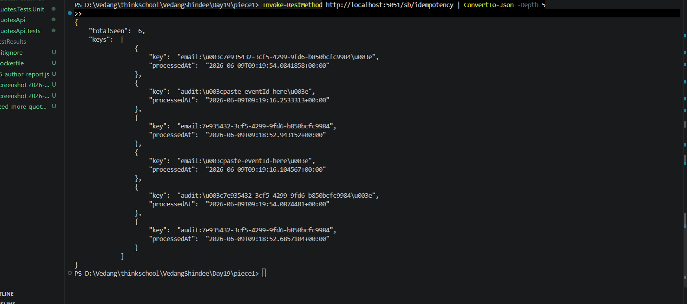
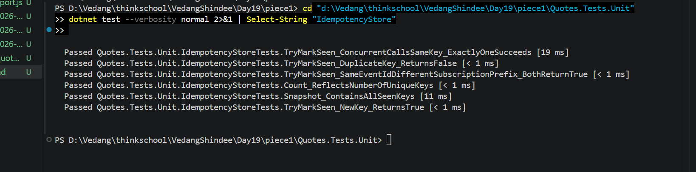

# Day 19 – Azure Service Bus: Topics, Competing Consumers, Idempotency, DLQ

## Architecture



---

## 1 — Publisher

`Messaging/QuoteEventPublisher.cs`

```csharp
public async Task PublishAsync(QuoteCreatedEvent evt, CancellationToken ct = default)
{
    var body = JsonSerializer.Serialize(evt);

    var message = new ServiceBusMessage(body)
    {
        // MessageId = EventId — stable GUID set once by the publisher.
        // Both subscription consumers use this as their idempotency key.
        MessageId = evt.EventId,

        // Subject = "poison" flags a demo poison message; "quote-created" is normal.
        Subject = evt.IsPoison ? "poison" : "quote-created",

        ContentType = "application/json",
    };

    message.ApplicationProperties["author"] = evt.Author;

    await _sender.SendMessageAsync(message, ct);

    _logger.LogInformation(
        "[Publisher] Sent {Subject} | MessageId={MessageId} | QuoteId={QuoteId} | Author={Author}",
        message.Subject, message.MessageId, evt.QuoteId, evt.Author);
}
```

---

## 2 — Consumer (competing consumers)

`Messaging/Workers/EmailNotificationWorker.cs`

```csharp
// MaxConcurrentCalls = 2 → the SDK dispatches up to 2 HandleMessageAsync Tasks
// simultaneously against the same subscription lock.
// Each concurrent call is a "competing consumer".
_processor = client.CreateProcessor(
    opts.Value.TopicName,
    opts.Value.EmailSubscriptionName,
    new ServiceBusProcessorOptions
    {
        MaxConcurrentCalls    = opts.Value.MaxConcurrentCalls,   // 2
        AutoCompleteMessages  = false,   // we settle manually
    });
```

The same pattern runs on `AuditLogWorker` for the `audit-log` subscription.  
Every published message is delivered **independently** to both subscriptions (fan-out).

---

## 3 — Idempotency key handling

`Messaging/IdempotencyStore.cs`

```csharp
// Thread-safe in-memory deduplication store (singleton).
// Key = "{subscription-prefix}:{MessageId}"
// ConcurrentDictionary.TryAdd is atomic — exactly one concurrent caller wins.
public sealed class IdempotencyStore
{
    private readonly ConcurrentDictionary<string, DateTimeOffset> _seen = new();

    public bool TryMarkSeen(string key) => _seen.TryAdd(key, DateTimeOffset.UtcNow);
}
```

Used in the handler before any work is done:

```csharp
var idempotencyKey = $"email:{messageId}";   // "audit:" prefix on AuditLogWorker
if (!_idempotency.TryMarkSeen(idempotencyKey))
{
    _logger.LogWarning(
        "[EmailWorker] Duplicate MessageId={MessageId} — already processed, completing without work",
        messageId);
    await args.CompleteMessageAsync(msg, args.CancellationToken);
    return;
}
```

Prefix namespacing (`email:` vs `audit:`) means the same `EventId` is processed **once per subscription** — email once, audit once — without blocking either.

---

## 4 — Dead-letter queue: poison message path

```csharp
if (msg.Subject == "poison")
{
    _logger.LogError(
        "[EmailWorker] Poison message detected (MessageId={MessageId}) — dead-lettering immediately",
        messageId);

    await args.DeadLetterMessageAsync(
        msg,
        deadLetterReason: "PoisonMessage",
        deadLetterErrorDescription: "Subject=poison; detected by EmailNotificationWorker",
        args.CancellationToken);

    return;
}
```

Both workers dead-letter their own copy independently.  
`DlqMonitorWorker` peeks `{topic}/Subscriptions/{sub}/$DeadLetterQueue` every 30 seconds and logs/exposes the results.

---

## Proof

### App logs — fan-out, idempotency, and DLQ in one view



- Both workers received the **same MessageId** (fan-out across two subscriptions)
- Both workers logged `Duplicate MessageId — already processed / skipping` on re-delivery (idempotency)
- `DlqMonitor` reported `email-notifications: 1 msg(s), audit-log: 1 msg(s)` with `Reason=PoisonMessage`

### Poison message detected and dead-lettered live



- `[EmailWorker] Poison message detected (MessageId=d5febe09...) — dead-lettering immediately`
- `[AuditWorker] Poison message (MessageId=d5febe09...) — dead-lettering on audit-log subscription`
- DlqMonitor confirms within 4 seconds: `email-notifications: 2 msg(s), audit-log: 2 msg(s)` with `Reason=PoisonMessage Description=Subject=poison; detected by EmailNotificationWorker/AuditLogWorker`

### Azure Portal — email-notifications DLQ



- `email-notifications` subscription → **Dead-letter (2)** tab
- MessageId `430ac3f0...` (first poison) and `d5febe09...` (second poison) both sitting in the DLQ
- `Label/Subject = poison`, `State = Active`, `DeliveryCount = 0` — explicitly dead-lettered, not exhausted retries

### Azure Portal — audit-log DLQ



- `audit-log` subscription → **Dead-letter (2)** tab
- Same two poison MessageIds dead-lettered independently on the audit-log subscription

### GET /sb/dlq — poison message in the dead-letter queue



### GET /sb/idempotency — keys seen by the store



### Unit tests — idempotency logic verified



| Test | What it proves |
|---|---|
| `TryMarkSeen_NewKey_ReturnsTrue` | First delivery is always processed |
| `TryMarkSeen_DuplicateKey_ReturnsFalse` | Re-delivery is silently skipped |
| `TryMarkSeen_SameEventIdDifferentSubscriptionPrefix_BothReturnTrue` | `email:` and `audit:` are independent namespaces |
| `Count_ReflectsNumberOfUniqueKeys` | Duplicates don't inflate the store |
| `Snapshot_ContainsAllSeenKeys` | `/sb/idempotency` endpoint has accurate data |
| `TryMarkSeen_ConcurrentCallsSameKey_ExactlyOneSucceeds` | Thread-safe — exactly 1 of 20 concurrent callers wins |
