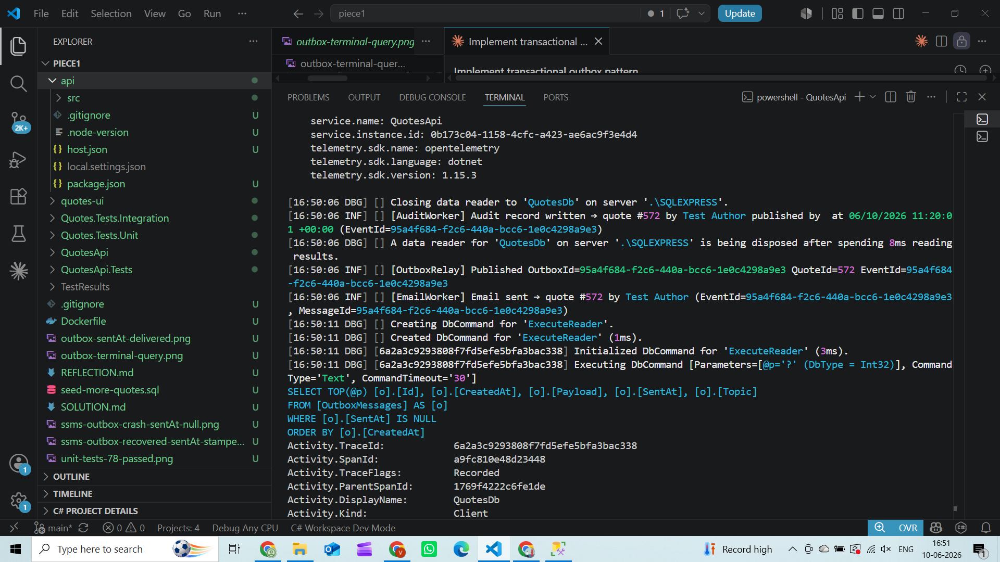
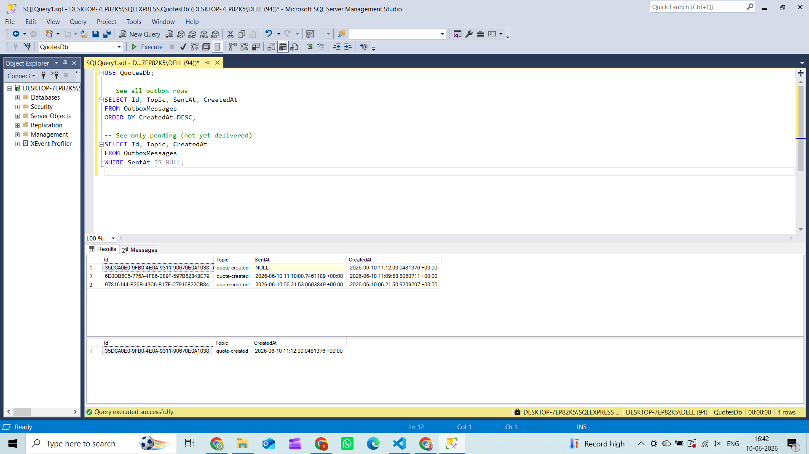
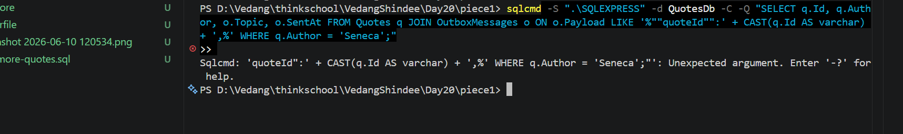
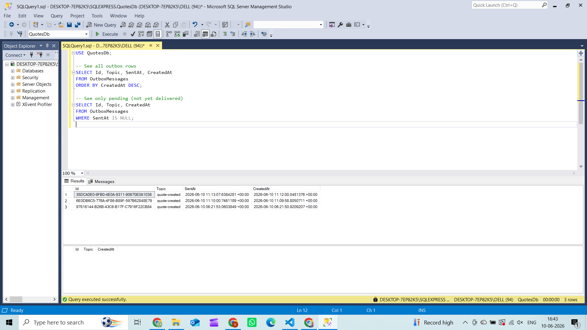
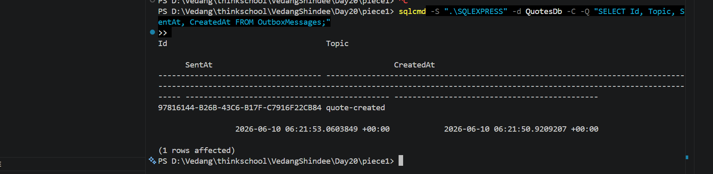
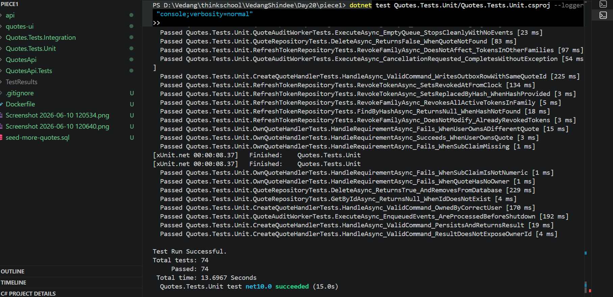

# Day 20 – Transactional Outbox

## Outbox table

```sql
CREATE TABLE OutboxMessages (
    Id        uniqueidentifier  NOT NULL  PRIMARY KEY,   -- client-generated = EventId
    Topic     nvarchar(200)     NOT NULL,
    Payload   nvarchar(max)     NOT NULL,                -- serialized QuoteCreatedEvent JSON
    CreatedAt datetimeoffset    NOT NULL,
    SentAt    datetimeoffset    NULL                     -- NULL = pending, non-NULL = delivered
);

-- Partial index — only covers unsent rows.
-- Shrinks to zero once all messages are delivered.
CREATE INDEX IX_OutboxMessages_Pending
    ON OutboxMessages (SentAt, CreatedAt)
    WHERE SentAt IS NULL;
```

## Atomic write — CreateQuoteHandler

Both the Quote row and the OutboxMessage row are written inside **one DB transaction**.
Either both commit or neither does — there is no state where a Quote exists without
a pending relay row.

```csharp
await using var tx = await _db.Database.BeginTransactionAsync(ct);

// Step 1: insert Quote → EF populates quote.Id via IDENTITY
_db.Quotes.Add(quote);
await _db.SaveChangesAsync(ct);

// Step 2: build event with the real QuoteId, then insert OutboxMessage
var eventId = Guid.NewGuid();
var evt = new QuoteCreatedEvent
{
    EventId    = eventId.ToString(),   // stable dedup key — never regenerated
    QuoteId    = quote.Id,
    Author     = quote.Author,
    Text       = quote.Text,
    OccurredAt = quote.CreatedAt,
};
_db.OutboxMessages.Add(new OutboxMessage
{
    Id      = eventId,                 // OutboxMessage.Id == EventId == ServiceBus MessageId
    Topic   = "quote-created",
    Payload = JsonSerializer.Serialize(evt),
});
await _db.SaveChangesAsync(ct);

await tx.CommitAsync(ct);             // both rows commit here — or neither does
```

## Relay — OutboxRelayWorker

Polls every **5 seconds** for rows where `SentAt IS NULL`, publishes each to the
Service Bus topic, then stamps `SentAt`.

```csharp
var pending = await db.OutboxMessages
    .Where(m => m.SentAt == null)
    .OrderBy(m => m.CreatedAt)
    .Take(50)
    .ToListAsync(ct);

foreach (var msg in pending)
{
    var evt = JsonSerializer.Deserialize<QuoteCreatedEvent>(msg.Payload);

    await _publisher.PublishAsync(evt, ct);

    // ── CRASH WINDOW ──────────────────────────────────────────────────────────
    // If the process is killed here, SentAt is never written.
    // The row stays SentAt=null — the next relay tick retries the same message.

    msg.SentAt = DateTimeOffset.UtcNow;
    await db.SaveChangesAsync(ct);
}
```

**Relay log — terminal proof that delivery happened:**



## Crash scenario tested

**Setup:** created a quote via `POST /api/quotes`, then immediately killed the app
with Ctrl+C before the 5-second relay tick fired.

**What happened:**

```
[app running]
  POST /api/quotes
    → BEGIN TRANSACTION
    → INSERT INTO Quotes          ← committed
    → INSERT INTO OutboxMessages  ← committed, SentAt = NULL
    → COMMIT
  ← 201 Created (id=567)

[Ctrl+C — process killed]
  OutboxRelayWorker never ran → SentAt stays NULL
```

**OutboxMessages table queried after kill — SentAt is NULL (message not lost):**





**App restarted — relay ran within 5 seconds, SentAt stamped:**





```
Id                                   Topic          SentAt                         CreatedAt
------------------------------------ -------------- ------------------------------ -------------------
97816144-B26B-43C6-B17F-C7916F22CB84 quote-created  2026-06-10 06:21:53 +00:00    2026-06-10 06:21:50
```

The relay found the pending row on the next tick and delivered it.

## Why no message is lost

The DB transaction commits the Quote and the OutboxMessage together.
A process crash after the commit leaves the outbox row intact with `SentAt = NULL`.
The relay finds it on the next tick and re-delivers it.
There is no window where the Quote exists but the relay row does not.

## Why no duplicate effect (at-least-once + idempotent consumer)

`EventId` is a `Guid` generated once at insert time and written into the Payload.
It never changes across retries.

The relay sets `ServiceBusMessage.MessageId = evt.EventId`.
Both subscription consumers (`EmailNotificationWorker`, `AuditLogWorker`) use
`IdempotencyStore` keyed on `MessageId` — if they have already processed this key
they silently skip the re-delivery.

```
Tick 1 (after crash):   PublishAsync(EventId=97816144) → consumer processes → stores key
Tick 2 (if crash again): PublishAsync(EventId=97816144) → consumer sees key → SKIP
```

**Result: at-least-once delivery + idempotent consumer = exactly-once observable effect.**

## Tests that prove it (no Docker required)



```
Quotes.Tests.Unit — 78/78 passed

OutboxRelayWorkerTests
  ✓ CrashBeforeSentAt_RowRemainsNull_MessageNotLost
  ✓ RetryAfterCrash_DeliversSameEventId_IdempotentKey
  ✓ SuccessfulRelay_StampsSentAt_RowLeavesThePendingSet
  ✓ PartialFailure_DoesNotBlockHealthyRows
```
