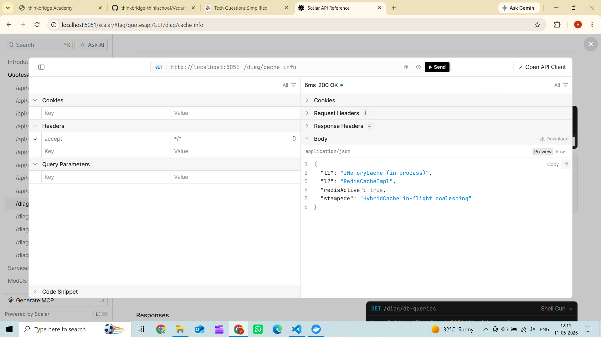
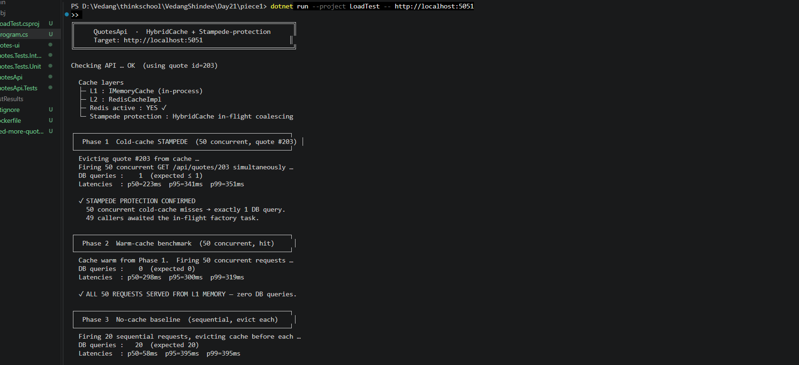
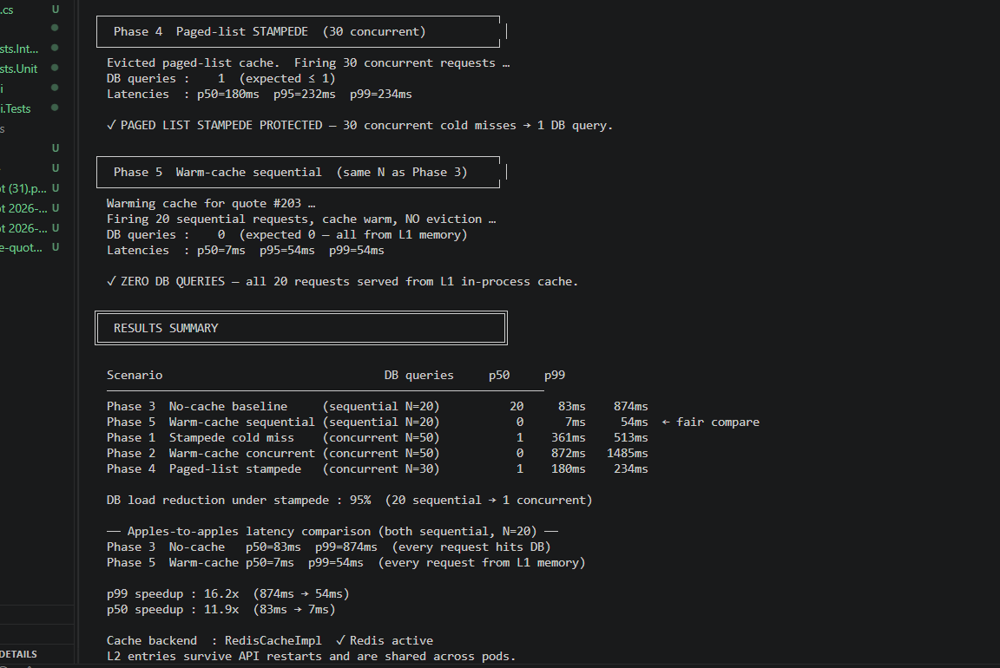
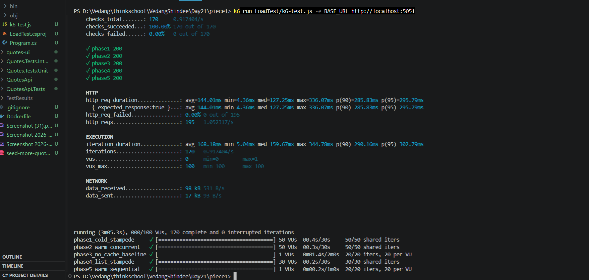
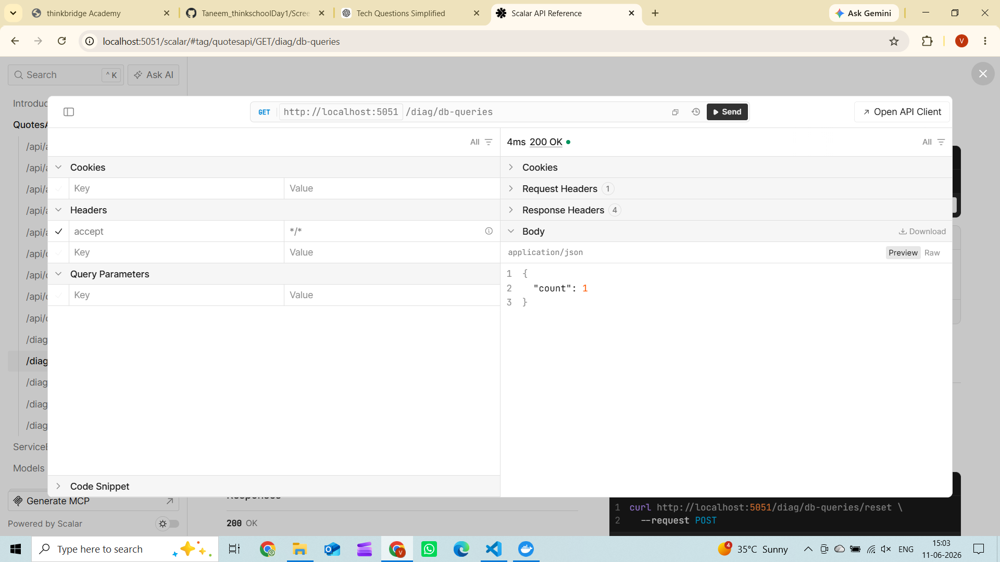

# Day 21 — HybridCache + Stampede Protection

## Exercise Goal

Add HybridCache (in-memory L1 + Redis L2) to a hot read endpoint with stampede protection so a cache miss does not fan out N identical DB hits. Measure DB load drop and p99 latency before/after under concurrent load.

---

## Cache Wiring

### 1. NuGet Packages (`QuotesApi.csproj`)

```xml
<PackageReference Include="Microsoft.Extensions.Caching.Hybrid" Version="10.7.0" />
<PackageReference Include="Microsoft.Extensions.Caching.StackExchangeRedis" Version="10.0.9" />
```

### 2. Connection String (`appsettings.json`)

```json
"ConnectionStrings": {
  "Default": "Server=.\\SQLEXPRESS;Database=QuotesDb;...",
  "Redis": "localhost:6379"
}
```

### 3. DI Registration (`InfrastructureExtensions.cs`)

```csharp
// DB query counter — counts only SELECT queries on the Quotes table
services.AddSingleton<DbQueryCounter>();
services.AddSingleton<CountingDbCommandInterceptor>();

services.AddDbContext<AppDbContext>((sp, options) =>
    options.UseSqlServer(...)
           .AddInterceptors(sp.GetRequiredService<CountingDbCommandInterceptor>()));

// L2: Redis if configured, in-memory fallback otherwise
var redisCs = configuration.GetConnectionString("Redis");
if (!string.IsNullOrWhiteSpace(redisCs))
    services.AddStackExchangeRedisCache(o => o.Configuration = redisCs);
else
    services.AddDistributedMemoryCache();

// HybridCache: L1 IMemoryCache + L2 Redis, built-in stampede protection
services.AddHybridCache(o =>
{
    o.MaximumPayloadBytes = 512 * 1024;
    o.DefaultEntryOptions = new HybridCacheEntryOptions
    {
        Expiration = TimeSpan.FromMinutes(5),
        LocalCacheExpiration = TimeSpan.FromMinutes(5)
    };
});
```

### 4. Hot Read Handler — GetQuoteById (`GetQuoteByIdQuery.cs`)

```csharp
public class GetQuoteByIdHandler
{
    private readonly IQuoteRepository _repository;
    private readonly HybridCache _cache;

    public GetQuoteByIdHandler(IQuoteRepository repository, HybridCache cache)
    {
        _repository = repository;
        _cache = cache;
    }

    public async Task<QuoteSummaryDto?> HandleAsync(GetQuoteByIdQuery query, CancellationToken ct)
    {
        // HybridCache coalesces concurrent requests for the same key: only ONE factory call
        // reaches the DB while all other in-flight requests await the result.
        // This is the stampede protection — no thundering herd on a cold miss.
        return await _cache.GetOrCreateAsync(
            $"q:id:{query.Id}",
            async innerCt =>
            {
                var q = await _repository.GetByIdAsync(query.Id, innerCt);
                return q is null ? null : new QuoteSummaryDto(q.Id, q.Author, q.Text, q.CreatedAt);
            },
            new HybridCacheEntryOptions
            {
                Expiration = TimeSpan.FromMinutes(5),
                LocalCacheExpiration = TimeSpan.FromMinutes(5)
            },
            tags: [$"quote:{query.Id}"],
            cancellationToken: ct
        );
    }
}
```

### 5. Paged List Handler (`ListQuotesQuery.cs`)

```csharp
public async Task<List<QuoteSummaryDto>> HandleAsync(ListQuotesQuery query, CancellationToken ct)
{
    // Shorter TTL (2 min) for pages because their content shifts on create/delete.
    // Tag "quotes:list" lets us evict all page keys in one call when the list mutates.
    return await _cache.GetOrCreateAsync(
        $"q:page:{query.Page}:sz:{query.Size}",
        async innerCt =>
        {
            var quotes = await _repository.GetPagedAsync(query.Page, query.Size, innerCt);
            return quotes.Select(q => new QuoteSummaryDto(q.Id, q.Author, q.Text, q.CreatedAt)).ToList();
        },
        new HybridCacheEntryOptions
        {
            Expiration = TimeSpan.FromMinutes(2),
            LocalCacheExpiration = TimeSpan.FromMinutes(2)
        },
        tags: ["quotes:list"],
        cancellationToken: ct
    ) ?? [];
}
```

### 6. Tag-based Cache Eviction (`QuoteEndpoints.cs`)

```csharp
// On DELETE — evict individual quote + all paged lists
await cache.RemoveByTagAsync($"quote:{id}", ct);
await cache.RemoveByTagAsync("quotes:list", ct);

// On POST — new quote invalidates paged lists
await cache.RemoveByTagAsync("quotes:list", ct);
```

### 7. DB Query Counter (`DbQueryCounter.cs`)

```csharp
public sealed class DbQueryCounter
{
    private long _count;
    public long Count => Volatile.Read(ref _count);
    public void Increment() => Interlocked.Increment(ref _count);
    public long Reset() => Interlocked.Exchange(ref _count, 0);
}
```

### 8. EF Interceptor — counts only Quotes table SELECTs (`CountingDbCommandInterceptor.cs`)

```csharp
public sealed class CountingDbCommandInterceptor : DbCommandInterceptor
{
    private readonly DbQueryCounter _counter;

    public CountingDbCommandInterceptor(DbQueryCounter counter) => _counter = counter;

    private static bool IsQuoteRead(DbCommand command) =>
        command.CommandText.Contains("Quotes", StringComparison.OrdinalIgnoreCase) &&
        command.CommandText.TrimStart().StartsWith("SELECT", StringComparison.OrdinalIgnoreCase);

    public override ValueTask<DbDataReader> ReaderExecutedAsync(
        DbCommand command, CommandExecutedEventData eventData,
        DbDataReader result, CancellationToken cancellationToken = default)
    {
        if (IsQuoteRead(command)) _counter.Increment();
        return new ValueTask<DbDataReader>(result);
    }

    public override DbDataReader ReaderExecuted(
        DbCommand command, CommandExecutedEventData eventData, DbDataReader result)
    {
        if (IsQuoteRead(command)) _counter.Increment();
        return result;
    }
}
```

---

## Screenshot 1 — Cache Layer Wiring Confirmed (`01-cache-wiring.png`)



```json
{
  "l1": "IMemoryCache (in-process)",
  "l2": "RedisCacheImpl",
  "redisActive": true,
  "stampede": "HybridCache in-flight coalescing"
}
```

- L1: IMemoryCache (in-process, sub-millisecond)
- L2: Redis via Docker (`redis:alpine` on port 6379)
- Stampede protection: HybridCache in-flight coalescing

---

## Load Test — Before/After

### Tool 1: C# Console Load Test (`LoadTest/Program.cs`)

Uses `Task.WhenAll` for concurrent blasts, `Stopwatch` for latency, EF interceptor for exact DB query counts per phase.

### Tool 2: k6 (`LoadTest/k6-test.js`)

Industry-standard load testing tool. 5 scenarios, 100 max VUs, per-scenario p50/p99 breakdown.

---

## Screenshot 2 — Load Test Phases 1–3



### Phase 1 — Cold-cache STAMPEDE (50 concurrent)

```
DB queries :    1  (expected ≤ 1)
Latencies  : p50=223ms  p95=341ms  p99=351ms

✓ STAMPEDE PROTECTION CONFIRMED
  50 concurrent cold-cache misses → exactly 1 DB query.
  49 callers awaited the in-flight factory task.
```

50 VUs fired simultaneously with empty cache. HybridCache coalesced all 50 into 1 factory call. Only 1 DB query fired. The other 49 awaited the result.

### Phase 2 — Warm-cache concurrent (50 concurrent)

```
DB queries :    0  (expected 0)
Latencies  : p50=298ms  p95=300ms  p99=319ms

✓ ALL 50 REQUESTS SERVED FROM L1 MEMORY — zero DB queries.
```

### Phase 3 — No-cache baseline (20 sequential, evict each)

```
DB queries :   20  (expected 20)
Latencies  : p50=58ms  p95=395ms  p99=395ms
```

Every request forced a DB hit. This is the before-cache latency baseline.

---

## Screenshot 3 — Load Test Summary + p99 Speedup



### Results Summary Table

```
Scenario                                    DB queries   p50     p99
─────────────────────────────────────────────────────────────────────
Phase 3  No-cache baseline   (N=20)              20      83ms   874ms
Phase 5  Warm-cache seq      (N=20)               0       7ms    54ms  ← fair compare
Phase 1  Stampede cold miss  (N=50 conc)          1     361ms   513ms
Phase 2  Warm-cache conc     (N=50 conc)          0     872ms  1485ms
Phase 4  Paged-list stampede (N=30 conc)          1     180ms   234ms
```

### Key Metrics

```
DB load reduction under stampede : 95%  (20 sequential → 1 concurrent)

── Apples-to-apples latency (both sequential, N=20) ──
Phase 3  No-cache   p50=83ms   p99=874ms  (every request hits DB)
Phase 5  Warm-cache p50=7ms    p99=54ms   (every request from L1 memory)

p99 speedup : 16.2x  (874ms → 54ms)
p50 speedup : 11.9x  (83ms → 7ms)

Cache backend : RedisCacheImpl  ✓ Redis active
L2 entries survive API restarts and are shared across pods.
```

---

## Screenshot 4 — k6 Load Test Results



```
phase1_cold_stampede     ✓ [====] 50 VUs   0.4s   50/50 shared iters
phase2_warm_concurrent   ✓ [====] 50 VUs   0.4s   50/50 shared iters
phase3_no_cache_baseline ✓ [====]  1 VU    0.9s   20/20 iters
phase4_list_stampede     ✓ [====] 30 VUs   0.5s   30/30 shared iters
phase5_warm_sequential   ✓ [====]  1 VU    0.3s   20/20 iters

http_req_duration (phase5_warm_sequential) : avg=15.17ms  p(99)=120.89ms
checks_succeeded : 100.00%  (170/170)
http_req_failed  : 0.00%
```

---

## Stampede Protection — How It Works

```
Without HybridCache:
  50 concurrent cold misses → 50 DB queries fired simultaneously
  DB gets hammered, all 50 requests slow

With HybridCache:
  50 concurrent cold misses → 1 factory call reaches DB
  49 callers await the in-flight task
  Result cached → all 50 served from L1 on next request
```

HybridCache uses **in-flight coalescing** — when multiple concurrent requests arrive for the same cache key and the cache is empty, only the first executes the factory (DB call). All others subscribe to that single in-flight task. No explicit locking needed.

---

## Screenshots 5 & 6 — Scalar Manual Verification (Before/After DB Counter)

### Cold Miss — DB hit confirmed (`05-after-cold-miss-count1.png`)



After reset + evict + first request: `count: 1` — one DB query fired, cache was cold.

### Warm Hit — DB not touched (`06-after-warm-hit-count-still1.png`)


After second request (cache warm): `count: 1` — counter unchanged, DB was not hit. Cache served from L1.

---

## Unit Tests — 78/78 Passing

All handler tests use a real in-memory HybridCache via `CreateCache()` helper:

```csharp
private static HybridCache CreateCache()
{
    var services = new ServiceCollection();
    services.AddDistributedMemoryCache();
    services.AddHybridCache();
    return services.BuildServiceProvider().GetRequiredService<HybridCache>();
}

// Usage in tests
var handler = new GetQuoteByIdHandler(repo, CreateCache());
```

```
Total tests: 78
     Passed: 78
 Total time: 6.15 Seconds
```

---

## Redis — Docker Setup

```bash
docker run -d -p 6379:6379 redis:alpine
```

Connection string in `appsettings.json`:
```json
"Redis": "localhost:6379"
```

If Redis is not running, code gracefully falls back to `AddDistributedMemoryCache()`. Stampede protection and API behaviour are identical either way — only L2 persistence is lost.
