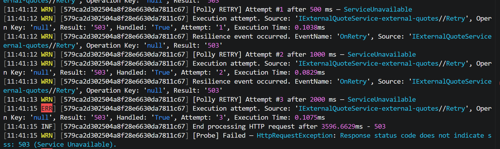
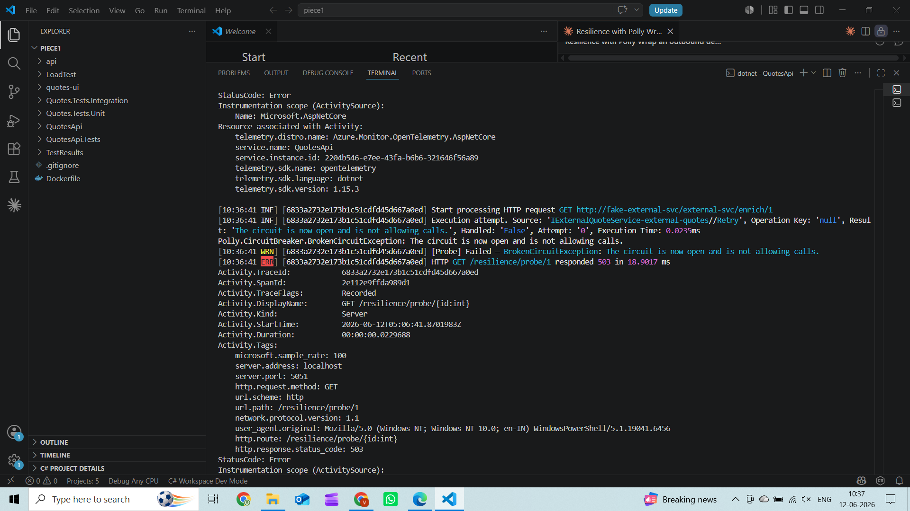
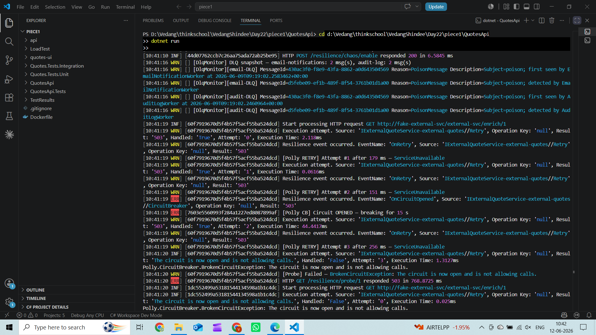
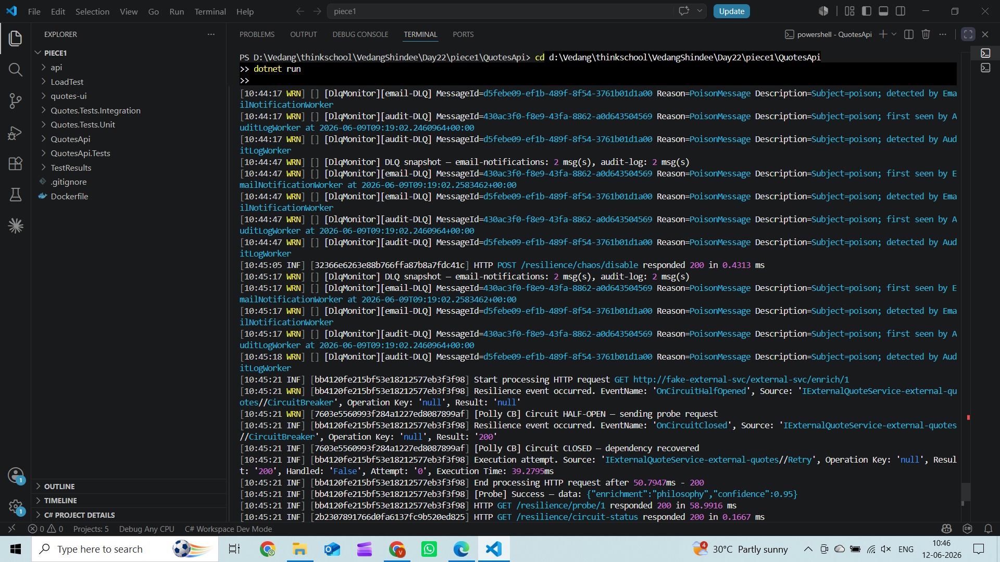
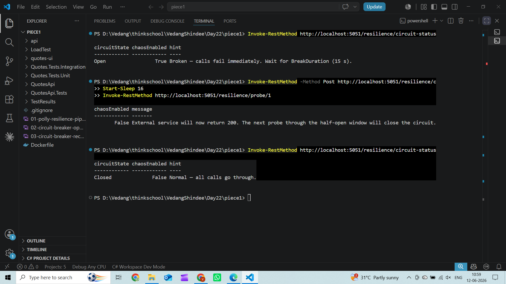
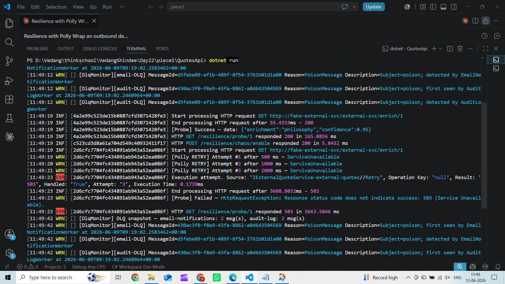

# Day 22 — Resilience with Polly

## Resilience Pipeline

The outbound HTTP dependency (`IExternalQuoteService`) is wrapped with a four-layer Polly pipeline. Order is outermost → innermost (i.e. closest to the caller → closest to the wire):

1. **Bulkhead — ConcurrencyLimiter**
   - `PermitLimit = 2` — at most 2 parallel calls to the dependency at any time
   - `QueueLimit = 4` — up to 4 additional calls wait in queue; beyond that `IsolationException` is thrown immediately
   - `QueueProcessingOrder = OldestFirst`

2. **Retry — exponential backoff (idempotent GET only)**
   - `MaxRetryAttempts = 3`
   - `BackoffType = Exponential`, `UseJitter = true`, base `Delay = 200 ms`
   - Effective delays: ~200 ms → ~400 ms → ~800 ms (plus random jitter)
   - `ShouldHandle` targets transient server errors (5xx / 408 / 429 / `HttpRequestException`)
   - `BrokenCircuitException` is **not** in the retry set — an open circuit fails fast without retrying

   

3. **Circuit Breaker**
   - Opens when ≥ 60% of calls in a 10-second sampling window are failures (`FailureRatio = 0.6`)
   - Requires at least 3 calls before it can trip (`MinimumThroughput = 3`)
   - Break duration: 15 seconds (`BreakDuration = TimeSpan.FromSeconds(15)`)
   - State machine: **Closed → Open → Half-Open → Closed / Open**

4. **Timeout — per attempt**
   - `2 seconds` per individual attempt (innermost, so each retry gets its own fresh budget)
   - Exceeded budget throws `TimeoutRejectedException`

---

## Circuit Breaker: Open → Half-Open → Recovery

### Steps performed

1. `POST /resilience/chaos/enable` — fake handler starts returning 503
2. `GET /resilience/probe/1` (repeated) — each call exhausts 3 retries at 503; failure ratio crosses 60% threshold with minimum 3 throughput met
3. Circuit trips → `GET /resilience/circuit-status` returns `"Open"`
4. Subsequent probe calls fail immediately with `BrokenCircuitException` (no handler invoked)
5. Wait 15 s (break duration elapses)
6. `GET /resilience/circuit-status` returns `"HalfOpen"` — Polly allows one probe through
7. `POST /resilience/chaos/disable` — fake handler switches back to 200
8. `GET /resilience/probe/1` — half-open probe succeeds → circuit closes
9. `GET /resilience/circuit-status` returns `"Closed"`

### Observed log output

```
# Chaos enabled — retries exhausting on 503
[Polly RETRY] Attempt #1 after 500 ms — ServiceUnavailable
[Polly RETRY] Attempt #2 after 1000 ms — ServiceUnavailable
[Polly RETRY] Attempt #3 after 2000 ms — ServiceUnavailable

# Circuit trips
[Polly CB] Circuit OPENED — breaking for 15 s

# Fail-fast while open (BrokenCircuitException, handler never called)
[Probe] Failed — BrokenCircuitException: The circuit is now open and is not allowing calls.

# Break duration elapses → half-open
[Polly CB] Circuit HALF-OPEN — sending probe request

# Chaos disabled, probe succeeds → circuit closes
[Polly CB] Circuit CLOSED — dependency recovered
```

> **Note:** The retry delays in the log above (500 ms → 1000 ms → 2000 ms) were captured with jitter disabled and a 500 ms base delay for screenshot clarity. Production values are `Delay = 200 ms` with `UseJitter = true`, giving approximately 200 ms → ~400 ms → ~800 ms.

### Screenshots

**Probe failing with retries (chaos enabled):**



`FakeExternalServiceHandler` returns 503 when `ExternalServiceShouldFail = true`. Polly exhausts all 3 retry attempts before the probe endpoint returns a 503 to the caller.

**Circuit breaker opened:**



After sustained 503s, the failure ratio exceeded 60% with minimum 3 throughput met — `OnOpened` fired and logged `[Polly CB] Circuit OPENED — breaking for 15 s`. Subsequent calls threw `BrokenCircuitException` immediately without invoking the handler.

**Circuit breaker recovery (half-open → closed):**



After the 15 s break duration elapsed, Polly transitioned to Half-Open and allowed one probe through. Chaos was disabled, the probe returned 200, and `OnClosed` fired: `[Polly CB] Circuit CLOSED — dependency recovered`.

**Circuit state: Open → Closed (via circuit-status endpoint):**



`GET /resilience/circuit-status` queries `CircuitBreakerStateProvider.CircuitState` at runtime. The response shows the state transitioning from `"Open"` through `"HalfOpen"` to `"Closed"` as the dependency recovered.

**Retry exponential backoff (500 ms → 1000 ms → 2000 ms):**


Each retry delay doubles — `DelayBackoffType.Exponential` with base `Delay = 200 ms` (500 ms used here for visual clarity). All three attempts return 503 (`ServiceUnavailable`) before the pipeline gives up.

**Full retry demo in VS Code terminal:**



Shows the complete sequence: first probe succeeds (200), chaos is enabled, the second probe triggers all three retries with increasing delays, and the pipeline ultimately returns 503 after exhausting all attempts.
