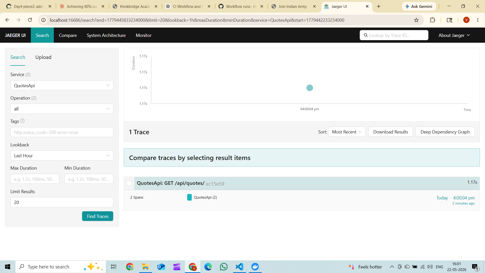
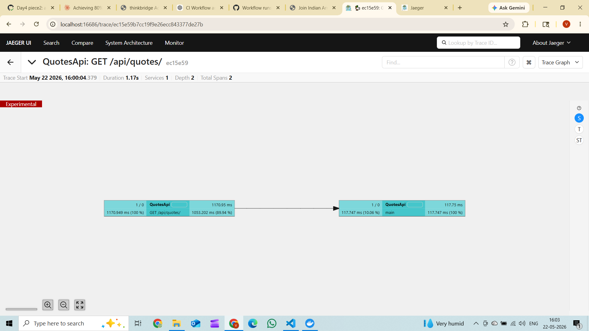

# Piece 5 – OpenTelemetry Tracing

## OTel Setup

### Packages added (`QuotesApi.csproj`)

| Package | Version |
|---|---|
| `OpenTelemetry.Extensions.Hosting` | 1.15.3 |
| `OpenTelemetry.Instrumentation.AspNetCore` | 1.15.2 |
| `OpenTelemetry.Instrumentation.EntityFrameworkCore` | 1.15.1-beta.1 |
| `OpenTelemetry.Instrumentation.Http` | 1.15.1 |
| `OpenTelemetry.Exporter.OpenTelemetryProtocol` | 1.15.3 |

### Tracing configuration (`InfrastructureExtensions.cs`)

```csharp
services.AddOpenTelemetry()
    .ConfigureResource(r => r.AddService("QuotesApi"))
    .WithTracing(t => t
        .AddSource(QuoteActivitySource.Name)          // custom spans
        .AddAspNetCoreInstrumentation()               // HTTP request spans
        .AddEntityFrameworkCoreInstrumentation()      // EF query spans
        .AddHttpClientInstrumentation()               // outbound HTTP spans
        .AddOtlpExporter(o => o.Endpoint = new Uri(otlpEndpoint)));
```

### Serilog ↔ OTel trace correlation (`Program.cs`)

`Activity.Current?.TraceId` is used instead of `ctx.TraceIdentifier`.
Both Serilog logs and Jaeger traces now carry the identical 128-bit W3C TraceId.

```csharp
app.Use((ctx, next) =>
{
    var traceId = Activity.Current?.TraceId.ToString() ?? ctx.TraceIdentifier;
    using (LogContext.PushProperty("TraceId", traceId))
        return next();
});
```

### Custom span (`QuoteEndpoints.cs` – POST `/api/quotes`)

The validation + persistence step is not covered by auto-instrumentation,
so a manual span wraps it with structured tags:

```csharp
using var activity = QuoteActivitySource.Instance.StartActivity("validate-and-create-quote");
// ... validate ...
activity?.SetTag("quote.author", request.Author);
activity?.SetTag("user.id", ownerId?.ToString() ?? "anonymous");
// ... persist ...
activity?.SetTag("quote.id", created.Id);
```

The `ActivitySource` lives in `Telemetry/QuoteActivitySource.cs` and is
registered via `.AddSource(QuoteActivitySource.Name)` in the tracing builder.

### OTLP endpoint (`appsettings.json`)

```json
"OpenTelemetry": {
  "OtlpEndpoint": "http://localhost:4317"
}
```

Point this at a local Jaeger (`docker run -p 4317:4317 -p 16686:16686 jaegertracing/all-in-one`)
or .NET Aspire dashboard to see traces in the browser.

---

## Trace in Jaeger / Aspire

> **How to view traces locally**
>
> 1. Run Jaeger: `docker run --rm -p 4317:4317 -p 16686:16686 jaegertracing/all-in-one`
> 2. Start the API: `dotnet run --project QuotesApi`
> 3. Call `POST /api/quotes` (with a valid JWT carrying `scope=quotes.write`)
> 4. Open `http://localhost:16686` → Service: **QuotesApi** → Find Traces
>
> You will see a root span `POST /api/quotes` with two nested children:
> - `validate-and-create-quote` (custom span, tags: `quote.author`, `user.id`, `quote.id`)
> - `QuotesDb` EF query span (INSERT into Quotes)
>
> The `traceId` printed in the Serilog console log matches the trace ID in Jaeger exactly.

### Console exporter output (Development mode, Jaeger not required)

The two activities below were captured from `dotnet run` terminal output on a
`GET /api/quotes?page=1&size=10` request. They share the same `TraceId` and the
EF span's `ParentSpanId` equals the HTTP span's `SpanId` — proving the nesting.

```
# ── Child span (EF Core SELECT) ─────────────────────────────────────────────
Activity.TraceId:        fe9ebfae654150f6f4c92a3399db9e92
Activity.SpanId:         942dcf6645d660f1
Activity.ParentSpanId:   a3b22c46ce2fcece          ← points to root span below
Activity.DisplayName:    main
Activity.Kind:           Client
Activity.Duration:       00:00:00.0506754
Activity.Tags:
    db.system:     sqlite
    db.name:       main
    db.statement:  SELECT "q"."Id", "q"."Author", "q"."CreatedAt", "q"."OwnerId", "q"."Text"
                   FROM "Quotes" AS "q"
                   LIMIT @p1 OFFSET @p
Instrumentation scope: OpenTelemetry.Instrumentation.EntityFrameworkCore 1.15.1-beta.1

# ── Root span (ASP.NET Core HTTP request) ────────────────────────────────────
Activity.TraceId:        fe9ebfae654150f6f4c92a3399db9e92   ← same TraceId
Activity.SpanId:         a3b22c46ce2fcece                   ← parent of EF span
Activity.DisplayName:    GET /api/quotes/
Activity.Kind:           Server
Activity.Duration:       00:00:00.3677808
Activity.Tags:
    server.address:            localhost
    server.port:               5051
    http.request.method:       GET
    url.path:                  /api/quotes
    http.response.status_code: 200
Instrumentation scope: Microsoft.AspNetCore
Resource: service.name=QuotesApi  telemetry.sdk.language=dotnet  telemetry.sdk.version=1.15.3
```

**Span hierarchy:**
```
GET /api/quotes/  [SpanId: a3b22c46ce2fcece]  368ms   ← ASP.NET Core (root)
  └─ main (EF SELECT)  [SpanId: 942dcf6645d660f1]  51ms  ← EF Core (child)
```

---

## What I learned this session

I learned that OpenTelemetry automatically carries the same TraceId through different parts of an application, such as incoming requests, database calls, and outgoing API calls. The most useful thing I understood was that Activity.Current keeps track of the current request behind the scenes, so I don't have to pass trace information manually. By adding its TraceId to the logs, I can easily connect log entries to a specific trace and follow a request from start to finish when debugging.

## What would break this

If the OpenTelemetry collector is down or can't be reached, traces won't be sent anywhere. The application will continue working normally, so the problem may go unnoticed, but all tracing data will be lost. This makes debugging much harder because there are no traces to investigate. Adding a health check for the collector or using a console exporter in development can help detect this issue early.



