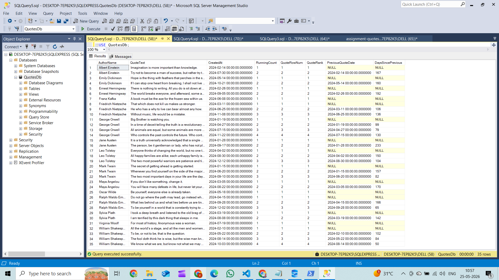

# SQL Query

USE QuotesDb;
GO

SELECT
    a.Name        AS AuthorName,
    q.QuoteText,
    q.CreatedAt,

    SUM(1) OVER (
        PARTITION BY q.AuthorId
        ORDER BY     q.CreatedAt, q.QuoteId
        ROWS BETWEEN UNBOUNDED PRECEDING AND CURRENT ROW
    ) AS RunningCount,

    ROW_NUMBER() OVER (
        PARTITION BY q.AuthorId
        ORDER BY     q.CreatedAt, q.QuoteId
    ) AS QuoteRowNum,

    RANK() OVER (
        PARTITION BY q.AuthorId
        ORDER BY     q.CreatedAt
    ) AS QuoteRank,

    LAG(q.CreatedAt) OVER (
        PARTITION BY q.AuthorId
        ORDER BY     q.CreatedAt, q.QuoteId
    ) AS PreviousQuoteDate,

    DATEDIFF(
        DAY,
        LAG(q.CreatedAt) OVER (
            PARTITION BY q.AuthorId
            ORDER BY     q.CreatedAt, q.QuoteId
        ),
        q.CreatedAt
    ) AS DaysSincePrevious

FROM       Authors a
INNER JOIN Quotes  q ON q.AuthorId = a.AuthorId
ORDER BY   a.Name, q.CreatedAt;

# Sample Rows Output

| Author | Quote (short) | Date | # | Days Gap |
|---|---|---|---|---|
| Albert Einstein | Imagination is more important… | 2024-02-14 | 1 | NULL |
| Albert Einstein | Try not to become a man of success… | 2024-07-30 | 2 | 167 |
| Emily Dickinson | Hope is the thing with feathers… | 2024-05-14 | 1 | NULL |
| Emily Dickinson | If I can stop one heart from breaking… | 2024-10-21 | 2 | 160 |
| Ernest Hemingway | There is nothing to writing… | 2024-02-26 | 1 | NULL |
| Ernest Hemingway | The world breaks everyone… | 2024-09-05 | 2 | 192 |
| Franz Kafka | A book must be the axe… | 2024-06-08 | 1 | NULL |
| Friedrich Nietzsche | That which does not kill us… | 2024-03-11 | 1 | NULL |
| Friedrich Nietzsche | He who has a why to live… | 2024-06-25 | 2 | 106 |
| Friedrich Nietzsche | Without music, life would be a mistake. | 2024-11-08 | 3 | 136 |

