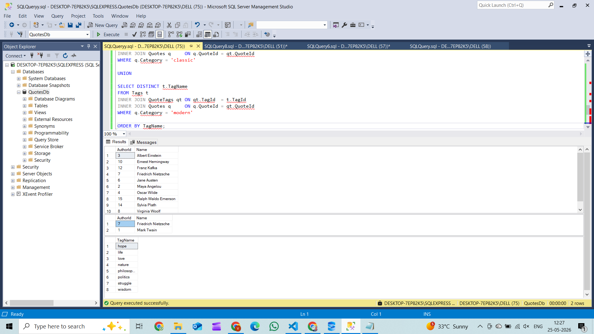

## Q1 — Authors with quotes but no tags
**Operator:** `EXCEPT`
**Why:** "A but not B" — start with all authors who have quotes, subtract those whose quotes have tags. `EXCEPT` is the set-difference operator built for exactly this case.

```sql
SELECT DISTINCT a.AuthorId, a.Name
FROM Authors a
INNER JOIN Quotes q ON q.AuthorId = a.AuthorId

EXCEPT

SELECT DISTINCT a.AuthorId, a.Name
FROM Authors a
INNER JOIN Quotes q     ON q.AuthorId = a.AuthorId
INNER JOIN QuoteTags qt ON qt.QuoteId = q.QuoteId

ORDER BY Name;
```

**Results (10 rows)**

| AuthorId | Name                |
|----------|---------------------|
| 3        | Albert Einstein     |
| 10       | Ernest Hemingway    |
| 12       | Franz Kafka         |
| 7        | Friedrich Nietzsche |
| 6        | Jane Austen         |
| 2        | Maya Angelou        |
| 4        | Oscar Wilde         |
| 15       | Ralph Waldo Emerson |
| 14       | Sylvia Plath        |
| 8        | Virginia Woolf      |

---

## Q2 — Authors in both 'classic' AND 'modern'
**Operator:** `INTERSECT`
**Why:** Need rows present in **both** result sets. `INTERSECT` keeps only what appears in both — exactly the "and" semantics the business question asks for.

```sql
SELECT DISTINCT a.AuthorId, a.Name
FROM Authors a
INNER JOIN Quotes q ON q.AuthorId = a.AuthorId
WHERE q.Category = 'classic'

INTERSECT

SELECT DISTINCT a.AuthorId, a.Name
FROM Authors a
INNER JOIN Quotes q ON q.AuthorId = a.AuthorId
WHERE q.Category = 'modern'

ORDER BY Name;
```

**Results (2 rows)**

| AuthorId | Name                |
|----------|---------------------|
| 7        | Friedrich Nietzsche |
| 1        | Mark Twain          |

---

## Q3 — Combined distinct tag list across 'classic' + 'modern'
**Operator:** `UNION` (not `UNION ALL`)
**Why:** Want every tag in either category with no duplicates. `UNION` combines and deduplicates automatically. `UNION ALL` would keep duplicates — wrong for a "distinct" list.

```sql
SELECT DISTINCT t.TagName
FROM Tags t
INNER JOIN QuoteTags qt ON qt.TagId  = t.TagId
INNER JOIN Quotes q     ON q.QuoteId = qt.QuoteId
WHERE q.Category = 'classic'

UNION

SELECT DISTINCT t.TagName
FROM Tags t
INNER JOIN QuoteTags qt ON qt.TagId  = t.TagId
INNER JOIN Quotes q     ON q.QuoteId = qt.QuoteId
WHERE q.Category = 'modern'

ORDER BY TagName;
```

**Results (8 rows)**

| TagName    |
|------------|
| hope       |
| life       |
| love       |
| nature     |
| philosophy |
| politics   |
| struggle   |
| wisdom     |

---



## What I learned

The main thing I learned is that set operators like `UNION`, `INTERSECT`, and `EXCEPT` work on the results returned by queries, not directly on tables. They are useful when comparing two sets of data. `EXCEPT` finds rows that exist in one result but not the other, while `INTERSECT` finds rows that exist in both. This is different from a `JOIN`, which combines related data from multiple tables.

## What could go wrong

If an author has both tagged and untagged quotes, an `EXCEPT` query may give misleading results because it removes matching rows completely. Differences in text case, such as `'Classic'` and `'classic'`, can also cause filters to miss data in case-sensitive databases. Another common mistake is using `UNION ALL` instead of `UNION`. `UNION` removes duplicates automatically, while `UNION ALL` keeps them, which can lead to duplicate rows and incorrect counts in reports or calculations.
