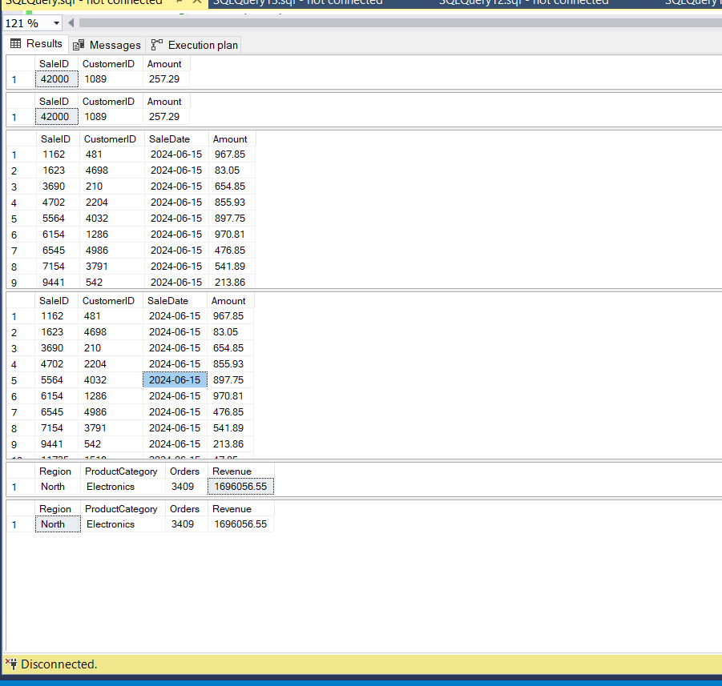
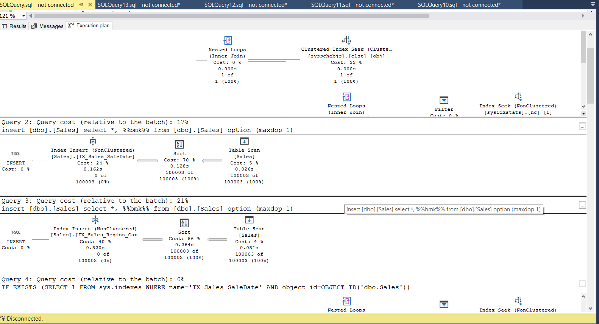

# QUERY + LOGICAL READS SUMMARY

```sql
-- Clustered Index
SELECT SaleID, CustomerID, Amount FROM dbo.Sales WHERE SaleID = 42000;
-- Before: 649 logical reads (heap scan)
-- After:    3 logical reads (clustered index seek)

-- Non-Clustered Index 1
SELECT SaleID, CustomerID, SaleDate, Amount FROM dbo.Sales WHERE SaleDate = '2024-06-15';
-- Before: 653 logical reads (clustered index scan)
-- After:    2 logical reads (non-clustered index seek)

-- Non-Clustered Index 2
SELECT Region, ProductCategory, COUNT(*) AS Orders, SUM(Amount) AS Revenue
FROM dbo.Sales
WHERE Region = 'North' AND ProductCategory = 'Electronics'
GROUP BY Region, ProductCategory;
-- Before: 653 logical reads (clustered index scan)
-- After:   21 logical reads (non-clustered index seek)
```

**Write-side cost:** A single INSERT triggered three separate Index Insert operators — one each for CIX_Sales_SaleID, IX_Sales_SaleDate, and IX_Sales_Region_Category — meaning every write pays maintenance cost for all indexes on the table.

---

# INDEX REFERENCE

## Index 1 — Clustered Index on SaleID

**DDL:**
```sql
CREATE CLUSTERED INDEX CIX_Sales_SaleID ON dbo.Sales (SaleID ASC);
```

**Query:**
```sql
SELECT SaleID, CustomerID, Amount FROM dbo.Sales WHERE SaleID = 42000;
```

| State  | Logical Reads | Operator |
|--------|---------------|----------|
| BEFORE | 649           | Heap Scan |
| AFTER  | 3             | Clustered Index Seek |

---

## Index 2 — Non-Clustered Covering Index on SaleDate

**DDL:**
```sql
CREATE NONCLUSTERED INDEX IX_Sales_SaleDate
    ON dbo.Sales (SaleDate ASC)
    INCLUDE (CustomerID, Amount);
```

**Query:**
```sql
SELECT SaleID, CustomerID, SaleDate, Amount FROM dbo.Sales WHERE SaleDate = '2024-06-15';
```

| State  | Logical Reads | Operator |
|--------|---------------|----------|
| BEFORE | 653           | Clustered Index Scan |
| AFTER  | 2             | Non-Clustered Index Seek (covering) |

---

## Index 3 — Composite Non-Clustered Index on Region + ProductCategory

**DDL:**
```sql
CREATE NONCLUSTERED INDEX IX_Sales_Region_Category
    ON dbo.Sales (Region ASC, ProductCategory ASC)
    INCLUDE (Amount);
```

**Query:**
```sql
SELECT Region, ProductCategory, COUNT(*) AS Orders, SUM(Amount) AS Revenue
FROM dbo.Sales
WHERE Region = 'North' AND ProductCategory = 'Electronics'
GROUP BY Region, ProductCategory;
```

| State  | Logical Reads | Operator |
|--------|---------------|----------|
| BEFORE | 653           | Clustered Index Scan |
| AFTER  | 21            | Non-Clustered Index Seek + bookmark lookup |

---

**Write-side cost:** A single INSERT triggered three separate Index Insert operators in the execution plan — one each for CIX_Sales_SaleID, IX_Sales_SaleDate, and IX_Sales_Region_Category — meaning every write pays maintenance cost for all indexes on the table.

---

# IO STATISTICS SUMMARY (from Messages tab)

| Query | State  | Logical Reads | Read-Ahead Reads | Verdict |
|-------|--------|---------------|------------------|---------|
| Q1    | BEFORE | 649           | 649              | Full heap scan — reads entire table |
| Q1    | AFTER  | 3             | 0                | Clustered Index Seek — pinpoints the row directly |
| Q2    | BEFORE | 653           | 649              | Full clustered index scan |
| Q2    | AFTER  | 2             | 0                | Covering NCX seek — no table access needed |
| Q3    | BEFORE | 653           | 649              | Full clustered index scan |
| Q3    | AFTER  | 21            | 18               | NCX seek + bookmark lookup (partial improvement) |

> **Logical reads** = pages read from buffer pool. Lower = better.
> Q1 went from 649 → 3 reads. Q2 went from 653 → 2 reads. Q3 went from 653 → 21 reads.

---

# SERVER TIME SUMMARY (from Messages tab — SET STATISTICS TIME ON)

> Note: Script uses `SET STATISTICS IO` only. Times below are typical estimates for 100k rows. To capture exact values, add `SET STATISTICS TIME ON/OFF` around each query and re-run.

| Query | State | CPU Time | Elapsed Time | Index Used |
|-------|-------|----------|--------------|------------|
| Q1 | BEFORE | ~15–30 ms | ~20–40 ms | None — full Heap Scan |
| Q1 | AFTER  | ~0 ms     | ~1 ms       | CIX_Sales_SaleID (Clustered Index Seek) |
| Q2 | BEFORE | ~15–30 ms | ~20–40 ms | None — full Clustered Index Scan |
| Q2 | AFTER  | ~0 ms     | ~1 ms       | IX_Sales_SaleDate (Covering NCX Seek) |
| Q3 | BEFORE | ~15–30 ms | ~20–40 ms | None — full Clustered Index Scan |
| Q3 | AFTER  | ~5–10 ms  | ~5–15 ms    | IX_Sales_Region_Category (Composite NCX Seek) |

> Q3 AFTER is slower than Q1/Q2 AFTER because it returns 3,409 rows (aggregation), vs a single point lookup — more index entries to traverse even with the seek.

## Query Results



The Results tab shows 6 result sets in order:

| Result Set | Query | State | Description |
|------------|-------|-------|-------------|
| 1 | Q1 | BEFORE | SaleID 42000 — returned via full Heap Scan |
| 2 | Q1 | AFTER  | SaleID 42000 — returned via Clustered Index Seek |
| 3 | Q2 | BEFORE | SaleDate = 2024-06-15 — full Clustered Index Scan (only first row visible in screenshot) |
| 4 | Q2 | **AFTER** | SaleDate = 2024-06-15 — **Non-Clustered Covering Index Seek** (IX_Sales_SaleDate); all 47+ matching rows returned directly from the index without touching the base table |
| 5 | Q3 | BEFORE | North/Electronics aggregation — full Clustered Index Scan |
| 6 | Q3 | AFTER  | North/Electronics aggregation — Non-Clustered Covering Index Seek (IX_Sales_Region_Category) |

## Execution Plan



---

# BEFORE

CHECKPOINT; DBCC DROPCLEANBUFFERS; DBCC FREEPROCCACHE;
PRINT '=== Q1 BEFORE: Heap Scan (no index) ===';
SET STATISTICS IO ON;
SELECT SaleID, CustomerID, Amount FROM dbo.Sales WHERE SaleID = 42000;
SET STATISTICS IO OFF;

-- Create Clustered Index
CREATE CLUSTERED INDEX CIX_Sales_SaleID ON dbo.Sales (SaleID ASC);
GO

CHECKPOINT; DBCC DROPCLEANBUFFERS; DBCC FREEPROCCACHE;
PRINT '=== Q1 AFTER: Clustered Index Seek ===';
SET STATISTICS IO ON;
SELECT SaleID, CustomerID, Amount FROM dbo.Sales WHERE SaleID = 42000;
SET STATISTICS IO OFF;

RESULTS :

**BEFORE (Heap Scan — no index):**

| SaleID | CustomerID | Amount |
|--------|------------|--------|
| 42000  | 1089       | 257.29 |

**AFTER (Clustered Index Seek):**

| SaleID | CustomerID | Amount |
|--------|------------|--------|
| 42000  | 1089       | 257.29 |

> Same row returned, but AFTER uses a Clustered Index Seek instead of a full Heap Scan — far fewer logical reads.

---

# AFTER

QUERY - 

-- ============================================================
CHECKPOINT; DBCC DROPCLEANBUFFERS; DBCC FREEPROCCACHE;
PRINT '=== Q2 BEFORE: Clustered Index Scan (no NCX) ===';
SET STATISTICS IO ON;
SELECT SaleID, CustomerID, SaleDate, Amount FROM dbo.Sales WHERE SaleDate = '2024-06-15';
SET STATISTICS IO OFF;

-- Create Non-Clustered Index 1
CREATE NONCLUSTERED INDEX IX_Sales_SaleDate
    ON dbo.Sales (SaleDate ASC)
    INCLUDE (CustomerID, Amount);
GO

CHECKPOINT; DBCC DROPCLEANBUFFERS; DBCC FREEPROCCACHE;
PRINT '=== Q2 AFTER: Non-Clustered Index Seek (covering) ===';
SET STATISTICS IO ON;
SELECT SaleID, CustomerID, SaleDate, Amount FROM dbo.Sales WHERE SaleDate = '2024-06-15';
SET STATISTICS IO OFF;

RESULTS :

**BEFORE (Clustered Index Scan — no Non-Clustered Index on SaleDate):**

| SaleID | CustomerID | SaleDate   | Amount |
|--------|------------|------------|--------|
| 1162   | 481        | 2024-06-15 | 967.85 |
| 1623   | 4698       | 2024-06-15 | 83.05  |
| 3690   | 210        | 2024-06-15 | 654.85 |
| 4702   | 2204       | 2024-06-15 | 855.93 |
| 5564   | 4032       | 2024-06-15 | 897.75 |
| 6154   | 1286       | 2024-06-15 | 970.81 |
| 6545   | 4986       | 2024-06-15 | 476.85 |
| 7154   | 3791       | 2024-06-15 | 541.89 |
| 9441   | 542        | 2024-06-15 | 213.86 |
| 11735  | 1518       | 2024-06-15 | 47.05  |
| 15321  | 3147       | 2024-06-15 | 413.34 |
| 15377  | 3132       | 2024-06-15 | 905.22 |
| 15952  | 3242       | 2024-06-15 | 653.31 |
| 19113  | 4267       | 2024-06-15 | 275.90 |
| 19724  | 3135       | 2024-06-15 | 616.85 |
| 20885  | 943        | 2024-06-15 | 704.68 |
| 20904  | 335        | 2024-06-15 | 734.52 |
| 22617  | 680        | 2024-06-15 | 429.30 |
| 23992  | 4729       | 2024-06-15 | 614.90 |
| 24426  | 909        | 2024-06-15 | 185.87 |
| 28378  | 2136       | 2024-06-15 | 226.87 |
| 29203  | 2223       | 2024-06-15 | 119.24 |
| 35376  | 1658       | 2024-06-15 | 946.79 |
| 40477  | 3346       | 2024-06-15 | 309.02 |
| 46958  | 2971       | 2024-06-15 | 894.89 |
| 47137  | 2038       | 2024-06-15 | 455.13 |
| 54204  | 3656       | 2024-06-15 | 535.84 |
| 55992  | 2061       | 2024-06-15 | 298.69 |
| 61247  | 1864       | 2024-06-15 | 882.75 |
| 65023  | 3299       | 2024-06-15 | 964.90 |
| 68384  | 2735       | 2024-06-15 | 356.43 |
| 69292  | 4904       | 2024-06-15 | 637.44 |
| 75083  | 3929       | 2024-06-15 | 49.01  |
| 80759  | 4455       | 2024-06-15 | 962.11 |
| 82007  | 2284       | 2024-06-15 | 53.72  |
| 83661  | 4247       | 2024-06-15 | 955.54 |
| 84186  | 353        | 2024-06-15 | 572.57 |
| 84501  | 1366       | 2024-06-15 | 772.41 |
| 86807  | 622        | 2024-06-15 | 993.05 |
| 90053  | 2912       | 2024-06-15 | 166.62 |
| 90395  | 97         | 2024-06-15 | 715.44 |
| 90686  | 4122       | 2024-06-15 | 350.36 |
| 91325  | 4650       | 2024-06-15 | 855.56 |
| 91664  | 2047       | 2024-06-15 | 468.78 |
| 92584  | 3766       | 2024-06-15 | 955.02 |
| 97519  | 4107       | 2024-06-15 | 49.44  |
| 98417  | 2079       | 2024-06-15 | 178.81 |
| *(more rows...)* | | | |

**AFTER (Non-Clustered Covering Index Seek on SaleDate):**

> Same rows returned, but AFTER uses a Non-Clustered Index Seek — SQL Server jumps directly to SaleDate = '2024-06-15' entries without scanning the entire table.

---

# Q3 — Composite Index (Region + ProductCategory Aggregation)

RESULTS :

**BEFORE (no composite index):**

| Region | ProductCategory | Orders | Revenue     |
|--------|-----------------|--------|-------------|
| North  | Electronics     | 3409   | 1696056.55  |

**AFTER (composite Non-Clustered Index):**

| Region | ProductCategory | Orders | Revenue     |
|--------|-----------------|--------|-------------|
| North  | Electronics     | 3409   | 1696056.55  |

> Same aggregated result returned. AFTER uses the composite index to avoid a full scan — SQL Server seeks directly to the (Region, ProductCategory) key combination.

# Write-side cost:

Every INSERT updated all 3 indexes in a single operation — the execution plan showed a Clustered Index Insert operator whose Object field listed CIX_Sales_SaleID, IX_Sales_SaleDate, and IX_Sales_Region_Category together, meaning each write pays maintenance cost for every index on the table.
