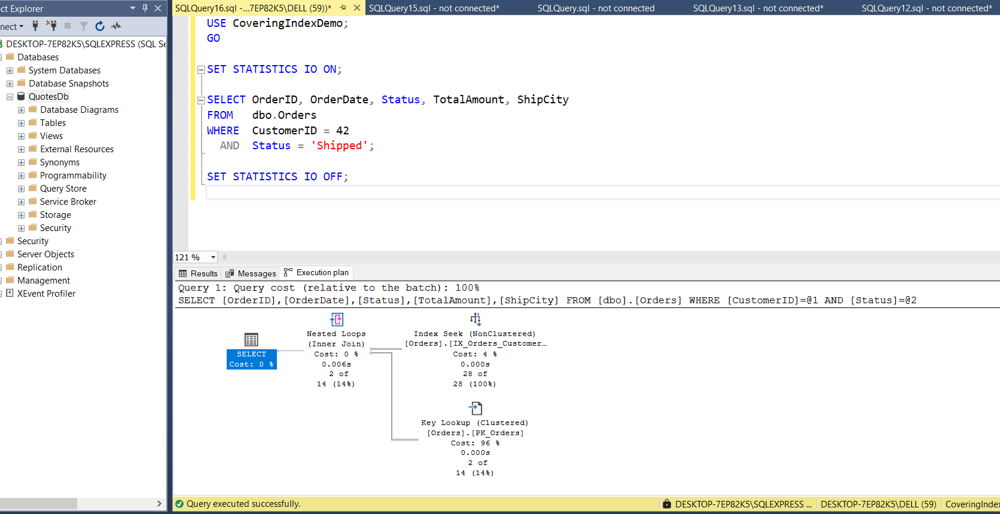
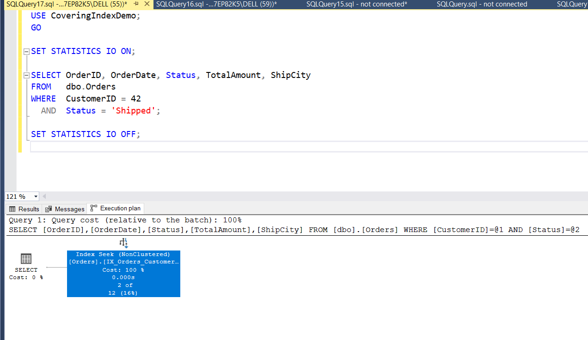

# Day 8 Piece 2 — Covering Indexes + INCLUDE

## BEFORE Plan (Key Lookup present)

**Index used:**
```sql
CREATE INDEX IX_Orders_CustomerID
    ON dbo.Orders (CustomerID);
```

**Query:**
```sql
SELECT OrderID, OrderDate, Status, TotalAmount, ShipCity
FROM   dbo.Orders
WHERE  CustomerID = 42
  AND  Status = 'Shipped';
```

**Execution Plan operators:**
- Index Seek → `IX_Orders_CustomerID` (finds rows where CustomerID = 42) — Cost: 4%
- **Key Lookup (Clustered) → `PK_Orders`** (goes back to clustered index to fetch Status, TotalAmount, ShipCity, OrderDate — one random read per row) — Cost: **96%**
- Nested Loops (Inner Join) joins the seek and lookup results



**STATISTICS IO output:**
```
Table 'Orders'. Scan count 1, logical reads 136, physical reads 3, read-ahead reads 20
```

---

## Covering Index with INCLUDE

```sql
CREATE INDEX IX_Orders_CustomerID_Status_Covering
    ON dbo.Orders (CustomerID, Status)
    INCLUDE (OrderDate, TotalAmount, ShipCity);
```

**Design reasoning:**
- `CustomerID`, `Status` → **key columns** because they are in the `WHERE` clause — the B-tree seeks directly to `CustomerID = 42 AND Status = 'Shipped'`
- `OrderDate`, `TotalAmount`, `ShipCity` → **INCLUDE columns** because they only appear in `SELECT` — stored only in the leaf pages, not in the B-tree, so the key stays narrow
- `OrderID` is the clustered key — SQL Server adds it to every non-clustered index leaf automatically

---

## AFTER Plan (Key Lookup gone)

**Same query, same connection:**
```sql
SELECT OrderID, OrderDate, Status, TotalAmount, ShipCity
FROM   dbo.Orders
WHERE  CustomerID = 42
  AND  Status = 'Shipped';
```

**Execution Plan operators:**
- Index Seek → `IX_Orders_CustomerID_Status_Covering` only — Cost: **100%**
- **Key Lookup → GONE** — every column the query needs lives in the index leaf pages



**STATISTICS IO output:**
```
Table 'Orders'. Scan count 1, logical reads 3, physical reads 0, read-ahead reads 0
```

---

## Logical-Reads Delta

| | Logical Reads |
|---|---|
| Before (non-covering, Key Lookup) | 136 |
| After (covering index) | 3 |
| **Delta** | **133 fewer reads (97.8% reduction)** |

---

# Full Query

```sql
-- Create the Database
USE master;
GO
IF DB_ID('CoveringIndexDemo') IS NOT NULL
BEGIN
    ALTER DATABASE CoveringIndexDemo SET SINGLE_USER WITH ROLLBACK IMMEDIATE;
    DROP DATABASE CoveringIndexDemo;
END
GO
CREATE DATABASE CoveringIndexDemo;
GO
USE CoveringIndexDemo;
GO
CREATE TABLE dbo.Orders
(
    OrderID      INT           NOT NULL IDENTITY(1,1),
    CustomerID   INT           NOT NULL,
    OrderDate    DATE          NOT NULL,
    Status       NVARCHAR(20)  NOT NULL,
    TotalAmount  DECIMAL(10,2) NOT NULL,
    ShipCity     NVARCHAR(50)  NOT NULL,
    Notes        NVARCHAR(500) NULL,
    CONSTRAINT PK_Orders PRIMARY KEY CLUSTERED (OrderID)
);
GO

-- Insert 50,000 rows
USE CoveringIndexDemo;
GO
;WITH Numbers AS
(
    SELECT TOP (50000) ROW_NUMBER() OVER (ORDER BY (SELECT NULL)) AS n
    FROM sys.all_columns a CROSS JOIN sys.all_columns b
)
INSERT INTO dbo.Orders (CustomerID, OrderDate, Status, TotalAmount, ShipCity, Notes)
SELECT
    ABS(CHECKSUM(NEWID())) % 1000 + 1,
    DATEADD(DAY, -(n % 730), CAST('2024-01-01' AS DATE)),
    CASE (n % 4)
        WHEN 0 THEN 'Pending'
        WHEN 1 THEN 'Shipped'
        WHEN 2 THEN 'Delivered'
        ELSE        'Cancelled'
    END,
    CAST((ABS(CHECKSUM(NEWID())) % 90000 + 1000) / 100.0 AS DECIMAL(10,2)),
    CASE (n % 5)
        WHEN 0 THEN 'Mumbai'
        WHEN 1 THEN 'Delhi'
        WHEN 2 THEN 'Bangalore'
        WHEN 3 THEN 'Chennai'
        ELSE        'Hyderabad'
    END,
    REPLICATE(N'x', n % 200)
FROM Numbers;
GO
SELECT COUNT(*) AS TotalRows FROM dbo.Orders;  -- should show 50000

-- Create the NON-covering index
USE CoveringIndexDemo;
GO
CREATE INDEX IX_Orders_CustomerID
    ON dbo.Orders (CustomerID);
GO

-- Run the BEFORE query
USE CoveringIndexDemo;
GO
SET STATISTICS IO ON;
SELECT OrderID, OrderDate, Status, TotalAmount, ShipCity
FROM   dbo.Orders
WHERE  CustomerID = 42
  AND  Status = 'Shipped';
SET STATISTICS IO OFF;

-- Drop old index, create the Covering index
USE CoveringIndexDemo;
GO
DROP INDEX IX_Orders_CustomerID ON dbo.Orders;
GO
CREATE INDEX IX_Orders_CustomerID_Status_Covering
    ON dbo.Orders (CustomerID, Status)
    INCLUDE (OrderDate, TotalAmount, ShipCity);
GO

-- Run the AFTER query
USE CoveringIndexDemo;
GO
SET STATISTICS IO ON;
SELECT OrderID, OrderDate, Status, TotalAmount, ShipCity
FROM   dbo.Orders
WHERE  CustomerID = 42
  AND  Status = 'Shipped';
SET STATISTICS IO OFF;

-- Side-by-side comparison
USE CoveringIndexDemo;
GO
DROP INDEX IX_Orders_CustomerID_Status_Covering ON dbo.Orders;
GO
CREATE INDEX IX_Orders_CustomerID_Baseline ON dbo.Orders (CustomerID);
GO
SET STATISTICS IO ON;
PRINT '=== BEFORE (non-covering) ===';
SELECT OrderID, OrderDate, Status, TotalAmount, ShipCity
FROM   dbo.Orders
WHERE  CustomerID = 42 AND Status = 'Shipped';
SET STATISTICS IO OFF;
GO
DROP INDEX IX_Orders_CustomerID_Baseline ON dbo.Orders;
GO
CREATE INDEX IX_Orders_CustomerID_Status_Covering
    ON dbo.Orders (CustomerID, Status)
    INCLUDE (OrderDate, TotalAmount, ShipCity);
GO
SET STATISTICS IO ON;
PRINT '=== AFTER (covering index) ===';
SELECT OrderID, OrderDate, Status, TotalAmount, ShipCity
FROM   dbo.Orders
WHERE  CustomerID = 42 AND Status = 'Shipped';
SET STATISTICS IO OFF;
GO
```

---

## What I learned

The main thing I learned is that a Key Lookup can be much more expensive than it looks. Even when SQL Server finds the matching rows quickly using an index, it may still have to go back to the main table to get extra columns. This happened for every matching row, which made most of the query time go into the lookup (96% of total cost). By adding the required columns to the index using INCLUDE, SQL Server could get everything from the index itself and the query became much faster. A simple rule I learned is: columns used for filtering should be in the index key, and columns only needed in the result can go in INCLUDE.

## What could go wrong

If the query uses `SELECT *`, SQL Server may need columns that are not included in the index, bringing the Key Lookup back. On tables with lots of inserts and updates, larger indexes can also slow down write operations because SQL Server has more data to maintain. Another issue is outdated statistics — if SQL Server has incorrect information about the data, it may choose a slower plan and ignore the index even when a better option exists.

