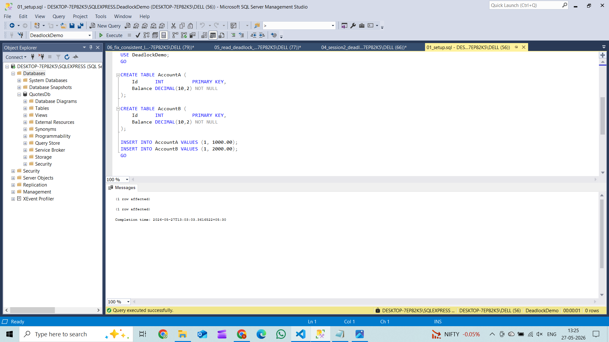
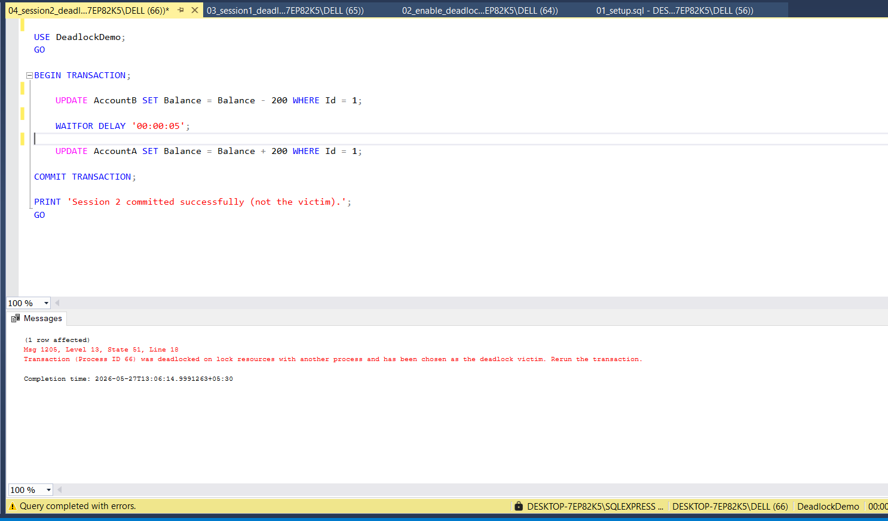
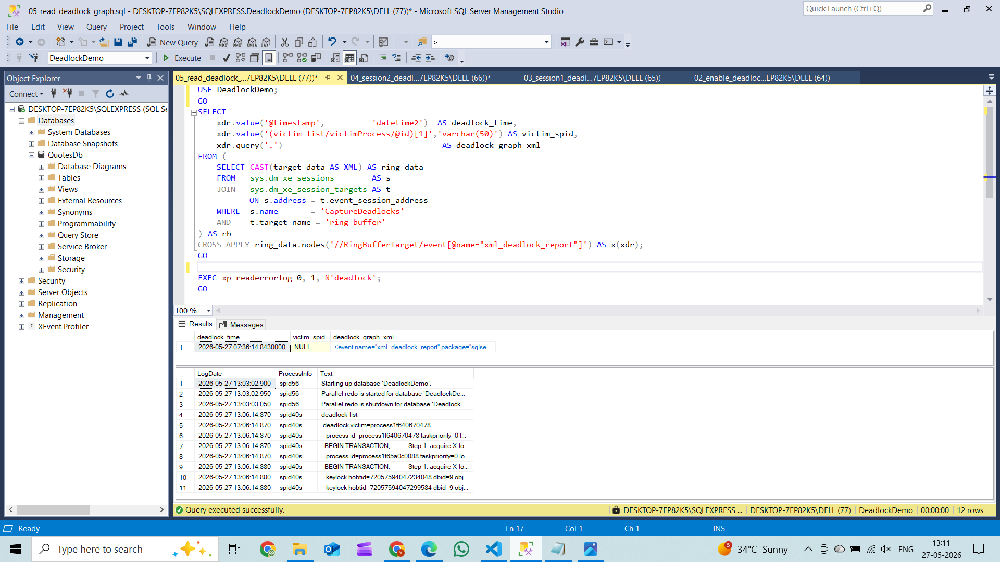
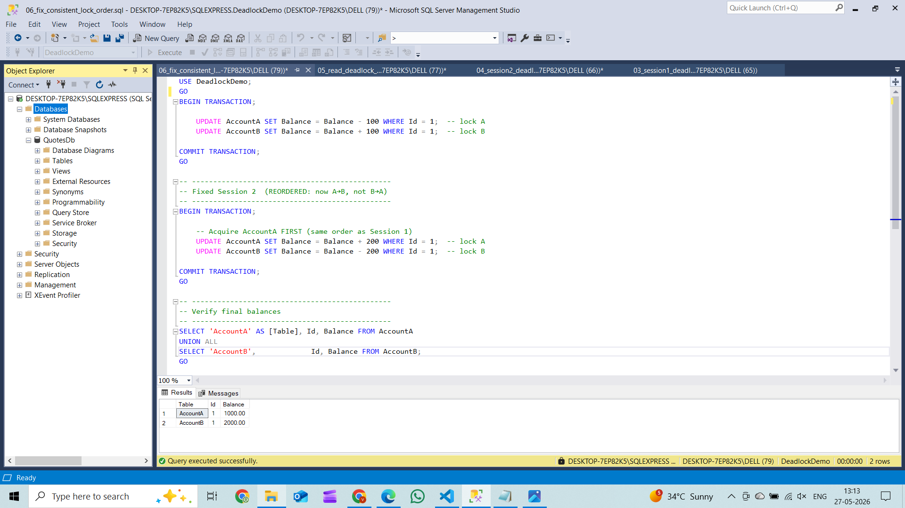

# Deadlock Exercise — Queries with Results

---

## Step 1 — Setup (01_setup.sql)

```sql
USE master;

IF DB_ID('DeadlockDemo') IS NOT NULL
    DROP DATABASE DeadlockDemo;

CREATE DATABASE DeadlockDemo;

USE DeadlockDemo;

CREATE TABLE AccountA (
    Id      INT           PRIMARY KEY,
    Balance DECIMAL(10,2) NOT NULL
);

CREATE TABLE AccountB (
    Id      INT           PRIMARY KEY,
    Balance DECIMAL(10,2) NOT NULL
);

INSERT INTO AccountA VALUES (1, 1000.00);
INSERT INTO AccountB VALUES (1, 2000.00);
```

**Result:**



---

## Step 2 — Enable Deadlock Capture (02_enable_deadlock_trace.sql)

```sql
DBCC TRACEON(1222, -1);

CREATE EVENT SESSION CaptureDeadlocks ON SERVER
ADD EVENT sqlserver.xml_deadlock_report
ADD TARGET package0.ring_buffer(SET max_memory = 4096)
WITH (MAX_DISPATCH_LATENCY = 5 SECONDS);

ALTER EVENT SESSION CaptureDeadlocks ON SERVER STATE = START;
```

**Result:**
```
Trace flag 1222 ON.  Extended Events session CaptureDeadlocks started.
Query executed successfully.
```

---

## Step 3 — Reproduce the Deadlock

### Session 1 (03_session1_deadlock.sql) — Locks A first, then waits for B

```sql
USE DeadlockDemo;

BEGIN TRANSACTION;
    UPDATE AccountA SET Balance = Balance - 100 WHERE Id = 1;  -- locks A
    WAITFOR DELAY '00:00:05';
    UPDATE AccountB SET Balance = Balance + 100 WHERE Id = 1;  -- waits for B
COMMIT TRANSACTION;
```

---

### Session 2 (04_session2_deadlock.sql) — Locks B first, then waits for A (opposite order)

```sql
USE DeadlockDemo;

BEGIN TRANSACTION;
    UPDATE AccountB SET Balance = Balance - 200 WHERE Id = 1;  -- locks B
    WAITFOR DELAY '00:00:05';
    UPDATE AccountA SET Balance = Balance + 200 WHERE Id = 1;  -- waits for A
COMMIT TRANSACTION;
```

**Result (DEADLOCK ERROR):**



> Session 2 (Process ID 66) was chosen as the deadlock victim and killed by SQL Server.

---

## Step 4 — Read the Deadlock Graph (05_read_deadlock_graph.sql)

```sql
-- Option A: Extended Events ring_buffer
SELECT
    xdr.value('@timestamp',          'datetime2')  AS deadlock_time,
    xdr.value('(victim-list/victimProcess/@id)[1]','varchar(50)') AS victim_spid,
    xdr.query('.')                                  AS deadlock_graph_xml
FROM (
    SELECT CAST(target_data AS XML) AS ring_data
    FROM   sys.dm_xe_sessions        AS s
    JOIN   sys.dm_xe_session_targets AS t
           ON s.address = t.event_session_address
    WHERE  s.name        = 'CaptureDeadlocks'
    AND    t.target_name = 'ring_buffer'
) AS rb
CROSS APPLY ring_data.nodes('//RingBufferTarget/event[@name="xml_deadlock_report"]') AS x(xdr);

-- Option B: ERRORLOG via trace flag 1222
EXEC xp_readerrorlog 0, 1, N'deadlock';
```

**Result:**



> ERRORLOG shows `deadlock victim=process1f640670478` with both keylocks confirming the circular wait.

---

## Step 5 — Fix: Consistent Lock Order (06_fix_consistent_lock_order.sql)

```sql
-- Session 1 (unchanged — already A → B)
BEGIN TRANSACTION;
    UPDATE AccountA SET Balance = Balance - 100 WHERE Id = 1;  -- lock A
    UPDATE AccountB SET Balance = Balance + 100 WHERE Id = 1;  -- lock B
COMMIT TRANSACTION;

-- Session 2 (FIXED — reordered to A → B, same as Session 1)
BEGIN TRANSACTION;
    UPDATE AccountA SET Balance = Balance + 200 WHERE Id = 1;  -- lock A first
    UPDATE AccountB SET Balance = Balance - 200 WHERE Id = 1;  -- lock B second
COMMIT TRANSACTION;

-- Verify final balances
SELECT 'AccountA' AS [Table], Id, Balance FROM AccountA
UNION ALL
SELECT 'AccountB',             Id, Balance FROM AccountB;
```

**Result:**



> No deadlock. Both transactions committed cleanly. Balances verified.

---

## Why the Fix Works

**Both sessions now lock resources in the same order (A → B), so a circular wait can never form.**

---

## Deadlock Visualised

```
BEFORE FIX (deadlock)          AFTER FIX (no deadlock)

Session1:  A → waits for B     Session1:  A → B  (commits)
Session2:  B → waits for A     Session2:  waits for A → B  (commits)
           ↑ circular wait                ↑ linear wait only
```
